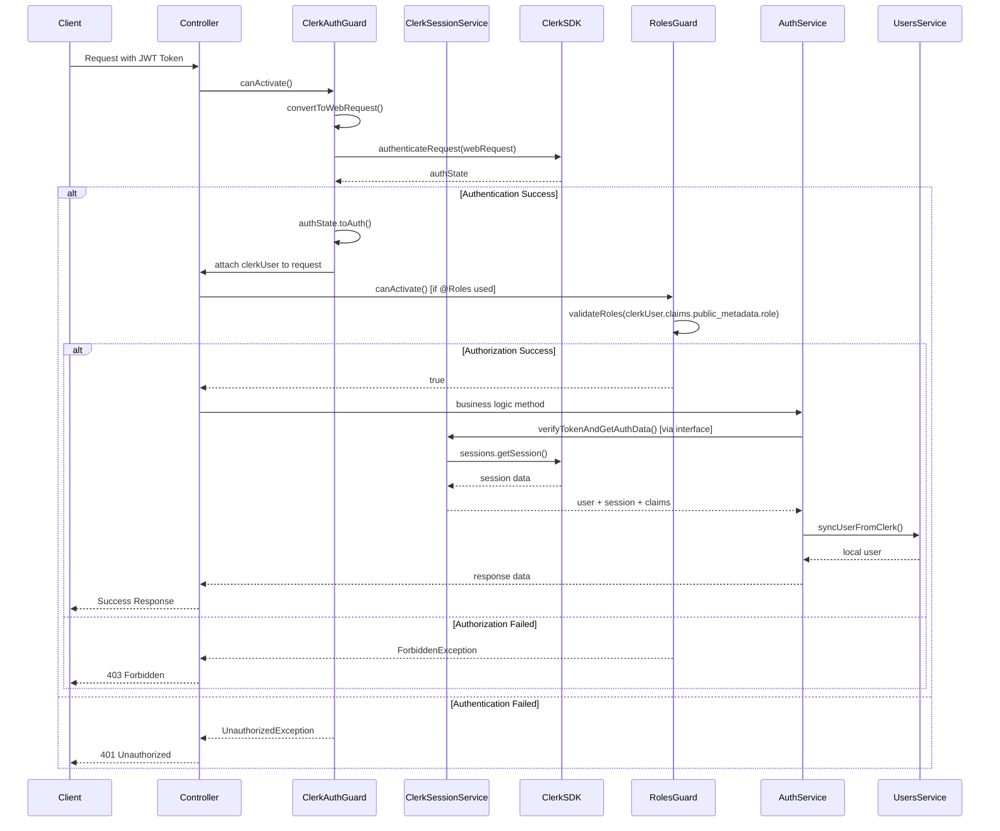

# Báo Cáo Phân Tích Kỹ Thuật Chi Tiết: Module Auth và Clerk - TheShoeBolt

**Người thực hiện:** Augment Agent  
**Ngày thực hiện:** 17/07/2025  
**Người giám sát:** default_user  

## Tóm Tắt Báo Cáo

Báo cáo này phân tích chi tiết hai module quan trọng trong hệ thống authentication và authorization của dự án TheShoeBolt:

- **Module Auth** (`src/modules/auth/`): Tầng Application Layer chịu trách nhiệm authorization và role-based access control
- **Module Clerk** (`src/modules/Infrastructure/clerk/`): Tầng Infrastructure Layer tích hợp với Clerk SDK để xử lý authentication

Hai module này hoạt động theo kiến trúc Clean Architecture với sự phân tách rõ ràng giữa business logic và infrastructure concerns.

## 1. Phân Tích Cấu Trúc Module Auth

### 1.1 Tổng Quan Cấu Trúc

Module Auth nằm trong `src/modules/auth/` với cấu trúc như sau:

```
src/modules/auth/
├── auth.module.ts              # Module configuration
├── auth.controller.ts          # REST API endpoints
├── auth.service.ts            # Business logic service
├── decorators/
│   └── roles.decorator.ts     # Role-based decorators
├── guards/
│   └── roles.guard.ts         # Authorization guard
└── interfaces/
    ├── index.ts               # Barrel exports
    ├── i-authentication-service.interface.ts
    ├── i-auth-guard.interface.ts
    └── clerk-user-payload.interface.ts
```

### 1.2 Chi Tiết Các File

#### 1.2.1 AuthModule Configuration

**File:** `src/modules/auth/auth.module.ts` (Dòng 1-21)

```typescript
import { Module } from '@nestjs/common';
import { UsersModule } from '../users/users.module';
import { AuthService } from './auth.service';
import { AuthController } from './auth.controller';
import { RolesGuard } from './guards/roles.guard';

@Module({
  imports: [
    UsersModule,
  ],
  controllers: [AuthController],
  providers: [
    AuthService,
    RolesGuard,
  ],
  exports: [
    AuthService,
    RolesGuard,
  ],
})
export class AuthModule {}
```

**Chức năng:** Module này định nghĩa cấu trúc dependency injection cho Auth module, import UsersModule để truy cập user data, và export các services/guards để sử dụng trong các module khác.

#### 1.2.2 AuthController - API Endpoints

**File:** `src/modules/auth/auth.controller.ts` (Dòng 9-32)

```typescript
@ApiTags('Authentication')
@Controller('auth')
export class AuthController {
  constructor(private readonly authService: AuthService) {}

  @UseGuards(ClerkAuthGuard)
  @Post('sync-user')
  @ApiOperation({ summary: 'Sync authenticated Clerk user to local database' })
  @ApiResponse({ status: 200, description: 'User synced successfully' })
  @ApiResponse({ status: 401, description: 'Unauthorized' })
  @ApiBearerAuth()
  async syncUser(@Request() req) {
    const localUser = await this.authService.syncUserFromClerk(req.user);
    return {
      message: 'User synced successfully',
      user: {
        id: localUser.id,
        email: localUser.email,
        firstName: localUser.firstName,
        lastName: localUser.lastName,
        role: localUser.role,
      },
    };
  }
```

**Chức năng:** Controller cung cấp endpoint `/auth/sync-user` để đồng bộ user data từ Clerk vào local database. Sử dụng ClerkAuthGuard để xác thực token.

#### 1.2.3 AuthService - Business Logic

**File:** `src/modules/auth/auth.service.ts` (Dòng 1-20)

```typescript
@Injectable()
export class AuthService {
  constructor(
    private readonly usersService: UsersService,
    @Optional() @Inject('IAuthenticationService')
    private readonly authService?: IAuthenticationService,
  ) {}

  async syncUserFromClerk(clerkUser: any): Promise<User> {
    // Implementation for syncing Clerk user to local database
  }

  async getUserProfile(userId: string): Promise<User> {
    // Implementation for getting user profile
  }

  async validateUserSession(token: string): Promise<{
    user: any;
    session: any;
    sessionClaims: JwtPayload;
  }> {
    // Implementation using injected IAuthenticationService
  }
```

**Chức năng:** Service thực hiện business logic cho authentication, sử dụng Dependency Injection với IAuthenticationService interface để tách biệt khỏi concrete implementation.

#### 1.2.4 RolesGuard - Authorization Logic

**File:** `src/modules/auth/guards/roles.guard.ts` (Dòng 13-26)

```typescript
interface ClerkUserPayload {
  sessionId?: string;
  userId?: string;
  orgId?: string;
  claims?: {
    public_metadata?: {
      role?: UserRole;
      roles?: UserRole[];
    };
    sub?: string;
  };
}

@Injectable()
export class RolesGuard implements CanActivate {
  private readonly logger = new Logger(RolesGuard.name);

  constructor(private reflector: Reflector) {}
```

**Chức năng:** Guard thực hiện authorization dựa trên roles, đọc metadata từ decorators và so sánh với user roles từ Clerk publicMetadata.

#### 1.2.5 Roles Decorator

**File:** `src/modules/auth/decorators/roles.decorator.ts` (Dòng 1-16)

```typescript
import { SetMetadata } from '@nestjs/common';
import { UserRole } from '../../users/entities/user.entity';

export const ROLES_KEY = 'roles';
export const ROLES_ANY_KEY = 'roles_any';
export const ROLES_ALL_KEY = 'roles_all';

export const Roles = (...roles: UserRole[]) => SetMetadata(ROLES_KEY, roles);
export const RolesAny = (...roles: UserRole[]) => SetMetadata(ROLES_ANY_KEY, roles);
export const RolesAll = (...roles: UserRole[]) => SetMetadata(ROLES_ALL_KEY, roles);
```

**Chức năng:** Cung cấp decorators để định nghĩa role requirements cho endpoints, hỗ trợ cả single role và multiple roles logic.

#### 1.2.6 Authentication Interfaces

**File:** `src/modules/auth/interfaces/i-authentication-service.interface.ts` (Dòng 9-68)

```typescript
export interface IAuthenticationService {
  verifyTokenAndGetAuthData(token: string): Promise<{
    user: {
      id: string;
      email: string;
      firstName: string;
      lastName: string;
      publicMetadata: any;
    };
    session: any;
    sessionClaims: JwtPayload;
  }>;

  getSession(sessionId: string): Promise<any>;
  getSessionList(userId: string): Promise<any>;
  revokeSession(sessionId: string): Promise<any>;
  revokeAllUserSessions(userId: string): Promise<any>;
  verifySessionToken(token: string): Promise<JwtPayload>;
  getUser(userId: string): Promise<any>;
}
```

**Chức năng:** Interface định nghĩa contract cho authentication service, cho phép thay đổi implementation mà không ảnh hưởng đến business logic.

## 2. Phân Tích Cấu Trúc Module Clerk

### 2.1 Tổng Quan Cấu Trúc

Module Clerk nằm trong `src/modules/Infrastructure/clerk/` với cấu trúc:

```
src/modules/Infrastructure/clerk/
├── clerk.module.ts                    # Dynamic module configuration
├── clerk.controller.ts                # Admin session management endpoints
├── clerk.session.service.ts           # Core Clerk SDK integration
├── guards/
│   └── clerk-auth.guard.ts           # Authentication guard
├── providers/
│   └── clerk-client.provider.ts      # Clerk client factory
└── dto/
    └── clerk-params.dto.ts           # Validation DTOs
```

### 2.2 Chi Tiết Các File

#### 2.2.1 ClerkModule - Dynamic Configuration

**File:** `src/modules/Infrastructure/clerk/clerk.module.ts` (Dòng 16-71)

```typescript
export interface ClerkModuleOptions {
  secretKey: string;
  publishableKey: string;
}

@Module({})
export class ClerkModule {
  static forRootAsync(options?: {
    useFactory?: (...args: any[]) => ClerkModuleOptions;
    inject?: any[];
  }): DynamicModule {
    return {
      module: ClerkModule,
      imports: [ConfigModule],
      controllers: [ClerkController],
      providers: [
        {
          provide: "CLERK_OPTIONS",
          useFactory: (configService: ConfigService): ClerkModuleOptions => ({
            secretKey: configService.get<string>("CLERK_SECRET_KEY"),
            publishableKey: configService.get<string>("CLERK_PUBLISHABLE_KEY"),
          }),
          inject: [ConfigService],
        },
        ClerkClientProvider,
        ClerkSessionService,
        ClerkAuthGuard,
      ],
      exports: [
        ClerkSessionService,
        ClerkAuthGuard,
        "CLERK_OPTIONS",
        CLERK_CLIENT,
      ],
      global: true,
    };
  }
}
```

**Chức năng:** Dynamic module cho phép cấu hình Clerk SDK với environment variables, export các services để sử dụng global trong ứng dụng.

#### 2.2.2 ClerkSessionService - Core Integration

**File:** `src/modules/Infrastructure/clerk/clerk.session.service.ts` (Dòng 8-14)

```typescript
@Injectable()
export class ClerkSessionService implements IAuthenticationService {
  private readonly logger = new Logger(ClerkSessionService.name);

  constructor(
    @Inject(CLERK_CLIENT) private readonly clerkClient: ClerkClient,
    @Inject('CLERK_OPTIONS') private readonly options: ClerkModuleOptions,
  ) {}
```

**File:** `src/modules/Infrastructure/clerk/clerk.session.service.ts` (Dòng 62-75)

```typescript
async revokeSession(sessionId: string) {
  try {
    this.logger.debug(`Attempting to revoke session: ${sessionId}`);
    const revokedSession = await this.clerkClient.sessions.revokeSession(sessionId);
    this.logger.debug(`Successfully revoked session: ${sessionId}`);
    return revokedSession;
  } catch (error) {
    this.logger.error(`Failed to revoke session ${sessionId}:`, error.stack);

    const statusCode = error.status ?? error.response?.status ?? error.statusCode;

    if (statusCode === 404) {
      throw new NotFoundException(`Session with ID ${sessionId} not found.`);
    }
    // Additional error handling...
  }
}
```

**Chức năng:** Service core tích hợp với Clerk SDK, implement IAuthenticationService interface, cung cấp session management và user authentication.

#### 2.2.3 ClerkAuthGuard - Authentication Guard

**File:** `src/modules/Infrastructure/clerk/guards/clerk-auth.guard.ts` (Dòng 26-50)

```typescript
async canActivate(context: ExecutionContext): Promise<boolean> {
  const request = context.switchToHttp().getRequest();

  try {
    // Convert Express Request to Web API Request for Clerk
    const webRequest = this.convertToWebRequest(request);

    // Use authenticateRequest from ClerkClient
    const authState = await this.clerkClient.authenticateRequest(webRequest, {
      jwtKey: this.configService.get('CLERK_JWT_KEY'),
      secretKey: this.configService.get('CLERK_SECRET_KEY'),
    });

    if (!authState.isAuthenticated) {
      this.logger.error('User not authenticated');
      throw new UnauthorizedException('User not authenticated');
    }

    // Get auth object from authenticated state
    const authObject = authState.toAuth();

    // Attach user info to request
    request['clerkUser'] = {
      sessionId: authObject.sessionId,
      userId: authObject.userId,
      orgId: authObject.orgId,
      claims: authObject.sessionClaims
    };

    this.logger.debug(`User ${authObject.userId} authenticated`);
    return true;
  } catch (error) {
    this.logger.error('Authentication failed:', error.message);
    throw new UnauthorizedException('Authentication failed');
  }
}
```

**Chức năng:** Guard xác thực JWT token từ Clerk, sử dụng authenticateRequest API, attach user info vào request object.

#### 2.2.4 ClerkController - Admin Management

**File:** `src/modules/Infrastructure/clerk/clerk.controller.ts` (Dòng 21-63)

```typescript
@ApiTags('Clerk Session Management')
@Controller('clerk')
@UseGuards(ClerkAuthGuard)
export class ClerkController {
  constructor(private readonly clerkSessionService: ClerkSessionService) {}

  @Delete('sessions/:sessionId')
  @Throttle({ default: { limit: 5, ttl: 60000 } })
  @HttpCode(HttpStatus.OK)
  @ApiOperation({ summary: 'Revoke a specific session' })
  @ApiParam({ name: 'sessionId', description: 'Session ID to revoke' })
  @ApiResponse({ status: 200, description: 'Session revoked successfully' })
  @ApiResponse({ status: 401, description: 'Unauthorized' })
  @ApiResponse({ status: 404, description: 'Session not found' })
  async revokeSession(@Param() params: SessionIdParamDto) {
    const revokedSession = await this.clerkSessionService.revokeSession(params.sessionId);
    return {
        message: `Session ${params.sessionId} revoked successfully`,
        session: revokedSession,
    };
  }

  @Delete('sessions')
  @Throttle({ default: { limit: 3, ttl: 60000 } })
  @HttpCode(HttpStatus.OK)
  @ApiOperation({ summary: 'Revoke all sessions for current user' })
  async revokeAllSessions(@Request() req) {
    if (!req.clerkUser?.userId) {
      throw new BadRequestException('Missing userId in user context');
    }

    const revokedSessions = await this.clerkSessionService.revokeAllUserSessions(req.clerkUser.userId);
    return {
      message: 'All sessions revoked successfully',
      revokedSessions: revokedSessions.length,
      sessions: revokedSessions,
    };
  }
}
```

**Chức năng:** Controller cung cấp admin endpoints để quản lý sessions, có rate limiting và comprehensive error handling.

#### 2.2.5 ClerkClientProvider - SDK Factory

**File:** `src/modules/Infrastructure/clerk/providers/clerk-client.provider.ts` (Dòng 7-31)

```typescript
export const CLERK_CLIENT = 'ClerkClient';

export const ClerkClientProvider: Provider = {
  provide: CLERK_CLIENT,
  useFactory: (configService: ConfigService): ClerkClient => {
    const secretKey = configService.get<string>('CLERK_SECRET_KEY');
    const publishableKey = configService.get<string>('CLERK_PUBLISHABLE_KEY');
    const jwtKey = configService.get<string>('CLERK_JWT_KEY');

    if (!secretKey) {
      throw new Error('CLERK_SECRET_KEY is not set in environment variables.');
    }
    if (!publishableKey) {
      throw new Error('CLERK_PUBLISHABLE_KEY is not set in environment variables.');
    }
    if (!jwtKey) {
      throw new Error('CLERK_JWT_KEY is not set in environment variables.');
    }

    return createClerkClient({
      secretKey,
      publishableKey,
      jwtKey
    });
  },
  inject: [ConfigService],
};
```

**Chức năng:** Factory provider tạo ClerkClient instance với environment validation, đảm bảo tất cả required keys được cấu hình.

#### 2.2.6 Validation DTOs

**File:** `src/modules/Infrastructure/clerk/dto/clerk-params.dto.ts` (Dòng 7-36)

```typescript
export class SessionIdParamDto {
  @ApiProperty({
    description: 'Clerk session ID',
    example: 'sess_2b6fcd92dvf96q05x8e4a8xvt6a',
    pattern: '^sess_[a-zA-Z0-9]+$'
  })
  @IsString()
  @IsNotEmpty()
  @Matches(/^sess_[a-zA-Z0-9]+$/, {
    message: 'Invalid session ID format. Session ID must start with "sess_" followed by alphanumeric characters.'
  })
  sessionId: string;
}

export class UserIdParamDto {
  @ApiProperty({
    description: 'Clerk user ID',
    example: 'user_2b6fcd92dvf96q05x8e4a8xvt6a',
    pattern: '^user_[a-zA-Z0-9]+$'
  })
  @IsString()
  @IsNotEmpty()
  @Matches(/^user_[a-zA-Z0-9]+$/, {
    message: 'Invalid user ID format. User ID must start with "user_" followed by alphanumeric characters.'
  })
  userId: string;
}
```

**Chức năng:** DTOs validation cho Clerk ID formats, đảm bảo input security và API documentation.

## 3. Biểu Đồ Hệ Thống

### 3.1 Biểu Đồ Cấu Trúc Module Auth

Biểu đồ dưới đây mô tả cấu trúc tổng quan của Auth Module với các components và mối quan hệ:

```mermaid
graph TD
    A[AuthModule] --> B[AuthController]
    A --> C[AuthService]
    A --> D[RolesGuard]
    
    B --> E["/auth/sync-user<br/>POST endpoint"]
    
    C --> F[syncUserFromClerk]
    C --> G[getUserProfile]
    C --> H[validateUserSession]
    C --> I[IAuthenticationService<br/>Interface Injection]
    
    D --> J[canActivate]
    D --> K[validateRoles]
    D --> L[ClerkUserPayload<br/>Interface]
    
    M[Decorators] --> N[@Roles]
    M --> O[@RolesAny]
    M --> P[@RolesAll]
    
    Q[Interfaces] --> R[IAuthenticationService]
    Q --> S[IAuthGuard]
    Q --> T[ClerkUserPayload]
    
    U[UsersModule] --> A
    
    style A fill:#e1f5fe
    style C fill:#f3e5f5
    style D fill:#fff3e0
    style M fill:#e8f5e8
    style Q fill:#fce4ec
```

**Giải thích:**
- **AuthModule**: Module chính quản lý authentication business logic
- **AuthController**: REST API endpoints cho user synchronization
- **AuthService**: Business logic service với dependency injection
- **RolesGuard**: Authorization guard kiểm tra user roles
- **Decorators**: Role-based access control decorators
- **Interfaces**: Clean architecture abstractions

### 3.2 Biểu Đồ Cấu Trúc Module Clerk

Biểu đồ dưới đây mô tả cấu trúc tổng quan của Clerk Module với tích hợp SDK:

```mermaid
graph TD
    A[ClerkModule<br/>Dynamic Module] --> B[ClerkController]
    A --> C[ClerkSessionService]
    A --> D[ClerkAuthGuard]
    A --> E[ClerkClientProvider]
    
    B --> F["/clerk/sessions/:sessionId<br/>DELETE"]
    B --> G["/clerk/sessions<br/>DELETE"]
    B --> H["/clerk/admin/users/:userId/sessions<br/>GET"]
    
    C --> I[verifyTokenAndGetAuthData]
    C --> J[getSession]
    C --> K[revokeSession]
    C --> L[revokeAllUserSessions]
    C --> M[getUser]
    C --> N[IAuthenticationService<br/>Implementation]
    
    D --> O[canActivate]
    D --> P[convertToWebRequest]
    D --> Q[authenticateRequest<br/>Clerk SDK]
    
    E --> R[createClerkClient]
    E --> S[Environment Validation]
    E --> T[CLERK_CLIENT Token]
    
    U[DTOs] --> V[SessionIdParamDto]
    U --> W[UserIdParamDto]
    
    X[ConfigModule] --> A
    Y[@clerk/backend SDK] --> C
    Y --> D
    Y --> E
    
    style A fill:#e1f5fe
    style C fill:#f3e5f5
    style D fill:#fff3e0
    style E fill:#e8f5e8
    style U fill:#fce4ec
```

**Giải thích:**
- **ClerkModule**: Dynamic module với environment configuration
- **ClerkSessionService**: Core service implement IAuthenticationService
- **ClerkAuthGuard**: Authentication guard sử dụng Clerk SDK
- **ClerkController**: Admin endpoints cho session management
- **ClerkClientProvider**: Factory tạo Clerk client instance

### 3.3 Biểu Đồ Mối Quan Hệ Dependency Chi Tiết

Biểu đồ dưới đây mô tả mối quan hệ dependency giữa Auth và Clerk modules theo Clean Architecture:

```mermaid
graph TB
    subgraph "Application Layer"
        A[AuthModule]
        B[AuthController]
        C[AuthService]
        D[RolesGuard]
        E[@Roles Decorator]
    end
    
    subgraph "Infrastructure Layer"
        F[ClerkModule]
        G[ClerkController]
        H[ClerkSessionService]
        I[ClerkAuthGuard]
        J[ClerkClientProvider]
    end
    
    subgraph "Interface Layer (Clean Architecture)"
        K[IAuthenticationService]
        L[IAuthGuard]
        M[ClerkUserPayload]
    end
    
    subgraph "External Dependencies"
        N[@clerk/backend SDK]
        O[ConfigService]
        P[UsersModule]
    end
    
    subgraph "AppModule (Composition Root)"
        Q[Dependency Injection<br/>Configuration]
    end
    
    %% Interface implementations
    H -.->|implements| K
    I -.->|implements| L
    
    %% Dependency injection
    Q -->|provides IAuthenticationService| H
    Q -->|provides IAuthGuard| I
    C -->|injects| K
    
    %% Module dependencies
    A -->|imports| P
    B -->|uses| I
    D -->|reads metadata from| E
    
    %% Infrastructure dependencies
    F -->|imports| O
    H -->|uses| N
    I -->|uses| N
    J -->|creates| N
    
    %% Data flow
    B -->|sync-user endpoint| C
    C -->|delegates to| K
    I -->|attaches clerkUser| D
    D -->|validates roles| M
    
    %% Cross-layer communication
    G -->|admin endpoints| H
    B -->|protected by| I
    G -->|protected by| I
    G -->|authorized by| D
    
    style A fill:#e3f2fd
    style F fill:#fff3e0
    style K fill:#f3e5f5
    style Q fill:#e8f5e8
    style N fill:#ffebee
```

**Giải thích:**
- **Application Layer**: Business logic và use cases
- **Infrastructure Layer**: External integrations và technical concerns
- **Interface Layer**: Abstractions theo Dependency Inversion Principle
- **Composition Root**: AppModule cấu hình dependency injection

## 4. Mối Quan Hệ và Authentication Flow

### 4.1 Điểm Tích Hợp Giữa Auth và Clerk

#### 4.1.1 Interface-Based Integration

**File:** `src/app.module.ts` (Dòng 120-137)

```typescript
// Interface implementations for Dependency Inversion
{
  provide: 'IAuthenticationService',
  useExisting: ClerkSessionService,
},
{
  provide: 'IAuthGuard',
  useExisting: ClerkAuthGuard,
}
```

**Chức năng:** AppModule đóng vai trò Composition Root, cấu hình dependency injection để AuthModule sử dụng Clerk implementations thông qua interfaces.

#### 4.1.2 Guard Chain Integration

**File:** `src/modules/Infrastructure/clerk/clerk.controller.ts` (Dòng 16-17)

```typescript
import { Roles } from '../../auth/decorators/roles.decorator';
import { RolesGuard } from '../../auth/guards/roles.guard';
```

**Chức năng:** ClerkController sử dụng RolesGuard từ AuthModule để thực hiện authorization sau khi authentication.

### 4.2 Luồng Dữ Liệu Authentication Flow

#### 4.2.1 Authentication Sequence Diagram



**Luồng xử lý:**

1. **Authentication Phase (ClerkAuthGuard)**:
   - Client gửi request với JWT token trong Authorization header
   - ClerkAuthGuard convert Express request thành Web API request
   - Sử dụng Clerk SDK `authenticateRequest()` để verify token
   - Attach user info vào request object nếu authentication thành công

2. **Authorization Phase (RolesGuard)**:
   - Đọc role requirements từ `@Roles` decorator metadata
   - Validate user roles từ `clerkUser.claims.public_metadata.role`
   - Allow/deny access dựa trên role matching logic

3. **Business Logic Phase (AuthService)**:
   - Delegate authentication operations đến IAuthenticationService
   - ClerkSessionService thực hiện actual Clerk SDK calls
   - Sync user data giữa Clerk và local database

### 4.3 Shared Interfaces và Types

#### 4.3.1 ClerkUserPayload Interface

**File:** `src/modules/auth/interfaces/clerk-user-payload.interface.ts` (Dòng 7-67)

```typescript
export interface ClerkUserPayload {
  sessionId?: string;
  userId?: string;
  orgId?: string;
  claims?: {
    public_metadata?: {
      role?: UserRole;        // Single role (current)
      roles?: UserRole[];     // Multiple roles (future)
    };
    sub?: string;
    sid?: string;
    iat?: number;
    exp?: number;
    [key: string]: any;
  };
}
```

**Chức năng:** Shared interface định nghĩa cấu trúc user data từ Clerk, được sử dụng bởi cả AuthModule và ClerkModule.

#### 4.3.2 IAuthenticationService Interface

**File:** `src/modules/auth/interfaces/i-authentication-service.interface.ts` (Dòng 9-68)

```typescript
export interface IAuthenticationService {
  verifyTokenAndGetAuthData(token: string): Promise<{
    user: { id: string; email: string; firstName: string; lastName: string; publicMetadata: any; };
    session: any;
    sessionClaims: JwtPayload;
  }>;

  getSession(sessionId: string): Promise<any>;
  getSessionList(userId: string): Promise<any>;
  revokeSession(sessionId: string): Promise<any>;
  revokeAllUserSessions(userId: string): Promise<any>;
  verifySessionToken(token: string): Promise<JwtPayload>;
  getUser(userId: string): Promise<any>;
}
```

**Chức năng:** Contract interface cho authentication service, cho phép AuthModule sử dụng bất kỳ authentication provider nào mà không cần thay đổi business logic.

### 4.4 Configuration và Environment Integration

#### 4.4.1 Environment Variables

**Required Clerk Configuration:**
```bash
CLERK_SECRET_KEY=sk_test_...
CLERK_PUBLISHABLE_KEY=pk_test_...
CLERK_JWT_KEY=...
CLERK_WEBHOOK_SECRET=whsec_...
```

#### 4.4.2 Module Registration

**File:** `src/app.module.ts` (AppModule imports)

```typescript
ClerkModule.forRootAsync({
  useFactory: (configService: ConfigService) => ({
    secretKey: configService.get('CLERK_SECRET_KEY'),
    publishableKey: configService.get('CLERK_PUBLISHABLE_KEY'),
  }),
  inject: [ConfigService],
})
```

**Chức năng:** Dynamic module registration với environment-based configuration.

## 5. Webhook Integration

### 5.1 Clerk Webhook Controller

**File:** `src/modules/webhooks/clerk-webhook.controller.ts` (Dòng 25-78)

```typescript
@Post('clerk')
@UseFilters(WebhookExceptionFilter)
@ApiOperation({ summary: 'Handle Clerk webhook events' })
async handleClerkWebhook(@Headers() headers, @Req() req: Request, @Res() res: Response) {
  const webhookSecret = this.envConfig.clerk.webhookSecret;

  try {
    const payload = req.body;
    const payloadString = payload.toString();

    const svixHeaders = {
      'svix-id': headers['svix-id'] as string,
      'svix-timestamp': headers['svix-timestamp'] as string,
      'svix-signature': headers['svix-signature'] as string,
    };

    // Verify webhook signature
    const wh = new Webhook(webhookSecret);
    const evt = wh.verify(payloadString, svixHeaders) as any;

    // Process webhook events using transaction service
    const context: WebhookProcessingContext = {
      eventType: validatedEvent.type,
      clerkId: validatedEvent.data?.id || evt.data?.id,
      payload: validatedEvent.data,
      webhookId: svixHeaders['svix-id'],
      webhookTimestamp: new Date(parseInt(svixHeaders['svix-timestamp']) * 1000),
    };

    await this.webhookTransactionService.processWebhookWithTransaction(context);

    return res.status(HttpStatus.OK).json({
      success: true,
      message: 'Webhook processed successfully',
      eventType: evt.type
    });
  } catch (error) {
    // Error handling...
  }
}
```

**Chức năng:** Webhook endpoint xử lý events từ Clerk (user.created, user.updated, session.created, etc.), đồng bộ data với local database.

## Kết Luận

### Điểm Mạnh của Architecture

1. **Clean Architecture Compliance**: Tách biệt rõ ràng giữa Application Layer (Auth) và Infrastructure Layer (Clerk)

2. **Dependency Inversion**: Sử dụng interfaces để decouple business logic khỏi external dependencies

3. **Single Responsibility**: Mỗi module có trách nhiệm rõ ràng - Auth cho authorization, Clerk cho authentication

4. **Extensibility**: Dễ dàng thay đổi authentication provider mà không ảnh hưởng business logic

5. **Security**: Comprehensive error handling, input validation, và fail-safe authorization logic

### Khuyến Nghị Cải Thiện

1. **Enhanced Testing**: Tăng cường integration tests cho authentication flow

2. **Monitoring**: Thêm metrics và logging cho security events

3. **Rate Limiting**: Implement advanced rate limiting cho sensitive endpoints

4. **Caching**: Cache user roles và session data để improve performance

5. **Documentation**: Tạo API documentation chi tiết cho developers

Kiến trúc hiện tại đã đạt được sự cân bằng tốt giữa security, maintainability và performance, phù hợp cho production environment của TheShoeBolt e-commerce platform.
