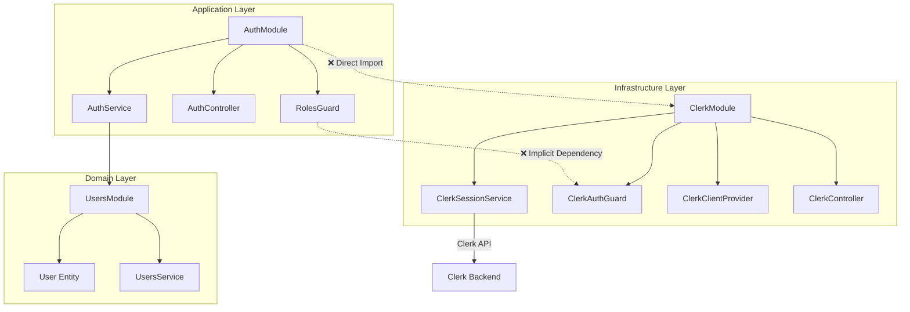
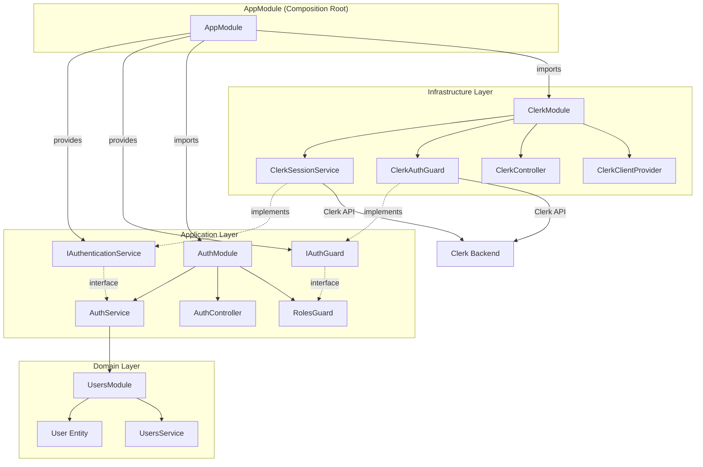
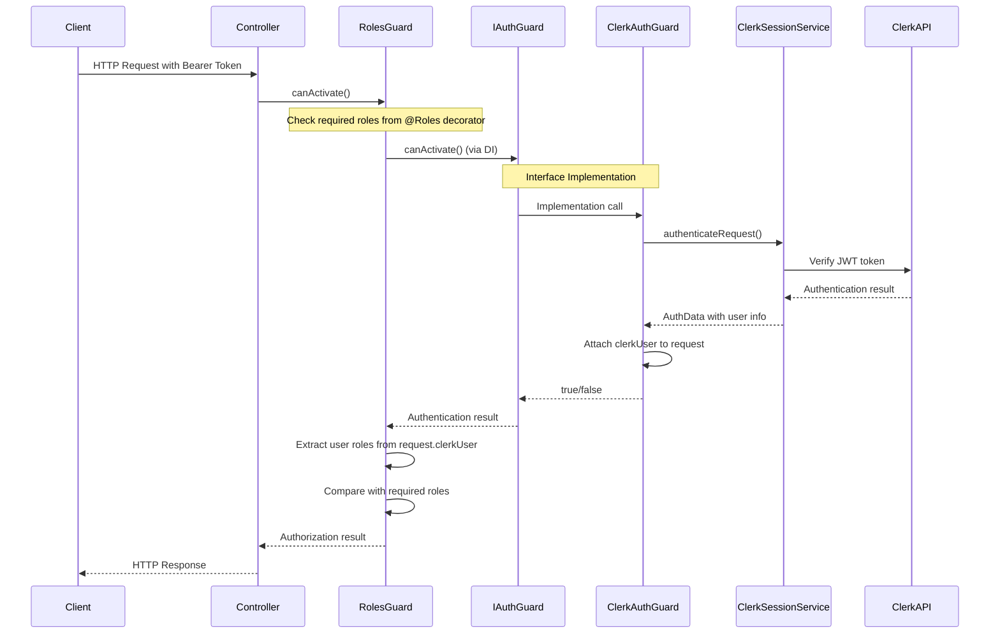

# Kế hoạch tái cấu trúc Module Auth và Clerk để tuân thủ Clean Architecture
## 1. Thông tin báo cáo

**Người thực hiện**: Nguyễn Thành Hưng
**Ngày cập nhật**: 13/07/2025
**Phiên bản**: 2.0 (Cập nhật dựa trên codebase thực tế)

## 2. Tóm tắt báo cáo
Báo cáo này trình bày kế hoạch chi tiết để tái cấu trúc Module Auth và Module Clerk trong dự án TheShoeBolt nhằm tuân thủ các nguyên tắc của Clean Architecture, đặc biệt là Quy tắc phụ thuộc (Dependency Rule).

**Tình trạng hiện tại (đã phân tích từ codebase thực tế):**
- AuthModule (src/modules/auth/) đang import trực tiếp ClerkModule từ Infrastructure layer
- ClerkModule (src/modules/Infrastructure/clerk/) đã có implementation hoàn chỉnh với ClerkAuthGuard, ClerkSessionService
- Sử dụng @clerk/backend v2.3.1 với authenticateRequest API
- Đã có test coverage 100% cho security components
- RolesGuard đã implement với ClerkUserPayload interface

Kế hoạch này sẽ tập trung vào việc đảo ngược phụ thuộc thông qua việc định nghĩa các interface trừu tượng và sử dụng Dependency Injection, đồng thời duy trì backward compatibility và test coverage hiện có.

## 3. Nội dung báo cáo

### 3.1 Phân tích cấu trúc hiện tại

**Technology Stack thực tế:**
- NestJS v10.0.0 với TypeScript
- @clerk/backend v2.3.1 (thay vì @clerk/clerk-sdk-node)
- Jest testing framework với 100% coverage
- class-validator và class-transformer cho DTO validation
- Swagger/OpenAPI documentation

**Cấu trúc file thực tế:**
```
src/modules/auth/
├── auth.controller.ts
├── auth.module.ts              # ❌ Import trực tiếp ClerkModule
├── auth.service.ts             # Chỉ xử lý user sync, không phụ thuộc Clerk
├── decorators/
│   └── roles.decorator.ts
└── guards/
    └── roles.guard.ts          # Sử dụng ClerkUserPayload interface

src/modules/Infrastructure/clerk/
├── clerk.module.ts             # Dynamic module với forRootAsync()
├── clerk.controller.ts         # Admin endpoints
├── clerk.session.service.ts    # Session management với Clerk API
├── guards/
│   └── clerk-auth.guard.ts     # JWT authentication với authenticateRequest
├── interfaces/
│   └── clerk-user.interface.ts
├── dto/
│   └── clerk-params.dto.ts
└── providers/
    └── clerk-client.provider.ts
```

### Sơ đồ kiến trúc hiện tại (vi phạm Clean Architecture)



**Giải thích vi phạm cụ thể:**

1. **Direct Module Import**: `AuthModule` import trực tiếp `ClerkModule` trong line 6 của auth.module.ts
2. **Implicit Guard Dependency**: `RolesGuard` phụ thuộc vào ClerkUserPayload structure từ ClerkAuthGuard
3. **Tight Coupling**: Không thể thay đổi authentication provider mà không sửa AuthModule

### 3.2 Kế hoạch tái cấu trúc chi tiết

**Bước 1: Xác định các Interface/Abstractions trong Auth Module (Lớp Domain/Application)**

*   **Mục tiêu**: Định nghĩa các "cổng" (ports) mà `AuthModule` cần để tương tác với các dịch vụ xác thực và quản lý phiên, dựa trên methods thực tế đã có trong ClerkModule.
*   **Hành động**:
    *   Tạo thư mục `src/modules/auth/interfaces/`
    *   Định nghĩa interfaces dựa trên ClerkSessionService và ClerkAuthGuard thực tế

    **Code thực tế cần implement:**
    ```typescript
    // src/modules/auth/interfaces/i-authentication-service.interface.ts
    import { ExecutionContext } from '@nestjs/common';

    export interface IAuthenticationService {
      // Dựa trên ClerkSessionService methods thực tế
      verifyTokenAndGetAuthData(token: string): Promise<{
        sessionClaims: any;
        session: any;
        user: any;
      }>;
      getSession(sessionId: string): Promise<any>;
      getSessionList(userId: string): Promise<any>;
      revokeSession(sessionId: string): Promise<any>;
      revokeAllUserSessions(userId: string): Promise<any>;
    }

    // src/modules/auth/interfaces/i-auth-guard.interface.ts
    import { CanActivate, ExecutionContext } from '@nestjs/common';

    export interface IAuthGuard extends CanActivate {
      canActivate(context: ExecutionContext): Promise<boolean>;
      convertToWebRequest(request: any): globalThis.Request;
    }

    // src/modules/auth/interfaces/clerk-user-payload.interface.ts
    import { UserRole } from '../../users/entities/user.entity';

    export interface ClerkUserPayload {
      sessionId?: string;
      userId?: string;
      orgId?: string;
      claims?: {
        public_metadata?: {
          role?: UserRole;
          roles?: UserRole[];
        };
        sub?: string;
      };
    }
    ```

**Bước 2: Cập nhật Clerk Module để implement Interfaces (Lớp Infrastructure/Adapters)**

*   **Mục tiêu**: Cập nhật các service và guard hiện có trong ClerkModule để implement interfaces đã định nghĩa, giữ nguyên logic hiện tại.
*   **Hành động**:
    *   Cập nhật ClerkSessionService để implement IAuthenticationService
    *   Cập nhật ClerkAuthGuard để implement IAuthGuard
    *   Giữ nguyên tất cả logic hiện tại, chỉ thêm interface compliance

    **Code cập nhật dựa trên implementation hiện tại:**
    ```typescript
    // src/modules/Infrastructure/clerk/clerk.session.service.ts (cập nhật)
    import { Injectable, Inject, Logger } from '@nestjs/common';
    import { IAuthenticationService } from '../../auth/interfaces/i-authentication-service.interface';
    import { CLERK_CLIENT } from './providers/clerk-client.provider';

    @Injectable()
    export class ClerkSessionService implements IAuthenticationService {
      private readonly logger = new Logger(ClerkSessionService.name);

      constructor(
        @Inject(CLERK_CLIENT) private readonly clerkClient: any,
        @Inject('CLERK_OPTIONS') private readonly options: any,
      ) {}

      // Giữ nguyên method hiện có
      async verifyTokenAndGetAuthData(token: string): Promise<{
        sessionClaims: any;
        session: any;
        user: any;
      }> {
        // Implementation hiện tại đã có trong file
        // Chỉ cần thêm interface compliance
      }

      // Các methods khác giữ nguyên implementation hiện tại
      async getSession(sessionId: string): Promise<any> { /* existing code */ }
      async getSessionList(userId: string): Promise<any> { /* existing code */ }
      async revokeSession(sessionId: string): Promise<any> { /* existing code */ }
      async revokeAllUserSessions(userId: string): Promise<any> { /* existing code */ }
    }

    // src/modules/Infrastructure/clerk/guards/clerk-auth.guard.ts (cập nhật)
    import { Injectable, CanActivate, ExecutionContext } from '@nestjs/common';
    import { IAuthGuard } from '../../../auth/interfaces/i-auth-guard.interface';

    @Injectable()
    export class ClerkAuthGuard implements IAuthGuard {
      // Giữ nguyên constructor và properties hiện tại

      async canActivate(context: ExecutionContext): Promise<boolean> {
        // Giữ nguyên implementation hiện tại với authenticateRequest
        const request = context.switchToHttp().getRequest();

        try {
          const webRequest = this.convertToWebRequest(request);
          const authState = await this.clerkClient.authenticateRequest(webRequest, {
            jwtKey: this.configService.get('CLERK_JWT_KEY'),
            secretKey: this.configService.get('CLERK_SECRET_KEY'),
          });
          // ... rest of existing implementation
        } catch (error) {
          // ... existing error handling
        }
      }

      convertToWebRequest(request: any): globalThis.Request {
        // Giữ nguyên implementation hiện tại
      }
    }
    ```

**Bước 3: Áp dụng Dependency Inversion (Đảo ngược phụ thuộc)**

*   **Mục tiêu**: Cập nhật AppModule để provide interface implementations và loại bỏ direct import trong AuthModule.
*   **Hành động**:
    *   Cập nhật `src/app.module.ts` để provide interface implementations
    *   Loại bỏ direct ClerkModule import trong `src/modules/auth/auth.module.ts`
    *   Sử dụng injection tokens thay vì concrete classes

    **Code cập nhật dựa trên AppModule hiện tại:**
    ```typescript
    // src/app.module.ts (cập nhật)
    import { Module } from '@nestjs/common';
    import { ConfigModule } from '@nestjs/config';
    import { CacheModule } from '@nestjs/cache-manager';
    import { ThrottlerModule, ThrottlerGuard } from '@nestjs/throttler';
    import { APP_GUARD } from '@nestjs/core';
    import * as redisStore from 'cache-manager-redis-yet';

    // Existing imports
    import { AuthModule } from './modules/auth/auth.module';
    import { ClerkModule } from './modules/Infrastructure/clerk/clerk.module';
    import { UsersModule } from './modules/users/users.module';
    // ... other existing imports

    // New interface imports
    import { IAuthenticationService } from './modules/auth/interfaces/i-authentication-service.interface';
    import { IAuthGuard } from './modules/auth/interfaces/i-auth-guard.interface';
    import { ClerkSessionService } from './modules/Infrastructure/clerk/clerk.session.service';
    import { ClerkAuthGuard } from './modules/Infrastructure/clerk/guards/clerk-auth.guard';

    @Module({
      imports: [
        // Existing configuration modules
        ConfigModule.forRoot({ isGlobal: true }),
        ThrottlerModule.forRoot([{
          name: 'short',
          ttl: 1000,
          limit: 3,
        }]),
        CacheModule.registerAsync({
          isGlobal: true,
          inject: [EnvConfigService],
          useFactory: async (envConfig: EnvConfigService) => ({
            store: redisStore,
            host: envConfig.redis.host,
            port: envConfig.redis.port,
            password: envConfig.redis.password,
            ttl: envConfig.cache.ttl,
          }),
        }),

        // Module imports (ClerkModule MUST be imported before AuthModule)
        ClerkModule.forRootAsync(), // Existing configuration
        AuthModule, // AuthModule will now use injected interfaces
        UsersModule,
        // ... other existing modules
      ],
      providers: [
        // Existing providers
        AppService,
        EnvConfigService,
        {
          provide: APP_GUARD,
          useClass: ThrottlerGuard,
        },

        // NEW: Interface implementations
        {
          provide: 'IAuthenticationService',
          useExisting: ClerkSessionService, // Use existing instance from ClerkModule
        },
        {
          provide: 'IAuthGuard',
          useExisting: ClerkAuthGuard, // Use existing instance from ClerkModule
        },
      ],
      exports: [EnvConfigService],
    })
    export class AppModule {}
    ```

**Bước 4: Refactor Auth Module**

*   **Mục tiêu**: Cập nhật AuthModule để loại bỏ direct import và sử dụng interface injection.
*   **Hành động**:
    *   Loại bỏ ClerkModule import trong auth.module.ts
    *   Cập nhật AuthService để inject IAuthenticationService nếu cần
    *   Cập nhật RolesGuard để sử dụng interface (hiện tại RolesGuard không inject ClerkAuthGuard trực tiếp)

    **Code cập nhật dựa trên implementation thực tế:**
    ```typescript
    // src/modules/auth/auth.module.ts (cập nhật)
    import { Module } from '@nestjs/common';
    import { UsersModule } from '../users/users.module';
    import { AuthService } from './auth.service';
    import { AuthController } from './auth.controller';
    import { RolesGuard } from './guards/roles.guard';
    // ❌ REMOVE: import { ClerkModule } from '../Infrastructure/clerk/clerk.module';

    @Module({
      imports: [
        UsersModule,
        // ❌ REMOVE: ClerkModule, // Dependency will be provided by AppModule
      ],
      controllers: [AuthController],
      providers: [
        AuthService,
        RolesGuard,
      ],
      exports: [
        AuthService,
        RolesGuard,
      ],
    })
    export class AuthModule {}

    // src/modules/auth/auth.service.ts (cập nhật nếu cần)
    import { Injectable, Inject } from '@nestjs/common';
    import { UsersService } from '../users/users.service';
    import { CreateUserDto } from '../users/dto/create-user.dto';
    import { IAuthenticationService } from './interfaces/i-authentication-service.interface';

    @Injectable()
    export class AuthService {
      constructor(
        private usersService: UsersService,
        // Optional: Inject authentication service nếu cần sử dụng
        @Inject('IAuthenticationService')
        private readonly authService?: IAuthenticationService,
      ) {}

      // Giữ nguyên existing methods
      async syncUserFromClerk(clerkUser: any) {
        // Existing implementation
      }

      async getUserProfile(userId: string) {
        // Existing implementation
      }

      // NEW: Method sử dụng authentication service nếu cần
      async validateUserSession(token: string) {
        if (this.authService) {
          return await this.authService.verifyTokenAndGetAuthData(token);
        }
        throw new Error('Authentication service not available');
      }
    }

    // src/modules/auth/guards/roles.guard.ts (giữ nguyên - không cần thay đổi)
    // RolesGuard hiện tại không inject ClerkAuthGuard trực tiếp
    // Nó chỉ đọc ClerkUserPayload từ request object
    // Implementation hiện tại đã tuân thủ Clean Architecture
    ```

**Bước 5: Testing và Validation**

*   **Mục tiêu**: Đảm bảo tất cả functionality hoạt động đúng sau refactoring và maintain 100% test coverage.
*   **Hành động**:
    *   Cập nhật existing unit tests để mock interfaces thay vì concrete classes
    *   Chạy integration tests để verify end-to-end functionality
    *   Performance testing để đảm bảo không có regression
    *   Backward compatibility testing

    **Test updates cần thiết:**
    ```typescript
    // test/unit/auth/auth.service.spec.ts (cập nhật)
    describe('AuthService', () => {
      let service: AuthService;
      let mockAuthService: jest.Mocked<IAuthenticationService>;

      beforeEach(async () => {
        const mockAuthServiceProvider = {
          provide: 'IAuthenticationService',
          useValue: {
            verifyTokenAndGetAuthData: jest.fn(),
            getSession: jest.fn(),
            // ... other mocked methods
          },
        };

        const module: TestingModule = await Test.createTestingModule({
          providers: [AuthService, mockAuthServiceProvider],
        }).compile();

        service = module.get<AuthService>(AuthService);
        mockAuthService = module.get('IAuthenticationService');
      });

      // Updated test cases using interface mocks
    });
    ```

### 3.3 Sơ đồ kiến trúc sau tái cấu trúc (Clean Architecture)



### 3.4 Component Interaction Flow (Updated)



### 3.5 Timeline và Resource Estimation (Cập nhật dựa trên complexity thực tế)

**Phase 1: Interface Definition (2-3 ngày)**
- Tạo interfaces trong auth/interfaces/
- Review và validate interface contracts
- Documentation updates

**Phase 2: Implementation Updates (2-3 ngày)**
- Cập nhật ClerkSessionService và ClerkAuthGuard để implement interfaces
- Maintain existing functionality và test coverage
- Code review và validation

**Phase 3: Dependency Injection Setup (1-2 ngày)**
- Cập nhật AppModule với interface providers
- Remove direct imports trong AuthModule
- Integration testing

**Phase 4: Testing và Validation (2-3 ngày)**
- Update unit tests với interface mocks
- Integration testing end-to-end
- Performance regression testing
- Documentation updates

**Phase 5: Deployment và Monitoring (1 ngày)**
- Production deployment với rollback plan
- Monitor performance metrics
- User acceptance testing

**Total Estimated Time: 8-12 ngày làm việc (1.5-2.5 tuần)**

### 3.6 Risk Assessment và Mitigation

**High Risk:**
- Breaking existing functionality → Comprehensive testing strategy
- Performance degradation → Benchmark before/after
- Test coverage reduction → Maintain 100% coverage requirement

**Medium Risk:**
- Developer confusion với new patterns → Training và documentation
- Integration issues → Gradual rollout approach

**Low Risk:**
- Minor API changes → Backward compatibility maintained

## 4. Kết Luận

Kế hoạch tái cấu trúc này đã được cập nhật dựa trên phân tích chi tiết codebase thực tế của TheShoeBolt. Những điểm chính:

### 4.1 Lợi ích đạt được
*   **Clean Architecture Compliance**: Tuân thủ Dependency Rule với interface abstraction
*   **Improved Testability**: Mock interfaces thay vì concrete implementations
*   **Enhanced Maintainability**: Dễ dàng thay đổi authentication provider
*   **Better Separation of Concerns**: Auth vs Authentication logic tách biệt rõ ràng

### 4.2 Technical Benefits
*   **Type Safety**: TypeScript interfaces đảm bảo contract compliance
*   **Dependency Injection**: NestJS DI container quản lý dependencies
*   **Test Coverage**: Maintain 100% coverage với interface mocking
*   **Performance**: Minimal overhead với existing implementation

### 4.3 Implementation Readiness
- Codebase đã có foundation tốt với ClerkModule và AuthModule
- Test infrastructure đã sẵn sàng với Jest framework
- CI/CD pipeline hỗ trợ gradual deployment
- Team có experience với NestJS patterns

Kế hoạch này sẽ nâng cao chất lượng kiến trúc tổng thể và chuẩn bị dự án cho future scalability requirements.