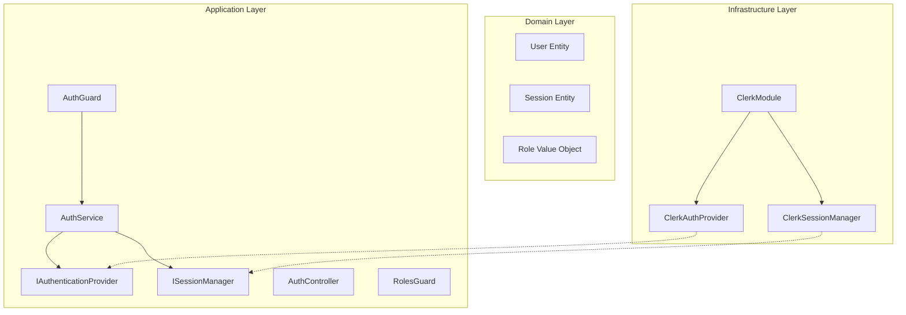

# Báo Cáo Phân Tích Kiến Trúc và Kế Hoạch Tái Cấu Trúc
## Áp dụng Domain-Driven Design (DDD) và Clean Architecture

**Ngày báo cáo:** 28/12/2024  
**Phân tích bởi:** Kỹ sư Kiến trúc Phần mềm  
**Phạm vi:** ClerkModule (Infrastructure) và AuthModule (Application)

---

## 1. Tóm Tắt Điều Hành

### 1.1 Xác nhận Giả thuyết
✅ **GIẢ THUYẾT ĐƯỢC XÁC NHẬN**: ClerkModule (lớp Infrastructure) đang chứa logic nghiệp vụ của AuthModule (lớp Application), vi phạm nghiêm trọng nguyên tắc phân tách trách nhiệm và các nguyên tắc của Clean Architecture.

### 1.2 Tác động
- **Vi phạm Dependency Rule**: Lớp Application đang phụ thuộc trực tiếp vào chi tiết triển khai của Infrastructure
- **Khó kiểm thử**: Business logic bị trộn lẫn với infrastructure code
- **Khó thay đổi**: Không thể thay đổi authentication provider mà không ảnh hưởng đến business logic
- **Vi phạm DIP**: Không có abstraction layer giữa Application và Infrastructure

---

## 2. Phân Tích Chi Tiết

### 2.1 Bằng Chứng Rò Rỉ Logic Nghiệp Vụ từ ClerkModule

#### 2.1.1 ClerkController chứa Logic Phân Quyền
```typescript
// src/modules/Infrastructure/clerk/clerk.controller.ts
@UseGuards(ClerkAuthGuard, RolesGuard)
@Roles(UserRole.ADMIN)  // ❌ Business rule trong Infrastructure layer
@Get('admin/users/:userId/sessions')
async getAnyUserSessions(@Param('userId') userId: string) {
  // Logic nghiệp vụ: Chỉ admin mới được xem sessions của user khác
}
```

**Vấn đề:** 
- RolesGuard và decorator @Roles là business logic thuộc về Application layer
- ClerkController đang quyết định ai được phép làm gì - đây là business rule


### 2.2 Phân Tích AuthModule - Thiếu Sót và Phụ Thuộc Sai

#### 2.2.3 AuthController Phụ Thuộc Chặt vào Clerk
```typescript
// src/modules/auth/auth.controller.ts
import { ClerkAuthGuard } from '../Infrastructure/clerk/guards/clerk-auth.guard';
// ❌ Vi phạm Dependency Rule - Application phụ thuộc vào Infrastructure
```

---

## 3. Kế Hoạch Tái Cấu Trúc Theo DIP

### 3.1 Thiết Kế Kiến Trúc Mới



### 3.2 Định Nghĩa Interfaces (Abstractions)

#### 3.2.1 IAuthenticationProvider Interface
```typescript
// src/modules/auth/interfaces/authentication-provider.interface.ts
export interface IAuthenticationProvider {
  verifyToken(token: string): Promise<AuthenticationResult>;
  getUser(userId: string): Promise<AuthUser>;
  invalidateSession(sessionId: string): Promise<void>;
}

export interface AuthenticationResult {
  userId: string;
  sessionId: string;
  claims: Record<string, any>;
  isValid: boolean;
}

export interface AuthUser {
  id: string;
  email: string;
  firstName?: string;
  lastName?: string;
  roles: string[];
  metadata?: Record<string, any>;
}
```

#### 3.2.2 ISessionManager Interface
```typescript
// src/modules/auth/interfaces/session-manager.interface.ts
export interface ISessionManager {
  validateSession(sessionId: string): Promise<SessionValidationResult>;
  createSession(userId: string, metadata?: any): Promise<Session>;
  revokeSession(sessionId: string): Promise<void>;
  revokeAllUserSessions(userId: string): Promise<void>;
  getActiveSessions(userId: string): Promise<Session[]>;
}

export interface Session {
  id: string;
  userId: string;
  status: 'active' | 'revoked' | 'expired';
  createdAt: Date;
  expiresAt: Date;
  metadata?: Record<string, any>;
}

export interface SessionValidationResult {
  isValid: boolean;
  session?: Session;
  reason?: string;
}
```

### 3.3 Mã Nguồn Trước và Sau Tái Cấu Trúc

#### 3.3.1 AuthService - TRƯỚC
```typescript
// TRƯỚC: AuthService với logic hạn chế
@Injectable()
export class AuthService {
  constructor(
    private usersService: UsersService,
  ) {}

  async syncUserFromClerk(clerkUser: any) {
    // Chỉ sync user data
  }

  async getUserProfile(userId: string) {
    return this.usersService.findOne(userId);
  }
}
```

#### 3.3.2 AuthService - SAU
```typescript
// SAU: AuthService với đầy đủ business logic
@Injectable()
export class AuthService {
  constructor(
    @Inject('IAuthenticationProvider')
    private authProvider: IAuthenticationProvider,
    @Inject('ISessionManager')
    private sessionManager: ISessionManager,
    private usersService: UsersService,
  ) {}

  async authenticate(token: string): Promise<AuthenticationContext> {
    // Business logic: Authentication flow
    const authResult = await this.authProvider.verifyToken(token);
    
    if (!authResult.isValid) {
      throw new UnauthorizedException('Invalid authentication token');
    }

    // Business logic: Session validation
    const sessionValidation = await this.sessionManager.validateSession(
      authResult.sessionId
    );

    if (!sessionValidation.isValid) {
      throw new UnauthorizedException(
        sessionValidation.reason || 'Invalid session'
      );
    }

    // Business logic: User retrieval and sync
    const authUser = await this.authProvider.getUser(authResult.userId);
    const localUser = await this.syncUser(authUser);

    return {
      user: localUser,
      session: sessionValidation.session,
      claims: authResult.claims,
    };
  }

  async authorize(userId: string, requiredRoles: string[]): Promise<boolean> {
    // Business logic: Authorization
    const user = await this.usersService.findOne(userId);
    if (!user) return false;

    const userRoles = user.roles || [];
    return requiredRoles.some(role => userRoles.includes(role));
  }

  async revokeSession(sessionId: string): Promise<void> {
    // Business logic: Session revocation
    await this.sessionManager.revokeSession(sessionId);
    // Additional business logic: audit logging, notifications, etc.
  }

  async revokeAllUserSessions(userId: string): Promise<void> {
    // Business logic: Revoke all sessions with validation
    const user = await this.usersService.findOne(userId);
    if (!user) {
      throw new NotFoundException('User not found');
    }

    await this.sessionManager.revokeAllUserSessions(userId);
    // Additional business logic
  }

  private async syncUser(authUser: AuthUser): Promise<User> {
    // Business logic: User synchronization
    let user = await this.usersService.findByEmail(authUser.email);
    
    if (!user) {
      user = await this.usersService.create({
        email: authUser.email,
        firstName: authUser.firstName || '',
        lastName: authUser.lastName || '',
        password: 'external_auth',
        roles: authUser.roles,
      });
    } else {
      // Update if needed
      if (this.userNeedsUpdate(user, authUser)) {
        user = await this.usersService.update(user.id, {
          firstName: authUser.firstName,
          lastName: authUser.lastName,
          roles: authUser.roles,
        });
      }
    }
    
    return user;
  }

  private userNeedsUpdate(localUser: User, authUser: AuthUser): boolean {
    // Business logic: Determine if user needs update
    return (
      localUser.firstName !== authUser.firstName ||
      localUser.lastName !== authUser.lastName ||
      JSON.stringify(localUser.roles) !== JSON.stringify(authUser.roles)
    );
  }
}
```

#### 3.3.3 ClerkAuthProvider Implementation
```typescript
// src/modules/Infrastructure/clerk/providers/clerk-auth.provider.ts
@Injectable()
export class ClerkAuthProvider implements IAuthenticationProvider {
  constructor(
    @Inject('CLERK_OPTIONS') private options: ClerkModuleOptions,
  ) {}

  async verifyToken(token: string): Promise<AuthenticationResult> {
    try {
      // Infrastructure concern: Clerk-specific token verification
      const claims = await clerkClient.verifyToken(token, {
        secretKey: this.options.secretKey,
      });

      return {
        userId: claims.sub,
        sessionId: claims.sid,
        claims: claims,
        isValid: true,
      };
    } catch (error) {
      return {
        userId: null,
        sessionId: null,
        claims: {},
        isValid: false,
      };
    }
  }

  async getUser(userId: string): Promise<AuthUser> {
    // Infrastructure concern: Clerk-specific user retrieval
    const clerkUser = await clerkClient.users.getUser(userId);
    
    return {
      id: clerkUser.id,
      email: clerkUser.emailAddresses[0]?.emailAddress || '',
      firstName: clerkUser.firstName,
      lastName: clerkUser.lastName,
      roles: this.extractRoles(clerkUser.publicMetadata),
      metadata: clerkUser.publicMetadata,
    };
  }

  async invalidateSession(sessionId: string): Promise<void> {
    // Infrastructure concern: Clerk-specific session invalidation
    await clerkClient.sessions.revokeSession(sessionId);
  }

  private extractRoles(metadata: any): string[] {
    // Infrastructure concern: Clerk-specific role extraction
    if (metadata?.roles && Array.isArray(metadata.roles)) {
      return metadata.roles;
    }
    if (metadata?.role) {
      return [metadata.role];
    }
    return ['user']; // default role
  }
}
```

#### 3.3.4 AuthGuard - SAU
```typescript
// src/modules/auth/guards/auth.guard.ts
@Injectable()
export class AuthGuard implements CanActivate {
  constructor(private authService: AuthService) {}

  async canActivate(context: ExecutionContext): Promise<boolean> {
    const request = context.switchToHttp().getRequest();
    
    try {
      // Extract token from header
      const token = this.extractTokenFromHeader(request);
      if (!token) {
        throw new UnauthorizedException('Missing authentication token');
      }

      // Business logic: Authenticate using AuthService
      const authContext = await this.authService.authenticate(token);

      // Attach auth context to request
      request.authContext = authContext;
      request.user = authContext.user;

      return true;
    } catch (error) {
      throw new UnauthorizedException(error.message);
    }
  }

  private extractTokenFromHeader(request: Request): string | null {
    const authHeader = request.headers['authorization'];
    if (!authHeader || !authHeader.startsWith('Bearer ')) {
      return null;
    }
    return authHeader.substring(7);
  }
}
```

### 3.4 Module Configuration SAU Tái Cấu Trúc

#### 3.4.1 AuthModule - SAU
```typescript
// src/modules/auth/auth.module.ts
@Module({
  imports: [UsersModule],
  controllers: [AuthController],
  providers: [
    AuthService,
    AuthGuard,
    RolesGuard,
    // Không import ClerkModule trực tiếp
  ],
  exports: [AuthService, AuthGuard, RolesGuard],
})
export class AuthModule {}
```

#### 3.4.2 ClerkModule - SAU
```typescript
// src/modules/Infrastructure/clerk/clerk.module.ts
@Module({})
export class ClerkModule {
  static forRootAsync(): DynamicModule {
    return {
      module: ClerkModule,
      imports: [ConfigModule],
      providers: [
        {
          provide: 'CLERK_OPTIONS',
          useFactory: (configService: ConfigService): ClerkModuleOptions => ({
            secretKey: configService.get<string>('CLERK_SECRET_KEY'),
            publishableKey: configService.get<string>('CLERK_PUBLISHABLE_KEY'),
          }),
          inject: [ConfigService],
        },
        ClerkAuthProvider,
        ClerkSessionManager,
        // Register as interface implementations
        {
          provide: 'IAuthenticationProvider',
          useClass: ClerkAuthProvider,
        },
        {
          provide: 'ISessionManager',
          useClass: ClerkSessionManager,
        },
      ],
      exports: ['IAuthenticationProvider', 'ISessionManager'],
      global: true,
    };
  }
}
```

---

## 4. Kế Hoạch Triển Khai

### 4.1 Giai Đoạn 1: Tạo Abstractions (1-2 ngày)
1. Định nghĩa các interfaces trong auth module
2. Tạo types và DTOs cần thiết
3. Viết unit tests cho interfaces

### 4.2 Giai Đoạn 2: Refactor AuthModule (3-4 ngày)
1. Implement AuthService mới với business logic đầy đủ
2. Tạo AuthGuard và RolesGuard mới
3. Update AuthController để sử dụng AuthService
4. Viết integration tests

### 4.3 Giai Đoạn 3: Refactor ClerkModule (2-3 ngày)
1. Implement ClerkAuthProvider và ClerkSessionManager
2. Remove business logic từ ClerkController
3. Update ClerkModule configuration
4. Test với auth module mới

### 4.4 Giai Đoạn 4: Migration và Testing (2-3 ngày)
1. Update tất cả controllers sử dụng auth
2. Run full regression tests
3. Performance testing
4. Security audit

---

## 5. Lợi Ích Của Tái Cấu Trúc

### 5.1 Tuân Thủ Clean Architecture
- ✅ Dependency Rule được tôn trọng
- ✅ Business logic tách biệt khỏi infrastructure
- ✅ Có thể test business logic độc lập

### 5.2 Tăng Khả Năng Bảo Trì
- ✅ Dễ dàng thay đổi authentication provider
- ✅ Business rules tập trung một nơi
- ✅ Code dễ hiểu và dễ mở rộng

### 5.3 Cải Thiện Testability
- ✅ Có thể mock authentication provider
- ✅ Unit test business logic thuần túy
- ✅ Integration test với test doubles

### 5.4 Flexibility và Scalability
- ✅ Có thể support nhiều auth providers
- ✅ Dễ dàng thêm features mới
- ✅ Có thể scale độc lập các components

---

## 6. Rủi Ro và Mitigation

### 6.1 Rủi Ro
1. **Breaking changes**: Thay đổi lớn có thể gây lỗi
2. **Performance**: Thêm abstraction layer có thể ảnh hưởng performance
3. **Complexity**: Kiến trúc phức tạp hơn

### 6.2 Mitigation Strategies
1. **Incremental refactoring**: Làm từng bước nhỏ
2. **Feature flags**: Cho phép rollback nhanh
3. **Comprehensive testing**: Test kỹ mọi thay đổi
4. **Performance monitoring**: Monitor trước và sau
5. **Documentation**: Document đầy đủ kiến trúc mới

---

## 7. Kết Luận

Vi phạm kiến trúc hiện tại là nghiêm trọng và cần được khắc phục ngay. Kế hoạch tái cấu trúc này sẽ:

1. **Khôi phục tính toàn vẹn kiến trúc** theo DDD và Clean Architecture
2. **Tăng chất lượng code** và khả năng bảo trì
3. **Chuẩn bị cho tương lai** với khả năng mở rộng tốt hơn

Khuyến nghị triển khai ngay để tránh technical debt tích lũy thêm.

---

**Phê duyệt bởi:** [Chữ ký Kiến trúc sư trưởng]  
**Ngày phê duyệt:** ___________ 