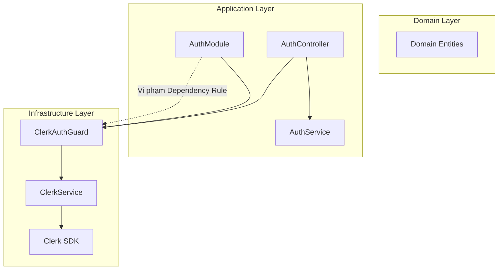
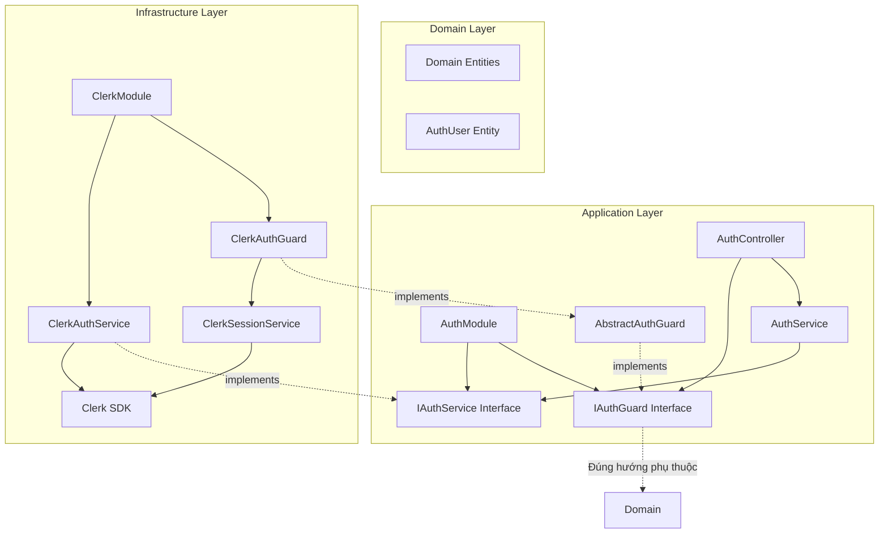

# BÁO CÁO ĐỀ XUẤT GIẢI PHÁP ABSTRACTION CHO AUTH CLERK

## TỔNG QUAN

### Thông tin báo cáo
- **Tiêu đề**: Đề xuất giải pháp Abstraction cho Auth Module trong kiến trúc Clean Architecture
- **Ngày**: Tháng 12, 2024
- **Phạm vi**: Module xác thực sử dụng Clerk trong dự án NestJS
- **Mục tiêu**: Giải quyết vi phạm Dependency Rule và cải thiện kiến trúc hệ thống

### Tóm tắt nội dung
Báo cáo này phân tích vấn đề vi phạm nguyên tắc Clean Architecture trong việc triển khai Auth Module hiện tại và đề xuất giải pháp tái cấu trúc sử dụng Abstraction Layer để đảm bảo tuân thủ các nguyên tắc kiến trúc phần mềm.

## 1. PHÂN TÍCH HIỆN TRẠNG

### 1.1 Bối cảnh dự án
Dự án hiện tại được xây dựng trên nền tảng NestJS và tuân theo kiến trúc Clean Architecture với ba lớp chính:
- **Domain Layer**: Chứa các business entities và business rules
- **Application Layer**: Chứa các use cases và application business logic
- **Infrastructure Layer**: Chứa các implementation cụ thể và tương tác với bên ngoài

Quy tắc phụ thuộc (Dependency Rule) quy định rằng các phụ thuộc chỉ được phép hướng vào trong: Infrastructure -> Application -> Domain.

### 1.2 Vấn đề hiện tại
AuthModule đang vi phạm Dependency Rule bằng cách sử dụng trực tiếp ClerkAuthGuard từ Infrastructure Layer:

```typescript
// Hiện trạng vi phạm
// AuthModule (Application Layer) -> ClerkAuthGuard (Infrastructure Layer)
```

### 1.3 Xác nhận vấn đề
Sau khi phân tích kỹ lưỡng, xác nhận rằng việc AuthModule (Application Layer) phụ thuộc trực tiếp vào ClerkAuthGuard (Infrastructure Layer) là một vi phạm nghiêm trọng đối với các nguyên tắc của Clean Architecture.

## 2. PHÂN TÍCH CHI TIẾT VẤN ĐỀ

### 2.1 Các nguyên tắc bị vi phạm

#### 2.1.1 Dependency Inversion Principle (DIP)
- Module cấp cao (Application) không nên phụ thuộc vào module cấp thấp (Infrastructure)
- Cả hai nên phụ thuộc vào abstraction
- Abstraction không nên phụ thuộc vào chi tiết implementation
- Chi tiết implementation nên phụ thuộc vào abstraction

#### 2.1.2 Dependency Rule của Clean Architecture
- Phụ thuộc chỉ được phép hướng vào trong theo thứ tự: Infrastructure -> Application -> Domain
- Không cho phép phụ thuộc ngược chiều

### 2.2 Hậu quả của vi phạm

#### 2.2.1 Liên kết chặt chẽ (Tight Coupling)
- Application Layer bị ràng buộc với công nghệ cụ thể (Clerk)
- Khó khăn trong việc thay đổi nhà cung cấp dịch vụ xác thực
- Giảm tính linh hoạt của hệ thống

#### 2.2.2 Khó khăn trong kiểm thử
- Không thể test Application Layer một cách độc lập
- Phải mock toàn bộ Clerk service khi test business logic
- Tăng độ phức tạp và thời gian cho việc viết test

#### 2.2.3 Vi phạm Single Responsibility Principle
- Application Layer phải biết về chi tiết implementation của Infrastructure
- Trộn lẫn business logic với technical implementation

#### 2.2.4 Giảm khả năng tái sử dụng
- Không thể sử dụng lại Application logic với provider khác
- Hạn chế khả năng đóng gói thành library độc lập

#### 2.2.5 Khó khăn trong bảo trì và mở rộng
- Thay đổi trong Infrastructure ảnh hưởng trực tiếp đến Application
- Tăng chi phí bảo trì trong dài hạn

## 3. GIẢI PHÁP ĐỀ XUẤT

### 3.1 Tổng quan giải pháp
Áp dụng Dependency Inversion Principle thông qua việc:
1. Định nghĩa các abstraction (interface) trong Application Layer
2. Triển khai các implementation cụ thể trong Infrastructure Layer
3. Sử dụng Dependency Injection để kết nối các layer

### 3.2 Kiến trúc đề xuất

#### 3.2.1 Sơ đồ kiến trúc hiện tại


#### 3.2.2 Sơ đồ kiến trúc đề xuất


## 4. CHI TIẾT TRIỂN KHAI

### 4.1 Bước 1: Định nghĩa Interface trong Application Layer

#### 4.1.1 Interface cho Auth Guard
```typescript
// src/modules/auth/interfaces/auth-guard.interface.ts
import { CanActivate, ExecutionContext } from '@nestjs/common';
import { Observable } from 'rxjs';

export interface IAuthGuard extends CanActivate {
  canActivate(
    context: ExecutionContext,
  ): boolean | Promise<boolean> | Observable<boolean>;
}

// Token injection để tránh circular dependency
export const AUTH_GUARD_TOKEN = Symbol('AUTH_GUARD_TOKEN');
```

#### 4.1.2 Interface cho Auth Service
```typescript
// src/modules/auth/interfaces/auth-service.interface.ts
export interface IAuthService {
  validateUser(token: string): Promise<AuthUser | null>;
  getUserPermissions(userId: string): Promise<string[]>;
}

export interface AuthUser {
  id: string;
  email: string;
  roles: string[];
  metadata?: Record<string, any>;
}

export const AUTH_SERVICE_TOKEN = Symbol('AUTH_SERVICE_TOKEN');
```

### 4.2 Bước 2: Tạo Abstract Guard trong Application Layer

```typescript
// src/modules/auth/guards/abstract-auth.guard.ts
import { Injectable, ExecutionContext } from '@nestjs/common';
import { IAuthGuard } from '../interfaces/auth-guard.interface';

@Injectable()
export abstract class AbstractAuthGuard implements IAuthGuard {
  abstract canActivate(
    context: ExecutionContext,
  ): boolean | Promise<boolean> | Observable<boolean>;
  
  protected extractTokenFromRequest(request: any): string | null {
    const [type, token] = request.headers.authorization?.split(' ') ?? [];
    return type === 'Bearer' ? token : null;
  }
}
```

### 4.3 Bước 3: Implementation trong Infrastructure Layer

#### 4.3.1 Clerk Auth Guard Implementation
```typescript
// src/modules/Infrastructure/clerk/guards/clerk-auth.guard.ts
import { Injectable, ExecutionContext, UnauthorizedException, Inject } from '@nestjs/common';
import { AbstractAuthGuard } from '../../../auth/guards/abstract-auth.guard';
import { ClerkSessionService } from '../clerk.session.service';
import { IAuthService, AUTH_SERVICE_TOKEN } from '../../../auth/interfaces/auth-service.interface';

@Injectable()
export class ClerkAuthGuard extends AbstractAuthGuard {
  constructor(
    private readonly clerkSessionService: ClerkSessionService,
    @Inject(AUTH_SERVICE_TOKEN) private readonly authService: IAuthService,
  ) {
    super();
  }

  async canActivate(context: ExecutionContext): Promise<boolean> {
    const request = context.switchToHttp().getRequest();
    
    try {
      const sessionToken = this.extractTokenFromRequest(request);
      if (!sessionToken) {
        throw new UnauthorizedException('No token provided');
      }

      const session = await this.clerkSessionService.verifySession(sessionToken);
      if (!session || !session.userId) {
        throw new UnauthorizedException('Invalid session');
      }

      const user = await this.authService.validateUser(session.userId);
      if (!user) {
        throw new UnauthorizedException('User not found');
      }

      request.user = user;
      return true;
    } catch (error) {
      throw new UnauthorizedException('Authentication failed');
    }
  }
}
```

#### 4.3.2 Clerk Auth Service Implementation
```typescript
// src/modules/Infrastructure/clerk/services/clerk-auth.service.ts
import { Injectable } from '@nestjs/common';
import { IAuthService, AuthUser } from '../../../auth/interfaces/auth-service.interface';
import { ClerkClient } from '@clerk/backend';

@Injectable()
export class ClerkAuthService implements IAuthService {
  private clerkClient: ClerkClient;

  constructor() {
    this.clerkClient = new ClerkClient({
      secretKey: process.env.CLERK_SECRET_KEY,
    });
  }

  async validateUser(userId: string): Promise<AuthUser | null> {
    try {
      const user = await this.clerkClient.users.getUser(userId);
      if (!user) return null;

      return {
        id: user.id,
        email: user.emailAddresses[0]?.emailAddress || '',
        roles: user.publicMetadata?.roles as string[] || [],
        metadata: user.publicMetadata,
      };
    } catch (error) {
      return null;
    }
  }

  async getUserPermissions(userId: string): Promise<string[]> {
    const user = await this.validateUser(userId);
    return user?.roles || [];
  }
}
```

### 4.4 Bước 4: Cấu hình Module với Dependency Injection

#### 4.4.1 Auth Module Configuration
```typescript
// src/modules/auth/auth.module.ts
import { Module, DynamicModule, Type } from '@nestjs/common';
import { AuthController } from './auth.controller';
import { AuthService } from './auth.service';
import { 
  AUTH_GUARD_TOKEN, 
  AUTH_SERVICE_TOKEN,
  IAuthGuard,
  IAuthService 
} from './interfaces';

@Module({})
export class AuthModule {
  static register(options: AuthModuleOptions): DynamicModule {
    return {
      module: AuthModule,
      controllers: [AuthController],
      providers: [
        AuthService,
        {
          provide: AUTH_GUARD_TOKEN,
          useClass: options.guardClass,
        },
        {
          provide: AUTH_SERVICE_TOKEN,
          useClass: options.authServiceClass,
        },
      ],
      exports: [
        AUTH_GUARD_TOKEN,
        AUTH_SERVICE_TOKEN,
        AuthService,
      ],
    };
  }
}

export interface AuthModuleOptions {
  guardClass: Type<IAuthGuard>;
  authServiceClass: Type<IAuthService>;
}
```

#### 4.4.2 Clerk Module Configuration
```typescript
// src/modules/Infrastructure/clerk/clerk.module.ts
import { Module } from '@nestjs/common';
import { ClerkAuthGuard } from './guards/clerk-auth.guard';
import { ClerkAuthService } from './services/clerk-auth.service';
import { ClerkSessionService } from './clerk.session.service';
import { ClerkController } from './clerk.controller';

@Module({
  providers: [
    ClerkAuthGuard,
    ClerkAuthService,
    ClerkSessionService,
  ],
  controllers: [ClerkController],
  exports: [
    ClerkAuthGuard,
    ClerkAuthService,
  ],
})
export class ClerkModule {}
```

### 4.5 Bước 5: Tích hợp trong App Module

```typescript
// src/app.module.ts
import { Module } from '@nestjs/common';
import { AuthModule } from './modules/auth/auth.module';
import { ClerkModule } from './modules/Infrastructure/clerk/clerk.module';
import { ClerkAuthGuard } from './modules/Infrastructure/clerk/guards/clerk-auth.guard';
import { ClerkAuthService } from './modules/Infrastructure/clerk/services/clerk-auth.service';

@Module({
  imports: [
    ClerkModule,
    AuthModule.register({
      guardClass: ClerkAuthGuard,
      authServiceClass: ClerkAuthService,
    }),
    // ... other modules
  ],
})
export class AppModule {}
```

### 4.6 Bước 6: Sử dụng Guard thông qua Injection

#### 4.6.1 Sử dụng trong Controller
```typescript
// src/modules/auth/auth.controller.ts
import { Controller, Get, UseGuards, Inject } from '@nestjs/common';
import { AUTH_GUARD_TOKEN, IAuthGuard } from './interfaces';

@Controller('auth')
export class AuthController {
  constructor(
    @Inject(AUTH_GUARD_TOKEN) private readonly authGuard: IAuthGuard,
  ) {}

  @Get('profile')
  @UseGuards(AUTH_GUARD_TOKEN)
  async getProfile() {
    return { message: 'Protected route' };
  }
}
```

#### 4.6.2 Custom Decorator
```typescript
// src/modules/auth/decorators/auth.decorator.ts
import { UseGuards, applyDecorators } from '@nestjs/common';
import { AUTH_GUARD_TOKEN } from '../interfaces';

export function RequireAuth() {
  return applyDecorators(
    UseGuards(AUTH_GUARD_TOKEN),
  );
}

// Sử dụng decorator
@Controller('users')
export class UsersController {
  @Get()
  @RequireAuth()
  async getUsers() {
    return [];
  }
}
```

## 5. LỢI ÍCH CỦA GIẢI PHÁP

### 5.1 Tính linh hoạt cao
- Dễ dàng thay thế Clerk bằng các provider khác (Auth0, Firebase Auth, custom solution)
- Chỉ cần implement lại interface trong Infrastructure Layer
- Không ảnh hưởng đến Application Layer

### 5.2 Khả năng kiểm thử được cải thiện
- Test Application Layer độc lập với mock implementation
- Unit test dễ dàng hơn nhờ dependency injection
- Giảm thời gian và chi phí cho việc viết test

### 5.3 Giảm phụ thuộc
- Application Layer không cần biết về Clerk
- Thay đổi trong Clerk không ảnh hưởng đến business logic
- Tăng tính độc lập của các layer

### 5.4 Tuân thủ SOLID principles
- **Single Responsibility**: Mỗi layer có trách nhiệm riêng biệt
- **Open/Closed**: Có thể mở rộng thêm auth provider mà không sửa đổi code hiện tại
- **Liskov Substitution**: Có thể thay thế implementation mà không làm hỏng hệ thống
- **Interface Segregation**: Interface nhỏ gọn, tập trung vào chức năng cụ thể
- **Dependency Inversion**: Phụ thuộc vào abstraction thay vì implementation

### 5.5 Dễ bảo trì và mở rộng
- Code structure rõ ràng, dễ hiểu
- Dễ thêm tính năng mới (multi-tenancy, role-based access control)
- Có thể sử dụng nhiều auth provider cùng lúc
- Giảm technical debt

### 5.6 Tăng khả năng tái sử dụng
- Application logic có thể sử dụng trong các context khác
- Có thể đóng gói thành library độc lập
- Tăng ROI cho việc phát triển

## 6. KẾ HOẠCH TRIỂN KHAI

### 6.1 Giai đoạn 1: Chuẩn bị (1 tuần)
- Review và phê duyệt giải pháp
- Lập kế hoạch chi tiết
- Chuẩn bị môi trường development

### 6.2 Giai đoạn 2: Triển khai (2 tuần)
- Tuần 1: Tạo interfaces và abstract classes
- Tuần 2: Implement Clerk services và guards

### 6.3 Giai đoạn 3: Testing (1 tuần)
- Unit testing cho các component mới
- Integration testing
- End-to-end testing

### 6.4 Giai đoạn 4: Migration (1 tuần)
- Migrate từng module một
- Monitoring và fix issues
- Documentation update

### 6.5 Giai đoạn 5: Hoàn thiện (1 tuần)
- Code review
- Performance testing
- Deployment to production

## 7. RỦI RO VÀ GIẢI PHÁP

### 7.1 Rủi ro kỹ thuật
- **Rủi ro**: Breaking changes trong quá trình migration
- **Giải pháp**: Áp dụng feature flags, migrate từng phần

### 7.2 Rủi ro về thời gian
- **Rủi ro**: Dự án kéo dài hơn dự kiến
- **Giải pháp**: Có buffer time, ưu tiên critical paths

### 7.3 Rủi ro về nguồn lực
- **Rủi ro**: Thiếu developer có kinh nghiệm
- **Giải pháp**: Training, pair programming, documentation

## 8. KẾT LUẬN

### 8.1 Tóm tắt
Giải pháp đề xuất giải quyết triệt để vấn đề vi phạm Clean Architecture trong Auth Module bằng cách áp dụng Dependency Inversion Principle thông qua abstraction layer. Điều này không chỉ giải quyết vấn đề hiện tại mà còn tạo nền tảng vững chắc cho sự phát triển trong tương lai.

### 8.2 Khuyến nghị
Khuyến nghị triển khai giải pháp này sớm nhất có thể để:
- Tránh technical debt tích lũy thêm
- Cải thiện chất lượng code base
- Tạo tiền đề cho việc scale hệ thống

### 8.3 Bước tiếp theo
1. Review và phê duyệt báo cáo
2. Lập kế hoạch triển khai chi tiết
3. Bắt đầu implementation theo phases đã định

## PHỤ LỤC

### A. Tài liệu tham khảo
- Clean Architecture - Robert C. Martin
- Domain-Driven Design - Eric Evans
- NestJS Official Documentation
- SOLID Principles in TypeScript

### B. Glossary
- **DIP**: Dependency Inversion Principle
- **DDD**: Domain-Driven Design
- **DI**: Dependency Injection
- **IoC**: Inversion of Control

### C. Changelog
- Version 1.0 - Initial proposal (12/2024) 