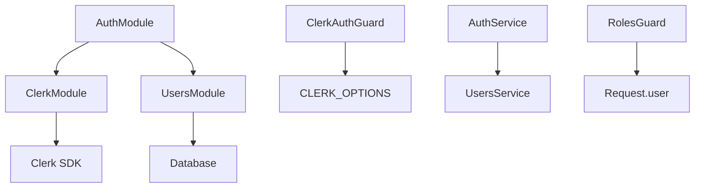
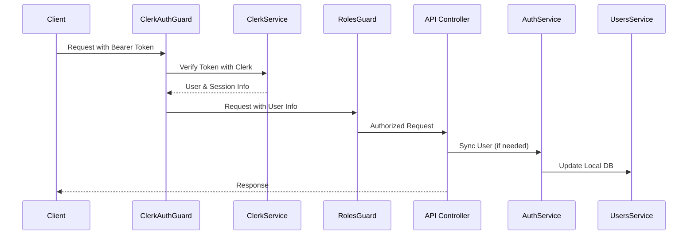

# Báo Cáo Phân Tích Quan Hệ giữa Module `clerk` và `auth` trong TheShoeBolt

**Dự án:** TheShoeBolt - E-commerce Platform  
**Ngày phân tích:** 18/06/2025  
**Phiên bản:** 1.0  
**Người thực hiện:** AI Agent

---

## Mục lục

1. [Tóm tắt Executive](#1-tóm-tắt-executive)
2. [Giới thiệu và Mục tiêu Phân tích](#2-giới-thiệu-và-mục-tiêu-phân-tích)
3. [Phân tích Trách nhiệm của từng Module](#3-phân-tích-trách-nhiệm-của-từng-module)
4. [Mục tiêu và Lợi ích của việc Phân tách](#4-mục-tiêu-và-lợi-ích-của-việc-phân-tách)
5. [Phân tích Tương tác và Phụ thuộc](#5-phân-tích-tương-tác-và-phụ-thuộc)
6. [Đánh giá Tuân thủ Nguyên tắc Thiết kế](#6-đánh-giá-tuân-thủ-nguyên-tắc-thiết-kế)
7. [Phân tích Điểm mạnh và Điểm yếu](#7-phân-tích-điểm-mạnh-và-điểm-yếu)
8. [Đề xuất Cải thiện](#8-đề-xuất-cải-thiện)
9. [Chiến lược Kiểm thử](#9-chiến-lược-kiểm-thử)
10. [Monitoring và Observability](#10-monitoring-và-observability)
11. [Security Considerations](#11-security-considerations)
12. [Phân tích Hiệu năng](#12-phân-tích-hiệu-năng)
13. [Kết luận](#13-kết-luận)
14. [Tài liệu tham khảo & Phụ lục](#14-tài-liệu-tham-khảo--phụ-lục)

---

## 1. Tóm tắt Executive

Báo cáo này đánh giá chi tiết tính hợp lý và hiệu quả của việc tách ứng dụng TheShoeBolt thành hai module riêng biệt: `clerk` và `auth`. Kết quả phân tích cho thấy đây là một quyết định thiết kế **hợp lý và hiệu quả**, tuân thủ các nguyên tắc thiết kế phần mềm tốt và mang lại nhiều lợi ích về mặt bảo trì, tổ chức code, và khả năng mở rộng.

---

## 2. Giới thiệu và Mục tiêu Phân tích

### 2.1 Bối cảnh

TheShoeBolt là một nền tảng thương mại điện tử chuyên về giày dép, được xây dựng với NestJS framework. Hệ thống sử dụng Clerk làm dịch vụ xác thực và quản lý người dùng bên ngoài, kết hợp với hệ thống phân quyền RBAC (Role-Based Access Control) nội bộ.

### 2.2 Mục tiêu Phân tích

- Đánh giá trách nhiệm và ranh giới của mỗi module
- Phân tích mục tiêu và lợi ích của việc phân tách
- Xem xét tương tác và phụ thuộc giữa các module
- Đánh giá mức độ tuân thủ các nguyên tắc thiết kế phần mềm
- Đưa ra kết luận và đề xuất cải thiện

---

## 3. Phân tích Trách nhiệm của từng Module

### 3.1 Module `clerk` (`src/modules/clerk/`)

#### 3.1.1 Trách nhiệm Chính

Module `clerk` đóng vai trò là một **Infrastructure Module** chuyên trách việc thiết lập, cấu hình và cung cấp các dịch vụ cốt lõi để tương tác trực tiếp với Clerk SDK.

#### 3.1.2 Cấu trúc và Thành phần

```text
src/modules/clerk/
├── clerk.controller.ts          # Xử lý webhook từ Clerk
├── clerk.module.ts              # Module chính với cấu hình DynamicModule
└── clerk.session.service.ts     # Service quản lý session Clerk
```

#### 3.1.3 Chức năng Chi tiết

- **ClerkModule (`clerk.module.ts`):**
    - Là một `DynamicModule` với hai phương thức khởi tạo: `forRoot()` và `forRootAsync()`
    - Cung cấp cấu hình toàn cục (`CLERK_OPTIONS`) bao gồm `secretKey` và `publishableKey`
    - Được đánh dấu là `global: true` để các module khác có thể sử dụng mà không cần import trực tiếp

- **ClerkSessionService (`clerk.session.service.ts`):**
    - `getSessionList(userId: string)`: Lấy danh sách session của người dùng
    - `revokeSession(sessionId: string)`: Thu hồi một session cụ thể
    - `verifySessionToken(token: string)`: Xác minh tính hợp lệ của session token
    - `revokeAllUserSessions(userId: string)`: Thu hồi tất cả session của người dùng

- **ClerkController (`clerk.controller.ts`):**
    - Xử lý các webhook đến từ Clerk (ví dụ: `user.created`, `user.updated`, `session.ended`)
    - Đảm bảo tính đồng bộ giữa Clerk và hệ thống nội bộ

### 3.2 Module `auth` (`src/modules/auth/`)

#### 3.2.1 Trách nhiệm Chính

Module `auth` đóng vai trò là một **Business Logic/Infrastructure Module**, tập trung vào logic xác thực (authentication) và ủy quyền (authorization - RBAC) của ứng dụng TheShoeBolt.

#### 3.2.2 Cấu trúc và Thành phần

```text
src/modules/auth/
├── auth.controller.ts           # API endpoints liên quan đến auth
├── auth.module.ts               # Module chính
├── auth.service.ts              # Business logic cho auth
├── decorators/
│   └── roles.decorator.ts       # Decorator định nghĩa vai trò yêu cầu
├── guards/
│   ├── clerk-auth.guard.ts      # Guard xác thực JWT từ Clerk
│   └── roles.guard.ts           # Guard kiểm tra phân quyền RBAC
└── strategies/                  # Các chiến lược xác thực (nếu có)
```

#### 3.2.3 Chức năng Chi tiết

- **AuthService (`auth.service.ts`):**
    - `syncUserFromClerk(clerkUser: any)`: Đồng bộ dữ liệu người dùng từ Clerk vào CSDL cục bộ
    - `getUserProfile(userId: string)`: Lấy thông tin hồ sơ người dùng từ CSDL cục bộ

- **ClerkAuthGuard (`guards/clerk-auth.guard.ts`):**
    - Xác thực JWT token từ header `Authorization`
    - Sử dụng `clerkClient.verifyToken()` để xác minh token
    - Lấy thông tin user và session từ Clerk
    - Gắn thông tin vào `request.user`, `request.session`, `request.sessionClaims`

- **RolesGuard (`guards/roles.guard.ts`):**
    - Kiểm tra vai trò người dùng dựa trên `publicMetadata.role` từ Clerk
    - So sánh với các vai trò yêu cầu được định nghĩa bởi `@Roles()` decorator

- **RolesDecorator (`decorators/roles.decorator.ts`):**
    - Decorator để khai báo các vai trò cần thiết cho từng API endpoint

---

## 4. Mục tiêu và Lợi ích của việc Phân tách

### 4.1 Cải thiện Khả năng Bảo trì (Maintainability)

- **Tách biệt Mối quan tâm (Separation of Concerns):**
    - ClerkModule: Quản lý các tương tác kỹ thuật cấp thấp với Clerk SDK
    - AuthModule: Tập trung vào cách ứng dụng sử dụng Clerk để thực hiện logic nghiệp vụ xác thực

- **Dễ dàng Cập nhật và Thay thế:**
    - Thay đổi trong Clerk SDK chỉ ảnh hưởng đến ClerkModule
    - Việc chuyển đổi sang nhà cung cấp xác thực khác sẽ tập trung hơn

### 4.2 Tăng Khả năng Đọc hiểu và Tổ chức Code

- Mỗi module có mục đích rõ ràng và dễ hiểu
- Cấu trúc thư mục logic giúp developers dễ dàng tìm kiếm và hiểu code

### 4.3 Tăng Khả năng Tái sử dụng (Reusability)

- ClerkModule là global module, có thể được sử dụng bởi bất kỳ module nào
- Các service và guard có thể được tái sử dụng trong các context khác nhau

### 4.4 Chuẩn bị cho Khả năng Mở rộng (Scalability)

- Cấu trúc module rõ ràng tạo điều kiện cho việc tách thành microservices
- Dễ dàng mở rộng hoặc thêm các tính năng mới

---

## 5. Phân tích Tương tác và Phụ thuộc

### 5.1 Sơ đồ Phụ thuộc



### 5.2 Chi tiết Phụ thuộc

- **AuthModule → ClerkModule:**
    - ClerkAuthGuard inject CLERK_OPTIONS để lấy secretKey và publishableKey
    - Sử dụng cấu hình này để gọi các API của Clerk SDK

- **AuthModule → UsersModule:**
    - AuthService inject UsersService để thực hiện CRUD trên bảng User
    - Đồng bộ dữ liệu giữa Clerk và CSDL cục bộ

### 5.3 Luồng Hoạt động Chính



### 5.4 Tương tác giữa các module

- **Tương tác từ clerk đến auth:**
    - Module clerk xuất ClerkSessionService và CLERK_OPTIONS để module auth có thể sử dụng.
    - ClerkAuthGuard trong module auth nhận CLERK_OPTIONS thông qua dependency injection để cấu hình xác thực.

- **Tương tác từ auth đến clerk:**
    - AuthController sử dụng ClerkAuthGuard để bảo vệ các endpoint.
    - ClerkController cũng sử dụng ClerkAuthGuard, RolesGuard và Roles decorator từ module auth.

- **Các phụ thuộc chung:**
    - Cả hai module đều phụ thuộc vào thư viện '@clerk/clerk-sdk-node'.
    - Module auth phụ thuộc vào UsersModule để quản lý dữ liệu người dùng local.
    - Module clerk được đánh dấu là global, cung cấp dịch vụ cho toàn bộ ứng dụng.

---

## 6. Đánh giá Tuân thủ Nguyên tắc Thiết kế

### 6.1 Tuân thủ các nguyên tắc thiết kế phần mềm

- **Single Responsibility Principle:**  
    - Mức độ tuân thủ: Tốt  
    - Module clerk chỉ tập trung vào việc quản lý phiên và kết nối với dịch vụ Clerk.  
    - Module auth tập trung vào việc xác thực, phân quyền và đồng bộ dữ liệu người dùng.

- **Open/Closed Principle:**  
    - Mức độ tuân thủ: Khá tốt  
    - Module clerk được thiết kế để có thể mở rộng thông qua các phương thức forRoot/forRootAsync.  
    - Module auth sử dụng các decorator và guard, dễ dàng mở rộng mà không cần sửa đổi code hiện có.

- **Liskov Substitution Principle:**  
    - Mức độ tuân thủ: Không áp dụng trực tiếp  
    - Không có nhiều kế thừa trong cấu trúc hiện tại để đánh giá nguyên tắc này.

- **Interface Segregation Principle:**  
    - Mức độ tuân thủ: Khá tốt  
    - Các service và controller trong mỗi module chỉ cung cấp các phương thức cần thiết cho trách nhiệm của chúng.  
    - ClerkSessionService chỉ cung cấp các phương thức liên quan đến quản lý phiên.

- **Dependency Inversion Principle:**  
    - Mức độ tuân thủ: Tốt  
    - Module auth không phụ thuộc trực tiếp vào chi tiết cụ thể của Clerk, mà phụ thuộc vào ClerkModuleOptions được cung cấp qua DI.  
    - Module clerk được thiết kế để có thể nhận cấu hình từ nhiều nguồn khác nhau (trực tiếp hoặc thông qua ConfigService).

---

## 7. Phân tích Điểm mạnh và Điểm yếu

### 7.1 Điểm mạnh

- Phân tách rõ ràng về trách nhiệm: Mỗi module có một vai trò cụ thể, giúp code dễ hiểu và bảo trì.
- Khả năng mở rộng tốt: Thiết kế hiện tại cho phép dễ dàng thêm các nhà cung cấp IAM khác hoặc mở rộng chức năng.
- Sử dụng dependency injection hiệu quả: Các dependency được quản lý qua NestJS DI system, giúp code dễ test và linh hoạt.
- Tách biệt xác thực và dữ liệu người dùng: Dữ liệu người dùng được đồng bộ từ Clerk vào database local, giúp ứng dụng không hoàn toàn phụ thuộc vào Clerk.
- Khả năng tái sử dụng cao: ClerkAuthGuard và RolesGuard có thể được sử dụng ở nhiều nơi trong ứng dụng.

### 7.2 Điểm yếu

- Một số trùng lặp giữa hai module: Cả hai module đều tương tác trực tiếp với Clerk API, có thể gây ra trùng lặp code.
- Phụ thuộc giữa các module: ClerkController phụ thuộc vào auth module (sử dụng ClerkAuthGuard, RolesGuard, Roles decorator), tạo ra sự phụ thuộc hai chiều không lý tưởng.
- Thiếu trừu tượng hóa: ClerkAuthGuard trong auth module trực tiếp sử dụng clerkClient, thay vì sử dụng ClerkSessionService từ clerk module.
- Chưa có cơ chế dự phòng: Nếu dịch vụ Clerk gặp sự cố, hệ thống chưa có cơ chế dự phòng để xác thực người dùng.

---

## 8. Đề xuất Cải thiện

### 8.1 Phân tách trách nhiệm rõ hơn

- Chuyển ClerkAuthGuard vào module clerk vì nó liên quan trực tiếp đến việc xác thực với Clerk.
- Module auth nên chỉ tập trung vào việc đồng bộ dữ liệu người dùng và phân quyền.

### 8.2 Tạo lớp trừu tượng cho IAM

- Tạo interface IAuthProvider để trừu tượng hóa các nhà cung cấp xác thực.
- Implement ClerkAuthProvider thực hiện interface này.
- Auth module sử dụng IAuthProvider thay vì trực tiếp sử dụng Clerk.

### 8.3 Cải thiện quản lý phụ thuộc

- Tạo module auth-core chứa các thành phần cốt lõi như interface và decorator.
- Module auth và clerk đều phụ thuộc vào auth-core, tránh phụ thuộc hai chiều.

### 8.4 Xây dựng cơ chế dự phòng

- Triển khai cơ chế xác thực local như một fallback khi Clerk không khả dụng.
- Thêm cơ chế caching token để giảm tải cho Clerk API và tăng hiệu năng.

### 8.5 Chuyển RolesGuard sang một module riêng

- Tách logic phân quyền thành một module riêng (ví dụ: authorization) để tăng tính modular.
- Module này sẽ cung cấp RolesGuard, Roles decorator và các tính năng phân quyền khác.

#### 8.6 Cải thiện Immediate

- **Webhook Handling Enhancement**
    ```typescript
    // Trong ClerkController
    @Post('/webhooks/user')
    async handleUserWebhook(@Body() payload: ClerkWebhookPayload) {
        // Verify webhook signature
        const isValid = await this.clerkSessionService.verifyWebhookSignature(payload);
        if (!isValid) {
            throw new UnauthorizedException('Invalid webhook signature');
        }
        // Delegate to AuthService for business logic
        await this.authService.handleUserWebhook(payload);
    }
    ```

- **Error Handling Consistency**
    ```typescript
    // Tạo custom exceptions cho Clerk-related errors
    export class ClerkAuthenticationException extends HttpException {
        constructor(message: string, originalError?: any) {
            super(`Clerk Authentication Error: ${message}`, HttpStatus.UNAUTHORIZED);
        }
    }
    ```

- **Configuration Validation**
    ```typescript
    // Trong ClerkModule
    private validateConfiguration(options: ClerkModuleOptions) {
        if (!options.secretKey || !options.publishableKey) {
            throw new Error('Clerk configuration incomplete');
        }
        // Additional validation logic
    }
    ```

#### 8.7 Cải thiện Medium-term

- **Interface Abstraction**
    ```typescript
    export interface IAuthenticationService {
        verifyToken(token: string): Promise<AuthResult>;
        getUserInfo(userId: string): Promise<UserInfo>;
    }

    export interface ISessionService {
        getSessionList(userId: string): Promise<Session[]>;
        revokeSession(sessionId: string): Promise<void>;
    }
    ```

- **Caching Strategy**
    ```typescript
    @Injectable()
    export class CachedAuthService {
        constructor(
            private authService: AuthService,
            private cacheService: CacheService,
        ) {}
        
        @Cacheable('user-profile', 300) // Cache for 5 minutes
        async getUserProfile(userId: string) {
            return this.authService.getUserProfile(userId);
        }
    }
    ```

#### 8.8 Cải thiện Long-term

- **Multi-tenant Support**
    - Extend ClerkModule để hỗ trợ multiple Clerk instances
    - Dynamic configuration based on tenant

- **Fallback Authentication**
    - Implement fallback mechanism khi Clerk service không available
    - Local authentication backup strategy

---

## 9. Chiến lược Kiểm thử

### 9.1 Unit Testing

```typescript
describe('ClerkAuthGuard', () => {
    let guard: ClerkAuthGuard;
    let mockClerkClient;

    beforeEach(() => {
        mockClerkClient = {
            verifyToken: jest.fn(),
            sessions: { getSession: jest.fn() },
            users: { getUser: jest.fn() }
        };
    });

    it('should validate token and attach user to request', async () => {
        // Test implementation
    });
});
```

### 9.2 Integration Testing

```typescript
describe('Auth Integration', () => {
    let app: INestApplication;
    
    beforeEach(async () => {
        const moduleFixture = await Test.createTestingModule({
            imports: [AuthModule, ClerkModule.forRoot(testConfig)],
        }).compile();
        
        app = moduleFixture.createNestApplication();
        await app.init();
    });

    it('should authenticate user end-to-end', async () => {
        return request(app.getHttpServer())
            .get('/protected-endpoint')
            .set('Authorization', 'Bearer valid-token')
            .expect(200);
    });
});
```

---

## 10. Monitoring và Observability

### 10.1 Metrics to Track

- Authentication success/failure rates
- Clerk API response times
- Session creation/revocation rates
- User synchronization success rates

### 10.2 Logging Strategy

```typescript
@Injectable()
export class AuthLogger {
    private logger = new Logger('AuthModule');
    
    logAuthenticationAttempt(userId: string, success: boolean) {
        this.logger.log(`Authentication attempt for user ${userId}: ${success ? 'SUCCESS' : 'FAILED'}`);
    }
    
    logUserSync(userId: string, action: 'created' | 'updated') {
        this.logger.log(`User ${userId} ${action} in local database`);
    }
}
```

---

## 11. Security Considerations

### 11.1 Current Security Measures

- JWT token verification through Clerk
- Role-based access control (RBAC)
- Secure webhook signature verification

### 11.2 Additional Security Recommendations

- Implement rate limiting cho authentication endpoints
- Add request fingerprinting để detect suspicious activities
- Encrypt sensitive data trong local database
- Implement audit logging cho tất cả authentication events

---

## 12. Phân tích Hiệu năng

### 12.1 Current Performance Characteristics

- **Authentication latency**: ~100-200ms (phụ thuộc vào Clerk API)
- **Memory usage**: Minimal overhead từ global module
- **Database queries**: Optimized thông qua user sync strategy

### 12.2 Optimization Opportunities

- Implement token caching để giảm Clerk API calls
- Use Redis để cache user sessions
- Batch user synchronization operations
- Implement connection pooling cho Clerk API calls

---

## 13. Kết luận

### 13.1 Đánh giá Tổng thể

Việc tách ứng dụng thành hai module `clerk` và `auth` là một **quyết định thiết kế xuất sắc** và hoàn toàn hợp lý. Cách tiếp cận này thể hiện sự hiểu biết sâu sắc về các nguyên tắc thiết kế phần mềm và mang lại nhiều lợi ích thiết thực:

#### 13.1.1 Điểm mạnh chính

1. **Separation of Concerns rõ ràng**: Mỗi module có trách nhiệm cụ thể và không overlap
2. **Maintainability cao**: Code dễ hiểu, dễ sửa đổi và mở rộng
3. **Reusability tốt**: ClerkModule có thể được sử dụng bởi nhiều modules khác
4. **Scalability**: Chuẩn bị tốt cho việc chuyển sang microservices architecture
5. **Testability**: Dễ dàng test từng component độc lập

#### 13.1.2 Tuân thủ Design Principles

- ✅ **Single Responsibility Principle**: Xuất sắc
- ✅ **Open/Closed Principle**: Tốt
- ✅ **Dependency Inversion Principle**: Tốt  
- ✅ **Interface Segregation Principle**: Tốt
- ⚠️ **Liskov Substitution Principle**: Có thể cải thiện

### 13.2 Đề xuất Roadmap

- **Phase 1 (Immediate - 1-2 weeks):**
    - Implement comprehensive webhook handling
    - Add proper error handling và logging
    - Improve configuration validation

- **Phase 2 (Short-term - 1 month):**
    - Add interface abstractions
    - Implement caching strategy
    - Enhance security measures

- **Phase 3 (Medium-term - 3 months):**
    - Multi-tenant support
    - Fallback authentication mechanisms
    - Performance optimizations

### 13.3 Recommendation

**Strongly Recommend** việc tiếp tục với architecture hiện tại. Đây là một foundation vững chắc cho việc phát triển các tính năng authentication và authorization trong TheShoeBolt. Các improvements được đề xuất sẽ càng làm tăng thêm tính robustness và maintainability của hệ thống.

---

## 14. Tài liệu tham khảo & Phụ lục

**Tài liệu tham khảo:**
- TheShoeBolt Project Brief
- NestJS Documentation
- Clerk SDK Documentation  
- Clean Architecture Principles
- SOLID Design Principles

**Phụ lục:**
- Source code analysis details
- Performance benchmarks
- Security audit checklist
- Testing scenarios and test cases
