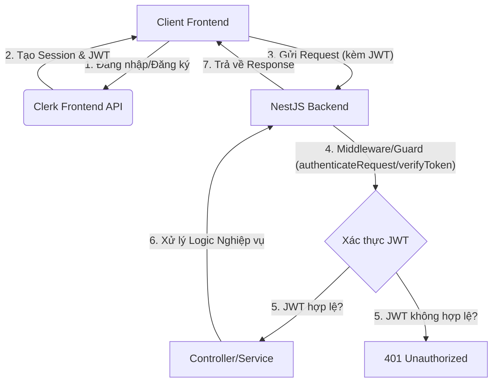
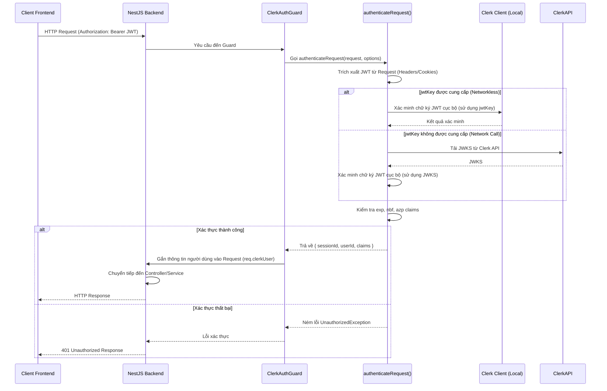
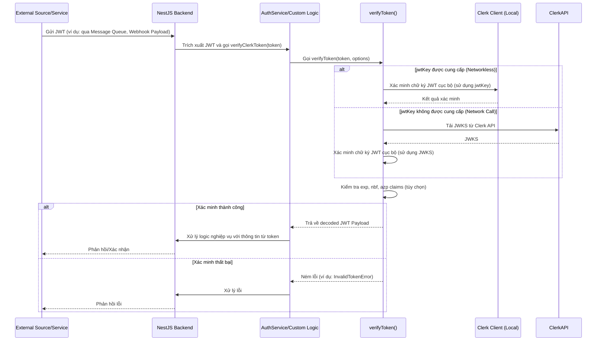

# Tích Hợp Clerk Với NestJS: Phân Tích Chuyên Sâu `authenticateRequest` và `verifyToken`

## Mục lục

1.  Giới thiệu
2.  Tổng quan về Clerk và NestJS
    *   Clerk: Nền tảng xác thực và quản lý người dùng
    *   NestJS: Framework Node.js mạnh mẽ
3.  Cơ chế xác thực JWT của Clerk
    *   JWT là gì?
    *   Vai trò của JWT trong Clerk
    *   Xác thực cục bộ (Networkless) và xác thực qua API
4.  Triển khai Clerk trong NestJS
    *   Cài đặt và cấu hình cơ bản
    *   Tạo Clerk Client Provider
5.  Phân tích chuyên sâu `authenticateRequest`
    *   Cách thức hoạt động và ưu điểm
    *   Ví dụ triển khai trong Guard/Middleware
    *   Các trường hợp sử dụng tối ưu
6.  Phân tích chuyên sâu `verifyToken`
    *   Cách thức hoạt động và ưu điểm
    *   Ví dụ triển khai cho các trường hợp đặc biệt
    *   Các trường hợp sử dụng tối ưu
7.  So sánh và lựa chọn giữa `authenticateRequest` và `verifyToken`
    *   Điểm tương đồng và khác biệt
    *   Khi nào sử dụng phương thức nào?
    *   Đảm bảo bảo mật và hiệu quả tối ưu
8.  Xử lý Webhook từ Clerk
    *   Tầm quan trọng của Webhook
    *   Triển khai Webhook Listener trong NestJS
9.  Kết luận
10. Tài liệu tham khảo


## 1. Giới thiệu

Trong bối cảnh phát triển ứng dụng hiện đại, việc quản lý xác thực và ủy quyền người dùng là một trong những thách thức lớn nhất đối với các nhà phát triển. Với sự gia tăng của các mối đe dọa bảo mật và nhu cầu về trải nghiệm người dùng liền mạch, việc lựa chọn một giải pháp xác thực mạnh mẽ và linh hoạt trở nên cực kỳ quan trọng. Clerk nổi lên như một nền tảng quản lý người dùng toàn diện, cung cấp các công cụ mạnh mẽ để xử lý xác thực, ủy quyền và quản lý hồ sơ người dùng, giúp các nhà phát triển tập trung vào logic nghiệp vụ cốt lõi của ứng dụng.

NestJS, một framework Node.js tiến bộ, cung cấp một kiến trúc mạnh mẽ và có tổ chức để xây dựng các ứng dụng phía máy chủ hiệu quả và có khả năng mở rộng. Sự kết hợp giữa NestJS và Clerk tạo ra một bộ đôi mạnh mẽ, cho phép các nhà phát triển xây dựng các ứng dụng an toàn, hiệu suất cao với quy trình xác thực được quản lý tốt.

Bài luận này sẽ đi sâu vào cách tích hợp Clerk vào một ứng dụng NestJS, đặc biệt tập trung vào hai phương thức xác thực quan trọng của Clerk: `authenticateRequest()` và `verifyToken()`. Chúng ta sẽ phân tích chi tiết cách thức hoạt động, ưu điểm, các trường hợp sử dụng tối ưu của từng phương thức, đồng thời so sánh chúng để giúp các nhà phát triển đưa ra lựa chọn phù hợp nhất nhằm đảm bảo tính bảo mật và hiệu quả tối ưu cho ứng dụng của mình. Ngoài ra, bài luận cũng sẽ đề cập đến tầm quan trọng của việc xử lý Webhook từ Clerk để duy trì sự đồng bộ dữ liệu giữa Clerk và backend NestJS.


## 2. Tổng quan về Clerk và NestJS

Để hiểu rõ hơn về cách tích hợp Clerk và NestJS, điều quan trọng là phải có cái nhìn tổng quan về từng công nghệ này.

### 2.1. Clerk: Nền tảng xác thực và quản lý người dùng

Clerk là một nền tảng xác thực và quản lý người dùng toàn diện, được thiết kế để đơn giản hóa quá trình thêm xác thực vào các ứng dụng web và di động. Nó cung cấp một bộ công cụ mạnh mẽ bao gồm giao diện người dùng có thể nhúng (embeddable UI components), API linh hoạt và một bảng điều khiển trực quan để quản lý người dùng và phiên. Mục tiêu chính của Clerk là giảm gánh nặng cho các nhà phát triển trong việc xử lý các khía cạnh phức tạp của xác thực, cho phép họ tập trung vào việc xây dựng các tính năng cốt lõi của sản phẩm.

**Các tính năng nổi bật của Clerk bao gồm:**

*   **Đa dạng phương thức đăng nhập:** Hỗ trợ đăng nhập bằng email/mật khẩu, số điện thoại, tài khoản xã hội (Google, Facebook, GitHub, v.v.), magic links, và mã OTP qua email/SMS.
*   **Quản lý phiên (Session Management):** Cung cấp khả năng quản lý vòng đời của phiên người dùng một cách an toàn và hiệu quả.
*   **Xác thực đa yếu tố (Multi-Factor Authentication - MFA):** Tăng cường bảo mật bằng cách yêu cầu nhiều hơn một phương thức xác thực.
*   **Quản lý người dùng:** Bảng điều khiển trực quan để xem, chỉnh sửa và quản lý thông tin người dùng.
*   **Webhook:** Gửi thông báo về các sự kiện quan trọng của người dùng (ví dụ: tạo mới, cập nhật, xóa) đến backend của ứng dụng, giúp đồng bộ hóa dữ liệu.
*   **JWT (JSON Web Tokens):** Sử dụng JWT để mã hóa thông tin phiên và xác thực giữa frontend và backend, đảm bảo tính bảo mật và không trạng thái (stateless).

Bằng cách sử dụng Clerk, các nhà phát triển có thể giảm đáng kể thời gian và công sức cần thiết để xây dựng và duy trì hệ thống xác thực, đồng thời đảm bảo rằng ứng dụng của họ tuân thủ các tiêu chuẩn bảo mật hiện đại.

### 2.2. NestJS: Framework Node.js mạnh mẽ

NestJS là một framework Node.js lũy tiến để xây dựng các ứng dụng phía máy chủ hiệu quả, đáng tin cậy và có khả năng mở rộng. Nó được xây dựng với TypeScript và kết hợp các yếu tố của Lập trình hướng đối tượng (OOP), Lập trình hàm phản ứng (FRP) và Lập trình hướng khía cạnh (AOP). NestJS lấy cảm hứng từ Angular, cung cấp một kiến trúc mô-đun và có tổ chức, giúp dễ dàng quản lý các ứng dụng phức tạp.

**Các đặc điểm chính của NestJS bao gồm:**

*   **Kiến trúc mô-đun:** Ứng dụng được tổ chức thành các mô-đun, giúp dễ dàng quản lý và tái sử dụng mã.
*   **Dependency Injection (DI):** Sử dụng DI để quản lý các thành phần và mối quan hệ giữa chúng, tăng cường khả năng kiểm thử và bảo trì.
*   **Decorators:** Sử dụng các decorator để định nghĩa các controller, service, module, v.v., giúp mã nguồn rõ ràng và dễ đọc.
*   **Middleware, Guards, Interceptors, Pipes:** Cung cấp các cơ chế mạnh mẽ để xử lý các yêu cầu HTTP, xác thực, ủy quyền, biến đổi dữ liệu và xử lý lỗi.
*   **Hỗ trợ TypeScript:** Tận dụng các lợi ích của TypeScript như kiểm tra kiểu tĩnh và IntelliSense, giúp phát triển ứng dụng lớn dễ dàng hơn.
*   **Khả năng mở rộng:** Được thiết kế để xây dựng các ứng dụng có khả năng mở rộng cao, từ các API RESTful đến các ứng dụng vi dịch vụ (microservices).

Sự kết hợp giữa NestJS và Clerk mang lại một giải pháp toàn diện cho việc xây dựng các ứng dụng web hiện đại, nơi NestJS cung cấp cấu trúc backend vững chắc và Clerk đảm nhiệm các tác vụ xác thực phức tạp.


## 3. Cơ chế xác thực JWT của Clerk

JSON Web Token (JWT) là một tiêu chuẩn mở (RFC 7519) định nghĩa một cách an toàn để truyền thông tin giữa các bên dưới dạng một đối tượng JSON. Thông tin này có thể được xác minh và tin cậy vì nó được ký điện tử. JWT đã trở thành một lựa chọn phổ biến cho xác thực và ủy quyền trong các ứng dụng web hiện đại nhờ tính nhỏ gọn, tự chứa và khả năng không trạng thái (stateless).

### 3.1. JWT là gì?

Một JWT bao gồm ba phần được phân tách bằng dấu chấm (`.`):

1.  **Header (Tiêu đề):** Chứa thông tin về loại token (JWT) và thuật toán mã hóa được sử dụng (ví dụ: HS256, RS256).
2.  **Payload (Tải trọng):** Chứa các "claims" (các tuyên bố) về thực thể (thường là người dùng) và các dữ liệu bổ sung. Các claims có thể là:
    *   **Registered claims:** Các claims được định nghĩa trước bởi IANA, không bắt buộc nhưng được khuyến nghị (ví dụ: `iss` (issuer), `exp` (expiration time), `sub` (subject), `aud` (audience)).
    *   **Public claims:** Các claims được định nghĩa bởi những người sử dụng JWT, nhưng phải được đăng ký trong IANA JSON Web Token Registry hoặc được định nghĩa trong một không gian tên (namespace) có khả năng chống va chạm.
    *   **Private claims:** Các claims tùy chỉnh được tạo ra để chia sẻ thông tin giữa các bên đã thống nhất với nhau.
3.  **Signature (Chữ ký):** Được tạo bằng cách mã hóa header và payload với một khóa bí mật (secret key) và thuật toán được chỉ định trong header. Chữ ký này được sử dụng để xác minh rằng token không bị giả mạo và được tạo bởi người gửi hợp lệ.

Cấu trúc của một JWT cho phép nó được truyền đi một cách an toàn giữa client và server, nơi server có thể xác minh tính toàn vẹn và xác thực của token mà không cần phải truy vấn cơ sở dữ liệu hoặc dịch vụ xác thực bên ngoài cho mỗi yêu cầu.

### 3.2. Vai trò của JWT trong Clerk

Clerk sử dụng JWT làm cơ chế chính để quản lý phiên và xác thực người dùng. Khi một người dùng đăng nhập thành công thông qua giao diện của Clerk (ví dụ: Clerk Hosted Pages hoặc các thành phần UI của Clerk trong ứng dụng frontend), Clerk sẽ tạo ra một JWT (được gọi là "session token" trong tài liệu của Clerk) và gửi nó về cho client. Token này sau đó được lưu trữ an toàn trên client (thường là trong cookie hoặc Local Storage) và được gửi kèm theo mỗi yêu cầu đến backend để xác thực.

Vai trò của JWT trong Clerk bao gồm:

*   **Xác thực phiên:** Backend sử dụng JWT để xác định xem yêu cầu đến có phải từ một người dùng đã đăng nhập hợp lệ hay không.
*   **Truyền thông tin người dùng:** Payload của JWT chứa các thông tin cần thiết về người dùng (như ID người dùng, vai trò, v.v.) mà backend có thể giải mã và sử dụng để ủy quyền hoặc cá nhân hóa phản hồi.
*   **Không trạng thái (Stateless):** Backend không cần lưu trữ thông tin phiên của người dùng. Mọi thông tin cần thiết đều nằm trong JWT, giúp backend dễ dàng mở rộng theo chiều ngang.
*   **Bảo mật:** Chữ ký của JWT đảm bảo rằng token không bị thay đổi bởi các bên không được ủy quyền, và thời gian hết hạn (expiration time) giúp giảm thiểu rủi ro khi token bị đánh cắp.

### 3.3. Xác thực cục bộ (Networkless) và xác thực qua API

Một trong những điểm mạnh của việc sử dụng JWT với Clerk là khả năng xác thực token mà không cần phải thực hiện cuộc gọi mạng đến máy chủ Clerk cho mỗi yêu cầu. Điều này được gọi là "xác thực cục bộ" (networkless authentication).

*   **Xác thực cục bộ (Networkless Authentication):**
    *   **Cơ chế:** Clerk ký các JWT bằng khóa riêng của nó. Để xác minh tính hợp lệ của một JWT, backend của bạn chỉ cần khóa công khai tương ứng của Clerk. Khi bạn cung cấp `jwtKey` (là JWKS Public Key của bạn) cho Clerk SDK, SDK có thể xác minh chữ ký của JWT hoàn toàn cục bộ mà không cần kết nối mạng đến máy chủ Clerk [1]. Điều này bao gồm việc kiểm tra chữ ký, thời gian hết hạn (`exp`), thời gian không trước (`nbf`), và các claims khác như `azp` (authorized parties) để đảm bảo token không bị giả mạo và được phát hành bởi một nguồn đáng tin cậy.
    *   **Ưu điểm:** Tăng cường hiệu suất đáng kể bằng cách giảm độ trễ (latency) và giảm tải cho mạng, vì không có cuộc gọi HTTP nào được thực hiện đến máy chủ Clerk cho mỗi lần xác thực. Điều này đặc biệt quan trọng đối với các ứng dụng có lưu lượng truy cập cao.

*   **Xác thực qua API (API-based Authentication):**
    *   **Cơ chế:** Nếu `jwtKey` không được cung cấp, Clerk SDK sẽ thực hiện một cuộc gọi mạng đến máy chủ Clerk để truy xuất JWKS (JSON Web Key Set) và sau đó sử dụng JWKS đó để xác minh token [2].
    *   **Ưu điểm:** Đơn giản hơn trong việc cấu hình ban đầu nếu bạn không muốn quản lý `jwtKey` trực tiếp. Tuy nhiên, nó sẽ có độ trễ cao hơn do phải thực hiện cuộc gọi mạng cho mỗi lần xác thực.

**Khuyến nghị:** Để đạt được hiệu suất tối ưu và giảm thiểu sự phụ thuộc vào kết nối mạng bên ngoài trong quá trình xác thực, **luôn khuyến nghị sử dụng xác thực cục bộ bằng cách cung cấp `jwtKey`** cho Clerk SDK trong backend của bạn. Điều này đảm bảo rằng các yêu cầu xác thực được xử lý nhanh chóng và hiệu quả, ngay cả khi có sự cố mạng tạm thời hoặc khi máy chủ Clerk gặp sự cố.


## 4. Triển khai Clerk trong NestJS

Để tích hợp Clerk vào ứng dụng NestJS, chúng ta cần thực hiện các bước cài đặt và cấu hình cơ bản, sau đó tạo một Clerk Client Provider để dễ dàng sử dụng Clerk SDK trong toàn bộ ứng dụng.

### 4.1. Cài đặt và cấu hình cơ bản

Đầu tiên, chúng ta cần cài đặt các gói thư viện cần thiết cho NestJS và Clerk. Gói `@clerk/backend` là SDK chính để tương tác với Clerk từ phía backend.

```bash
pnpm add @clerk/backend @nestjs/config @nestjs/passport passport passport-custom
```

Sau khi cài đặt, chúng ta cần cấu hình các biến môi trường cần thiết, đặc biệt là `CLERK_PUBLISHABLE_KEY` và `CLERK_SECRET_KEY`. Các khóa này có thể được tìm thấy trong Clerk Dashboard của bạn.

```dotenv
# .env

CLERK_PUBLISHABLE_KEY=pk_test_YOUR_PUBLISHABLE_KEY
CLERK_SECRET_KEY=sk_test_YOUR_SECRET_KEY
CLERK_JWT_KEY=-----BEGIN PUBLIC KEY-----\n...YOUR_JWKS_PUBLIC_KEY...\n-----END PUBLIC KEY-----
```

Lưu ý rằng `CLERK_JWT_KEY` là tùy chọn nhưng rất được khuyến nghị để kích hoạt xác thực cục bộ (networkless authentication), giúp cải thiện hiệu suất đáng kể. Bạn có thể lấy JWKS Public Key từ trang API Keys trong Clerk Dashboard [1].

Tiếp theo, tích hợp `ConfigModule` vào `AppModule` của NestJS để có thể truy cập các biến môi trường một cách dễ dàng:

```typescript
// src/app.module.ts

import { Module } from '@nestjs/common';
import { ConfigModule } from '@nestjs/config';

@Module({
  imports: [
    ConfigModule.forRoot({
      isGlobal: true, // Đảm bảo biến môi trường có thể truy cập toàn cục
    }),
  ],
  controllers: [],
  providers: [],
})
export class AppModule {}
```

### 4.2. Tạo Clerk Client Provider

Để sử dụng `ClerkClient` trong các service hoặc controller của NestJS thông qua Dependency Injection, chúng ta cần tạo một custom provider. Provider này sẽ khởi tạo `ClerkClient` với các khóa API của bạn.

```typescript
// src/providers/clerk-client.provider.ts

import { createClerkClient } from '@clerk/backend';
import { ConfigService } from '@nestjs/config';

export const ClerkClientProvider = {
  provide: 'ClerkClient', // Token để inject ClerkClient
  useFactory: (configService: ConfigService) => {
    return createClerkClient({
      publishableKey: configService.get<string>('CLERK_PUBLISHABLE_KEY'),
      secretKey: configService.get<string>('CLERK_SECRET_KEY'),
    });
  },
  inject: [ConfigService], // Inject ConfigService để lấy biến môi trường
};
```

Sau đó, đăng ký `ClerkClientProvider` này trong `AppModule`:

```typescript
// src/app.module.ts

import { Module } from '@nestjs/common';
import { ConfigModule } from '@nestjs/config';
import { ClerkClientProvider } from './providers/clerk-client.provider';

@Module({
  imports: [
    ConfigModule.forRoot({
      isGlobal: true,
    }),
  ],
  controllers: [],
  providers: [ClerkClientProvider],
})
export class AppModule {}
```

Với cấu hình này, `ClerkClient` đã sẵn sàng để được inject và sử dụng trong các thành phần khác của ứng dụng NestJS, mở đường cho việc triển khai các cơ chế xác thực mạnh mẽ của Clerk.


## 5. Phân tích chuyên sâu `authenticateRequest`

**`authenticateRequest()` là một phương thức cấp cao trong Clerk JavaScript Backend SDK, được thiết kế để đơn giản hóa quá trình xác thực token phiên (session token) từ các yêu cầu HTTP đến backend của bạn**. Phương thức này xử lý nhiều tác vụ phức tạp một cách tự động, giúp các nhà phát triển dễ dàng tích hợp xác thực Clerk vào ứng dụng NestJS.

### 5.1. Cách thức hoạt động và ưu điểm

**`authenticateRequest()` hoạt động bằng cách nhận một đối tượng `request` (thường là đối tượng `req` của Express trong môi trường NestJS) và tự động tìm kiếm token phiên. Token này có thể nằm trong cookie `__session` (đối với các yêu cầu cùng nguồn gốc) hoặc trong header `Authorization` dưới dạng Bearer token (đối với các yêu cầu khác nguồn gốc)**. Sau khi trích xuất token, `authenticateRequest()` sẽ thực hiện các bước xác thực sau:

1.  **Xác minh chữ ký:** Sử dụng khóa công khai của Clerk để xác minh rằng token không bị giả mạo và được ký bởi Clerk.
2.  **Kiểm tra thời gian hiệu lực:** Đảm bảo token chưa hết hạn (`exp`) và đã có hiệu lực (`nbf`).
3.  **Xác thực `azp` (Authorized Parties):** Kiểm tra xem `azp` claim trong token có khớp với các nguồn gốc được phép (authorized parties) mà bạn đã cấu hình hay không. Điều này rất quan trọng để ngăn chặn các cuộc tấn công CSRF (Cross-Site Request Forgery) [1].
4.  **Xác thực không cần mạng (Networkless Authentication):** **Nếu bạn đã cung cấp `jwtKey` (JWKS Public Key) trong cấu hình Clerk Client, `authenticateRequest()` sẽ thực hiện toàn bộ quá trình xác thực cục bộ mà không cần thực hiện bất kỳ cuộc gọi mạng nào đến máy chủ Clerk. Điều này mang lại hiệu suất vượt trội và giảm thiểu độ trễ [1].**

**Ưu điểm của `authenticateRequest()`:**

*   **Đơn giản hóa:** Tự động hóa quá trình trích xuất và xác thực token, giảm thiểu mã boilerplate.
*   **Hiệu suất cao:** Hỗ trợ xác thực không cần mạng, giúp giảm độ trễ và tăng tốc độ phản hồi của API.
*   **Bảo mật:** Tích hợp sẵn các kiểm tra bảo mật quan trọng như xác minh chữ ký và `azp` claim.
*   **Dễ tích hợp:** Phù hợp để sử dụng trong các middleware hoặc guard của NestJS, nơi bạn cần xác thực mọi yêu cầu đến một cách tập trung.

### 5.2. Ví dụ triển khai trong Guard/Middleware

Trong NestJS, `authenticateRequest()` thường được sử dụng trong một Guard tùy chỉnh để bảo vệ các route. Dưới đây là ví dụ về `ClerkAuthGuard`:

```typescript
// src/auth/clerk-auth.guard.ts

import { CanActivate, ExecutionContext, Injectable, UnauthorizedException, Inject } from '@nestjs/common';
import { Request } from 'express';
import { ClerkClient, authenticateRequest } from '@clerk/backend';
import { ConfigService } from '@nestjs/config';

@Injectable()
export class ClerkAuthGuard implements CanActivate {
  constructor(
    @Inject(\'ClerkClient\') private readonly clerkClient: ClerkClient,
    private readonly configService: ConfigService,
  ) {}

  async canActivate(context: ExecutionContext): Promise<boolean> {
    const request = context.switchToHttp().getRequest<Request>();

    try {
      // Lấy JWKS Public Key từ biến môi trường để xác thực networkless
      const jwtKey = this.configService.get<string>(\'CLERK_JWT_KEY\');

      // Sử dụng authenticateRequest để xác thực token
      const { sessionId, userId, orgId, claims } = await authenticateRequest({
        // Truyền đối tượng request của Express
        headers: request.headers,
        cookies: request.cookies,
      }, {
        // Cấu hình các tùy chọn xác thực
        jwtKey: jwtKey, // Để xác thực networkless
        secretKey: this.configService.get<string>(\'CLERK_SECRET_KEY\'), // Cần thiết cho một số trường hợp
        authorizedParties: [this.configService.get<string>(\'CLERK_FRONTEND_API_URL\')], // Đảm bảo token từ nguồn gốc hợp lệ
      });

      if (!userId) {
        throw new UnauthorizedException(\'User not authenticated\');
      }

      // Gắn thông tin người dùng vào request để các controller/service có thể truy cập
      // Lưu ý: Tùy thuộc vào cấu hình Passport hoặc custom logic, bạn có thể gắn user object đầy đủ hơn
      request[\'clerkUser\'] = { sessionId, userId, orgId, claims };

      return true;
    } catch (error) {
      console.error(\'Clerk authentication failed:\', error);
      throw new UnauthorizedException(\'Authentication failed\');
    }
  }
}
```

Để sử dụng Guard này, bạn có thể áp dụng nó cho các controller hoặc route cụ thể:

```typescript
// src/users/users.controller.ts

import { Controller, Get, UseGuards, Req } from '@nestjs/common';
import { ClerkAuthGuard } from '../auth/clerk-auth.guard';
import { Request } from 'express';

interface ClerkRequest extends Request {
  clerkUser?: { sessionId: string; userId: string; orgId?: string; claims: any };
}

@Controller(\'users\')
@UseGuards(ClerkAuthGuard) // Áp dụng Guard cho toàn bộ controller
export class UsersController {
  @Get(\'me\')
  getMe(@Req() req: ClerkRequest) {
    // Thông tin người dùng Clerk có sẵn trong req.clerkUser
    return `Hello, user ${req.clerkUser.userId}!`;
  }
}
```

### 5.3. Các trường hợp sử dụng tối ưu

`authenticateRequest()` là lựa chọn lý tưởng cho các trường hợp sau:

*   **Bảo vệ hầu hết các API endpoint:** Khi bạn cần xác thực mọi yêu cầu đến các API endpoint của mình để đảm bảo chỉ người dùng đã đăng nhập mới có thể truy cập.
*   **Triển khai xác thực toàn cục:** Sử dụng như một Global Guard hoặc trong các Module Guard để áp dụng chính sách xác thực cho một tập hợp lớn các route.
*   **Ứng dụng yêu cầu hiệu suất cao:** Nhờ khả năng xác thực không cần mạng, nó phù hợp cho các ứng dụng có lưu lượng truy cập lớn, nơi mỗi mili giây đều quan trọng.
*   **Đơn giản hóa logic xác thực:** Khi bạn muốn một giải pháp "cắm và chạy" để xử lý xác thực token mà không cần đi sâu vào chi tiết của JWT.


## 6. Phân tích chuyên sâu `verifyToken`

Trong khi `authenticateRequest()` là một phương thức cấp cao tiện lợi, **`verifyToken()` cung cấp một cách tiếp cận cấp thấp hơn để xác minh tính hợp lệ của một JSON Web Token (JWT) do Clerk phát hành. Phương thức này cho phép kiểm soát chi tiết hơn quá trình xác minh và phù hợp với các trường hợp sử dụng đặc biệt.**

### 6.1. Cách thức hoạt động và ưu điểm

`verifyToken()` nhận trực tiếp chuỗi JWT và một đối tượng tùy chọn (`VerifyTokenOptions`) làm tham số. Nó không tự động trích xuất token từ đối tượng request như `authenticateRequest()`. Thay vào đó, bạn phải tự trích xuất token từ header `Authorization` hoặc bất kỳ nguồn nào khác và truyền nó vào hàm.

Quá trình xác minh của `verifyToken()` tương tự như `authenticateRequest()` ở chỗ nó cũng thực hiện:

1.  **Xác minh chữ ký:** Đảm bảo token được ký bằng khóa riêng của Clerk và không bị giả mạo.
2.  **Kiểm tra thời gian hiệu lực:** Xác minh `exp` (expiration time) và `nbf` (not before time) của token.
3.  **Xác thực `azp` (Authorized Parties):** Tùy chọn kiểm tra `azp` claim nếu được cung cấp trong `VerifyTokenOptions`.

**Điểm khác biệt quan trọng:**

*   **Networkless vs. Network Call:** Giống như `authenticateRequest()`, `verifyToken()` cũng có thể thực hiện xác thực không cần mạng nếu `jwtKey` (JWKS Public Key) được cung cấp trong `VerifyTokenOptions`. Nếu `jwtKey` không được cung cấp, `verifyToken()` sẽ thực hiện một cuộc gọi mạng đến Backend API của Clerk để truy xuất JWKS và sau đó xác minh token [2]. Điều này nhấn mạnh tầm quan trọng của việc cấu hình `jwtKey` để tối ưu hiệu suất.

**Ưu điểm của `verifyToken()`:**

*   **Kiểm soát chi tiết:** Cho phép bạn kiểm soát chính xác các tùy chọn xác minh như `audience`, `authorizedParties`, `clockSkewInMs`, và `skipJwksCache`.
*   **Linh hoạt:** Có thể sử dụng để xác minh bất kỳ JWT nào do Clerk phát hành, không chỉ các token phiên được truyền qua request HTTP thông thường.
*   **Phù hợp cho các luồng tùy chỉnh:** Lý tưởng cho các kịch bản mà bạn cần xử lý token theo cách không chuẩn hoặc khi bạn đã có token và chỉ cần xác minh nó mà không cần xử lý toàn bộ request.

### 6.2. Ví dụ triển khai cho các trường hợp đặc biệt

`verifyToken()` thường được sử dụng trong các service hoặc các hàm tiện ích khi bạn cần xác minh một token độc lập với luồng xử lý request chính, hoặc khi bạn muốn tùy chỉnh sâu hơn quá trình xác minh.

```typescript
// src/auth/auth.service.ts

import { Injectable, UnauthorizedException, Inject } from '@nestjs/common';
import { verifyToken, ClerkClient } from '@clerk/backend';
import { ConfigService } from '@nestjs/config';

@Injectable()
export class AuthService {
  constructor(
    @Inject(\'ClerkClient\') private readonly clerkClient: ClerkClient,
    private readonly configService: ConfigService,
  ) {}

  async verifyClerkToken(token: string): Promise<any> {
    if (!token) {
      throw new UnauthorizedException(\'Token not provided\');
    }

    try {
      const jwtKey = this.configService.get<string>(\'CLERK_JWT_KEY\');
      const secretKey = this.configService.get<string>(\'CLERK_SECRET_KEY\');

      // Xác minh token sử dụng verifyToken()
      const decodedToken = await verifyToken(token, {
        jwtKey: jwtKey, // Để xác thực networkless
        secretKey: secretKey, // Cần thiết cho một số trường hợp
        authorizedParties: [this.configService.get<string>(\'CLERK_FRONTEND_API_URL\')],
        // Các tùy chọn khác có thể được thêm vào tại đây
        // audience: \'your-custom-audience\',
        // clockSkewInMs: 10000,
      });

      // Sau khi xác minh, bạn có thể lấy thông tin người dùng từ Clerk nếu cần
      const user = await this.clerkClient.users.getUser(decodedToken.sub);

      return { decodedToken, user };
    } catch (error) {
      console.error(\'Token verification failed:\', error);
      throw new UnauthorizedException(\'Invalid or expired token\');
    }
  }
}
```

Bạn có thể sử dụng service này trong một controller hoặc bất kỳ nơi nào khác cần xác minh token một cách thủ công:

```typescript
// src/example/example.controller.ts

import { Controller, Get, Headers, UnauthorizedException, UseGuards } from '@nestjs/common';
import { AuthService } from '../auth/auth.service';
import { ClerkAuthGuard } from '../auth/clerk-auth.guard'; // Sử dụng Guard cho các route thông thường

@Controller(\'example\')
export class ExampleController {
  constructor(private readonly authService: AuthService) {}

  @Get(\'custom-verify\')
  async customVerify(@Headers(\'authorization\') authorizationHeader: string) {
    if (!authorizationHeader || !authorizationHeader.startsWith(\'Bearer \')) {
      throw new UnauthorizedException(\'Bearer token not found\');
    }
    const token = authorizationHeader.split(\' \')[1];

    const { decodedToken, user } = await this.authService.verifyClerkToken(token);
    return { message: \'Token verified successfully via custom logic\', userId: user.id, email: user.emailAddresses[0].emailAddress };
  }

  @Get(\'protected-by-guard\')
  @UseGuards(ClerkAuthGuard) // Bảo vệ bằng Guard thông thường
  getProtectedData() {
    return \'This data is protected by ClerkAuthGuard\';
  }
}
```

### 6.3. Các trường hợp sử dụng tối ưu

`verifyToken()` là lựa chọn phù hợp cho các kịch bản sau:

*   **Xác minh token từ các nguồn không phải HTTP Request:** Ví dụ, nếu bạn nhận được JWT từ một hàng đợi tin nhắn, một sự kiện webhook tùy chỉnh, hoặc một luồng giao tiếp nội bộ khác.
*   **Xác thực token trong các hàm Lambda hoặc Cloud Functions:** Khi bạn cần một hàm nhẹ chỉ để xác minh token mà không cần toàn bộ ngữ cảnh request.
*   **Kiểm tra token trước khi ủy quyền chi tiết:** Trong các hệ thống ủy quyền phức tạp, bạn có thể muốn xác minh token trước, sau đó sử dụng các claims trong token để thực hiện các kiểm tra ủy quyền chi tiết hơn.
*   **Gỡ lỗi và kiểm thử:** Khi bạn cần kiểm tra tính hợp lệ của một token cụ thể một cách độc lập.
*   **Tùy chỉnh logic xác minh:** Khi bạn cần áp dụng các quy tắc xác minh bổ sung hoặc tùy chỉnh các tùy chọn xác minh mà `authenticateRequest()` không cung cấp đủ linh hoạt.


## 7. So sánh và lựa chọn giữa `authenticateRequest` và `verifyToken`

Việc lựa chọn giữa `authenticateRequest()` và `verifyToken()` phụ thuộc vào ngữ cảnh và yêu cầu cụ thể của ứng dụng. Cả hai phương thức đều đóng vai trò quan trọng trong việc xác thực JWT do Clerk phát hành, nhưng chúng được thiết kế cho các cấp độ trừu tượng và mục đích sử dụng khác nhau.

### 7.1. Điểm tương đồng và khác biệt

Để có cái nhìn rõ ràng hơn, chúng ta hãy so sánh hai phương thức này:

| Tính năng / Đặc điểm      | `authenticateRequest()`                                      | `verifyToken()`                                              |
| :------------------------ | :----------------------------------------------------------- | :----------------------------------------------------------- |
| **Cấp độ trừu tượng**     | Cao hơn (High-level)                                         | Thấp hơn (Low-level)                                         |
| **Mục đích chính**        | Xác thực toàn diện token từ đối tượng `request` (HTTP)       | Xác minh chữ ký và tính hợp lệ của một chuỗi token JWT cụ thể |
| **Trích xuất Token**      | Tự động trích xuất từ `headers` và `cookies` của `request`   | Không tự động; yêu cầu bạn phải tự trích xuất và truyền chuỗi token vào |
| **Xác thực Networkless**  | Có, nếu `jwtKey` được cung cấp trong tùy chọn               | Có, nếu `jwtKey` được cung cấp trong tùy chọn               |
| **Xác thực qua API**      | Có, nếu `jwtKey` không được cung cấp (sẽ gọi JWKS endpoint) | Có, nếu `jwtKey` không được cung cấp (sẽ gọi JWKS endpoint) |
| **Tham số đầu vào**       | Đối tượng `request` (ví dụ: `{ headers, cookies }`)          | Chuỗi token JWT và đối tượng `VerifyTokenOptions`            |
| **Kiểm soát tùy chọn**    | Ít hơn, tập trung vào luồng xác thực HTTP tiêu chuẩn         | Nhiều hơn, cho phép tùy chỉnh các tùy chọn xác minh như `audience`, `authorizedParties`, `clockSkewInMs` |
| **Kết quả trả về**        | Đối tượng chứa `sessionId`, `userId`, `orgId`, `claims`      | Đối tượng `JwtPayload` đã giải mã (chứa các claims)         |
| **Phù hợp với**           | Middleware, Guards, Interceptors trong luồng HTTP Request    | Service, hàm tiện ích, xử lý webhook, các luồng không phải HTTP |

### 7.2. Khi nào sử dụng phương thức nào?

**Sử dụng `authenticateRequest()` khi:**

*   Bạn cần bảo vệ các API endpoint của mình và muốn một giải pháp xác thực "cắm và chạy" đơn giản và hiệu quả.
*   Bạn đang làm việc trong ngữ cảnh của một HTTP request thông thường (ví dụ: trong NestJS Guards hoặc middleware).
*   Bạn muốn tận dụng khả năng tự động trích xuất token từ header hoặc cookie của request.
*   Bạn ưu tiên sự tiện lợi và giảm thiểu mã boilerplate.

**Sử dụng `verifyToken()` khi:**

*   Bạn cần xác minh một token JWT mà bạn đã trích xuất thủ công từ một nguồn không phải là HTTP request (ví dụ: từ một hàng đợi tin nhắn, một sự kiện webhook tùy chỉnh, hoặc một trường dữ liệu).
*   Bạn cần kiểm soát chi tiết hơn các tùy chọn xác minh token (ví dụ: kiểm tra `audience` cụ thể, điều chỉnh `clockSkewInMs`).
*   Bạn đang xây dựng một service hoặc hàm tiện ích chuyên biệt chỉ để xác minh token, tách biệt khỏi luồng xử lý request chính.
*   Bạn muốn thực hiện các kiểm tra ủy quyền phức tạp dựa trên các claims trong token sau khi đã xác minh tính hợp lệ của nó.

### 7.3. Đảm bảo bảo mật và hiệu quả tối ưu

Để đảm bảo cả tính bảo mật và hiệu quả tối ưu khi tích hợp Clerk vào NestJS, hãy tuân thủ các nguyên tắc sau:

1.  **Luôn sử dụng xác thực cục bộ (Networkless Authentication):** Bằng cách cung cấp `CLERK_JWT_KEY` (JWKS Public Key) cho cả `authenticateRequest()` và `verifyToken()`, bạn sẽ giảm đáng kể độ trễ và sự phụ thuộc vào kết nối mạng bên ngoài. Điều này là tối quan trọng cho hiệu suất của ứng dụng sản xuất.
2.  **Xác thực `authorizedParties`:** Luôn cấu hình `authorizedParties` trong các tùy chọn xác thực để đảm bảo rằng token được phát hành bởi các ứng dụng frontend hợp lệ của bạn. Điều này giúp ngăn chặn các cuộc tấn công CSRF và tăng cường bảo mật.
3.  **Xử lý lỗi xác thực:** Luôn có cơ chế xử lý lỗi mạnh mẽ khi xác thực token thất bại (ví dụ: token hết hạn, không hợp lệ, bị giả mạo). Trả về các mã trạng thái HTTP thích hợp (ví dụ: 401 Unauthorized, 403 Forbidden).
4.  **Gắn thông tin người dùng vào Request:** Sau khi xác thực thành công, hãy gắn thông tin người dùng đã giải mã (ví dụ: `userId`, `sessionId`, `claims`) vào đối tượng `request` để các controller và service có thể dễ dàng truy cập và sử dụng cho logic nghiệp vụ và ủy quyền.
5.  **Sử dụng Guards và Middleware:** Tận dụng các tính năng của NestJS như Guards và Middleware để tập trung hóa logic xác thực, giúp mã nguồn sạch sẽ, dễ bảo trì và tái sử dụng.


## 8. Xử lý Webhook từ Clerk

Webhook là một cơ chế mạnh mẽ mà Clerk sử dụng để thông báo cho ứng dụng backend của bạn về các sự kiện quan trọng xảy ra trong hệ thống Clerk, chẳng hạn như khi một người dùng mới được tạo, thông tin người dùng được cập nhật, hoặc một người dùng bị xóa. Việc xử lý webhook đúng cách là rất quan trọng để duy trì sự đồng bộ dữ liệu giữa Clerk và cơ sở dữ liệu nội bộ của ứng dụng bạn, cũng như để kích hoạt các quy trình nghiệp vụ dựa trên các sự kiện của người dùng.

### 8.1. Tầm quan trọng của Webhook

Webhook đóng vai trò cầu nối giữa Clerk và backend của bạn, cho phép ứng dụng của bạn phản ứng theo thời gian thực với các thay đổi trong dữ liệu người dùng mà không cần phải liên tục thăm dò (polling) API của Clerk. Các trường hợp sử dụng phổ biến của webhook bao gồm:

*   **Đồng bộ hóa dữ liệu người dùng:** Khi một người dùng đăng ký hoặc cập nhật hồ sơ trên Clerk, webhook có thể thông báo cho backend của bạn để tạo hoặc cập nhật bản ghi người dùng tương ứng trong cơ sở dữ liệu của bạn.
*   **Kích hoạt quy trình chào mừng:** Khi một người dùng mới được tạo, webhook có thể kích hoạt một email chào mừng hoặc một chuỗi onboarding.
*   **Quản lý quyền truy cập:** Khi vai trò hoặc trạng thái của người dùng thay đổi trong Clerk, webhook có thể được sử dụng để cập nhật quyền truy cập của họ trong ứng dụng của bạn.
*   **Xử lý xóa tài khoản:** Khi người dùng xóa tài khoản của họ trên Clerk, webhook có thể thông báo cho backend của bạn để xóa dữ liệu liên quan của họ, đảm bảo tuân thủ quyền riêng tư.

### 8.2. Triển khai Webhook Listener trong NestJS

Để xử lý webhook từ Clerk, bạn cần tạo một endpoint công khai trong ứng dụng NestJS của mình mà Clerk có thể gửi các sự kiện đến. Điều quan trọng là phải xác minh chữ ký của webhook để đảm bảo rằng nó thực sự đến từ Clerk và không bị giả mạo.

Clerk cung cấp phương thức `verifyWebhook()` trong `@clerk/backend` SDK để giúp bạn xác minh chữ ký của webhook. Bạn sẽ cần `CLERK_WEBHOOK_SECRET` từ Clerk Dashboard để thực hiện việc này.

```typescript
// src/webhook/webhook.controller.ts

import { Controller, Post, Req, Headers, Body, UnauthorizedException, Logger } from '@nestjs/common';
import { WebhookEvent, verifyWebhook } from '@clerk/backend';
import { ConfigService } from '@nestjs/config';
import { Request } from 'express';

@Controller(\'webhook\')
export class WebhookController {
  private readonly logger = new Logger(WebhookController.name);

  constructor(private readonly configService: ConfigService) {}

  @Post(\'clerk\')
  async handleClerkWebhook(
    @Req() req: Request,
    @Headers(\'svix-id\') svixId: string,
    @Headers(\'svix-timestamp\') svixTimestamp: string,
    @Headers(\'svix-signature\') svixSignature: string,
    @Body() payload: any,
  ) {
    const webhookSecret = this.configService.get<string>(\'CLERK_WEBHOOK_SECRET\');
    if (!webhookSecret) {
      this.logger.error(\'CLERK_WEBHOOK_SECRET is not set.\');
      throw new UnauthorizedException(\'Webhook secret not configured.\');
    }

    const headers = {
      


      "svix-id": svixId,
      "svix-timestamp": svixTimestamp,
      "svix-signature": svixSignature,
    };

    try {
      // Verify the webhook signature
      const event = verifyWebhook(JSON.stringify(payload), headers, webhookSecret) as WebhookEvent;

      this.logger.log(`Received webhook event: ${event.type}`);

      // Handle different event types
      switch (event.type) {
        case \'user.created\':
          // Logic to create user in your database
          this.logger.log(`User created: ${event.data.id} - ${event.data.email_addresses[0].email_address}`);
          break;
        case \'user.updated\':
          // Logic to update user in your database
          this.logger.log(`User updated: ${event.data.id} - ${event.data.email_addresses[0].email_address}`);
          break;
        case \'user.deleted\':
          // Logic to delete user in your database
          this.logger.log(`User deleted: ${event.data.id}`);
          break;
        // Add more cases for other event types as needed
        default:
          this.logger.warn(`Unhandled webhook event type: ${event.type}`);
      }

      return { success: true };
    } catch (error) {
      this.logger.error(\`Webhook verification failed: ${error.message}\`);
      throw new UnauthorizedException(\'Webhook signature verification failed.\');
    }
  }
}
```

Để `WebhookController` hoạt động, bạn cần đăng ký nó trong một module NestJS, ví dụ `WebhookModule`, và sau đó import `WebhookModule` vào `AppModule` của bạn.

```typescript
// src/webhook/webhook.module.ts

import { Module } from '@nestjs/common';
import { WebhookController } from './webhook.controller';
import { ConfigModule } from '@nestjs/config';

@Module({
  imports: [ConfigModule],
  controllers: [WebhookController],
})
export class WebhookModule {}
```

```typescript
// src/app.module.ts

import { Module } from '@nestjs/common';
import { ConfigModule } from '@nestjs/config';
import { ClerkClientProvider } from './providers/clerk-client.provider';
import { AuthModule } from './auth/auth.module'; // Giả sử bạn đã có AuthModule
import { WebhookModule } from './webhook/webhook.module';

@Module({
  imports: [
    ConfigModule.forRoot({
      isGlobal: true,
    }),
    AuthModule,
    WebhookModule, // Thêm WebhookModule vào đây
  ],
  providers: [ClerkClientProvider],
})
export class AppModule {}
```

**Lưu ý quan trọng:**

*   **Raw Body:** Khi xử lý webhook, điều quan trọng là phải truy cập được raw body của request trước khi nó được NestJS parse thành JSON. Điều này là do `verifyWebhook` yêu cầu raw body để xác minh chữ ký. Bạn có thể cần cấu hình Express (thông qua NestJS) để không parse JSON body cho endpoint webhook của bạn, hoặc sử dụng một middleware tùy chỉnh để lấy raw body.
*   **Bảo mật:** Luôn đảm bảo rằng `CLERK_WEBHOOK_SECRET` của bạn được bảo mật và không bị lộ ra ngoài. Đây là khóa bí mật được sử dụng để xác minh tính toàn vẹn của webhook.


## 9. Kết luận

Việc tích hợp Clerk vào NestJS mang lại một giải pháp mạnh mẽ và hiệu quả cho việc quản lý xác thực và ủy quyền người dùng trong các ứng dụng backend. Bằng cách tận dụng các SDK và cơ chế xác thực của Clerk, các nhà phát triển có thể giảm đáng kể gánh nặng liên quan đến bảo mật và quản lý người dùng, cho phép họ tập trung vào việc xây dựng các tính năng cốt lõi của ứng dụng.

Bài luận này đã đi sâu vào hai phương thức xác thực chính do Clerk cung cấp cho backend: `authenticateRequest()` và `verifyToken()`. Chúng ta đã thấy rằng `authenticateRequest()` là một lựa chọn tuyệt vời cho hầu hết các trường hợp sử dụng xác thực HTTP thông thường, cung cấp sự tiện lợi và hiệu suất cao thông qua khả năng xác thực không cần mạng. Trong khi đó, `verifyToken()` mang lại sự linh hoạt và kiểm soát chi tiết hơn, phù hợp với các kịch bản xác minh token tùy chỉnh hoặc khi token không đến từ một HTTP request tiêu chuẩn.

Để đảm bảo tính bảo mật và hiệu quả tối ưu, điều quan trọng là phải luôn ưu tiên xác thực cục bộ bằng cách cấu hình `jwtKey` và xác thực `authorizedParties`. Ngoài ra, việc triển khai một cơ chế xử lý webhook mạnh mẽ là không thể thiếu để duy trì sự đồng bộ dữ liệu giữa Clerk và ứng dụng của bạn, cũng như để kích hoạt các quy trình nghiệp vụ theo thời gian thực.

Với sự kết hợp giữa kiến trúc mạnh mẽ của NestJS và khả năng xác thực toàn diện của Clerk, các nhà phát triển có thể xây dựng các ứng dụng web an toàn, có khả năng mở rộng và mang lại trải nghiệm người dùng liền mạch.


## 10. Tài liệu tham khảo

[1] Clerk Documentation. Manual JWT verification. Available at: [https://clerk.com/docs/backend-requests/manual-jwt](https://clerk.com/docs/backend-requests/manual-jwt)

[2] Clerk Documentation. JS Backend SDK: verifyToken(). Available at: [https://clerk.com/docs/references/backend/verify-token](https://clerk.com/docs/references/backend/verify-token)


## 3.4. Sơ đồ luồng xác thực tổng quan

Để hình dung rõ hơn về cơ chế xác thực JWT của Clerk trong một ứng dụng NestJS, sơ đồ sau đây minh họa luồng xác thực tổng quan:



**Giải thích sơ đồ:**

1.  **Client Frontend** gửi yêu cầu đăng nhập hoặc đăng ký đến **Clerk Frontend API** (thông qua các component UI của Clerk).
2.  **Clerk Frontend API** xử lý xác thực, tạo một phiên (session) và phát hành một **JWT** (session token) gửi về cho **Client Frontend**.
3.  **Client Frontend** lưu trữ JWT và gửi nó kèm theo các yêu cầu tiếp theo đến **NestJS Backend** (thường trong header `Authorization` hoặc cookie `__session`).
4.  Tại **NestJS Backend**, một **Middleware** hoặc **Guard** (sử dụng `authenticateRequest()` hoặc `verifyToken()`) chặn yêu cầu và tiến hành **Xác thực JWT**.
5.  Nếu **JWT hợp lệ**, yêu cầu được chuyển tiếp đến **Controller/Service** để xử lý logic nghiệp vụ. Nếu **không hợp lệ**, một phản hồi **401 Unauthorized** được trả về.
6.  **Controller/Service** xử lý yêu cầu và thực hiện các tác vụ cần thiết.
7.  **NestJS Backend** trả về phản hồi cho **Client Frontend**.


## 5.4. Sơ đồ luồng `authenticateRequest`

Sơ đồ sequence dưới đây minh họa chi tiết luồng hoạt động của `authenticateRequest()` trong một ứng dụng NestJS:




## 6.4. Sơ đồ luồng `verifyToken`

Sơ đồ sequence dưới đây minh họa luồng hoạt động của `verifyToken()`:




