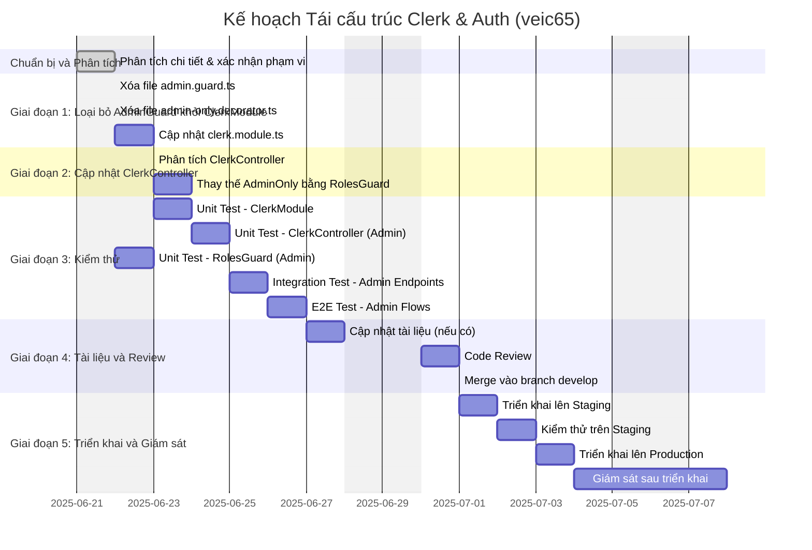

# Báo Cáo Kế Hoạch Tái Cấu Trúc: Module Clerk và Auth (Mã hiệu: veic65)

**Thông tin Tài liệu**

*   **Ngày tạo:** 20/06/2025
*   **Phiên bản:** 1.2
*   **Người soạn thảo:** Nguyễn Thành Hưng
*   **Mã hiệu tham chiếu:** veic65

**Mục lục**

1.  [Tóm tắt Báo cáo (Executive Summary)](#1-tom-tat-bao-cao-executive-summary)
2.  [Bối cảnh và Mục tiêu Tái cấu trúc](#2-boi-canh-va-muc-tieu-tai-cau-truc)
    *   [2.1 Hiện trạng và Vấn đề Tồn đọng](#21-hien-trang-va-van-de-ton-dong)
    *   [2.2 Mục tiêu Tái cấu trúc](#22-muc-tieu-tai-cau-truc)
3.  [Phạm vi Công việc](#3-pham-vi-cong-viec)
    *   [3.1 Các Module Ảnh hưởng](#31-cac-module-anh-huong)
4.  [Kế hoạch Thực thi Chi tiết](#4-ke-hoach-thuc-thi-chi-tiet)
    *   [4.1 Sơ đồ Gantt (Tiến độ Dự kiến)](#41-so-do-gantt-tien-do-du-kien)
    *   [4.2 Phân rã Công việc (WBS) và Hướng dẫn Sơ bộ](#42-phan-ra-cong-viec-wbs-va-huong-dan-so-bo)
5.  [Quản lý Rủi ro và Phụ thuộc](#5-quan-ly-rui-ro-va-phu-thuoc)
    *   [5.1 Các Yếu tố Phụ thuộc](#51-cac-yeu-to-phu-thuoc)
    *   [5.2 Phân tích Rủi ro và Kế hoạch Giảm thiểu](#52-phan-tich-rui-ro-va-ke-hoach-giam-thieu)
6.  [Chiến lược Đảm bảo Chất lượng](#6-chien-luoc-dam-bao-chat-luong)
    *   [6.1 Kiểm thử Đơn vị (Unit Tests)](#61-kiem-thu-don-vi-unit-tests)
    *   [6.2 Kiểm thử Tích hợp (Integration Tests)](#62-kiem-thu-tich-hop-integration-tests)
    *   [6.3 Kiểm thử Đầu cuối (End-to-End Tests)](#63-kiem-thu-dau-cuoi-end-to-end-tests)
7.  [Tiêu chí Nghiệm thu và Hoàn thành](#7-tieu-chi-nghiem-thu-va-hoan-thanh)
    *   [7.1 Tiêu chí Nghiệm thu](#71-tieu-chi-nghiem-thu)
    *   [7.2 Định nghĩa Hoàn thành (Definition of Done - DoD)](#72-dinh-nghia-hoan-thanh-definition-of-done---dod)
8.  [Quy trình Triển khai và Vận hành](#8-quy-trinh-trien-khai-va-van-hanh)
    *   [8.1 Quy trình Triển khai](#81-quy-trinh-trien-khai)
    *   [8.2 Kế hoạch Rollback](#82-ke-hoach-rollback)
9.  [Đo lường và Đánh giá Thành công](#9-do-luong-va-danh-gia-thanh-cong)
    *   [9.1 Các Chỉ số Chính (KPIs)](#91-cac-chi-so-chinh-kpis)
10. [Kết luận và Kiến nghị](#10-ket-luan-va-kien-nghi)

---

## 1. Tóm tắt Báo cáo (Executive Summary)

Báo cáo này trình bày kế hoạch chi tiết cho việc tái cấu trúc (refactor) mã nguồn liên quan đến module xác thực (`ClerkModule`) và phân quyền (`AuthModule`) trong dự án, với mã hiệu tham chiếu **veic65**. Phân tích kiến trúc trước đó đã chỉ ra sự vi phạm các nguyên tắc thiết kế phần mềm quan trọng, bao gồm việc đặt logic nghiệp vụ (kiểm tra vai trò Admin) vào tầng hạ tầng, dẫn đến trùng lặp mã và liên kết chặt chẽ.

Mục tiêu chính của đợt tái cấu trúc này là tách biệt rõ ràng trách nhiệm giữa xác thực và phân quyền, loại bỏ mã trùng lặp, giảm sự phụ thuộc giữa các tầng, và cải thiện tính bảo trì cũng như khả năng mở rộng của hệ thống. Kế hoạch bao gồm việc loại bỏ `AdminGuard` khỏi `ClerkModule` và sử dụng nhất quán `RolesGuard` từ `AuthModule` cho tất cả các nhu cầu kiểm tra vai trò.

Báo cáo này sẽ đi sâu vào phạm vi công việc, phân rã các tác vụ cụ thể kèm ước tính thời gian, xác định các rủi ro tiềm ẩn cùng giải pháp, đề xuất chiến lược kiểm thử toàn diện, quy trình triển khai, và các tiêu chí nghiệm thu để đảm bảo quá trình tái cấu trúc diễn ra thành công và hiệu quả.

---

## 2. Bối cảnh và Mục tiêu Tái cấu trúc

### 2.1 Hiện trạng và Vấn đề Tồn đọng

Phân tích kiến trúc hiện tại của hệ thống, đặc biệt là trong `ClerkModule` và `AuthModule`, đã phát hiện các vấn đề sau:

*   **Vi phạm Tách biệt Trách nhiệm (Separation of Concerns) và Đơn trách nhiệm (Single Responsibility Principle):** Logic kiểm tra vai trò Admin (`AdminGuard`) hiện đang nằm trong `ClerkModule` (tầng Infrastructure), trong khi trách nhiệm này nên thuộc về `AuthModule` (tầng Application/Domain).
*   **Liên kết chặt chẽ (Tight Coupling) giữa Hạ tầng và Logic Nghiệp vụ:** Việc `ClerkModule` export `AdminGuard` tạo ra sự phụ thuộc không mong muốn từ logic nghiệp vụ vào một thành phần cụ thể của tầng hạ tầng, vi phạm Nguyên tắc Đảo ngược Phụ thuộc (Dependency Inversion Principle).
*   **Trùng lặp Mã (Code Duplication):** Logic kiểm tra vai trò người dùng bị lặp lại giữa `AdminGuard` và `RolesGuard` (trong `AuthModule`), đi ngược lại nguyên tắc DRY (Don't Repeat Yourself).
*   **Nhầm lẫn về Tầng Kiến trúc (Architectural Layer Confusion):** Việc đặt logic nghiệp vụ không đúng tầng gây khó khăn cho việc bảo trì, mở rộng và làm giảm tính rõ ràng của kiến trúc tổng thể.

### 2.2 Mục tiêu Tái cấu trúc

Dựa trên các vấn đề đã xác định, mục tiêu của việc tái cấu trúc này bao gồm:

*   **Tách biệt rõ ràng trách nhiệm:** Di chuyển hoàn toàn logic phân quyền (authorization), bao gồm cả kiểm tra vai trò Admin, sang `AuthModule`. `ClerkModule` sẽ chỉ tập trung vào trách nhiệm xác thực (authentication).
*   <u>**Loại bỏ trùng lặp mã:** Đảm bảo `RolesGuard` từ `AuthModule` là cơ chế duy nhất được sử dụng cho tất cả các nhu cầu kiểm tra vai trò người dùng.</u>
*   **Giảm coupling, tăng tính module hóa:** Giảm thiểu sự phụ thuộc của business logic vào các thành phần cụ thể của `ClerkModule`, giúp hệ thống linh hoạt hơn.
*   **Cải thiện tính bảo trì và mở rộng:** Tạo điều kiện thuận lợi cho việc cập nhật logic phân quyền hoặc thay đổi nhà cung cấp dịch vụ xác thực trong tương lai mà không ảnh hưởng lớn đến các phần khác của hệ thống.
*   **Đảm bảo kiến trúc nhất quán và rõ ràng:** Giúp các nhà phát triển dễ dàng hiểu và làm việc với hệ thống xác thực và phân quyền, tuân thủ các nguyên tắc thiết kế tốt.

---

## 3. Phạm vi Công việc

### 3.1 Các Module Ảnh hưởng

Việc tái cấu trúc sẽ tập trung chủ yếu vào các module và thành phần sau:

*   **Module [`src/modules/Infracstructre/clerk`](src/modules/Infracstructre/clerk):**
    *   Tệp [`clerk.module.ts`](src/modules/Infracstructre/clerk/clerk.module.ts): Cần được cập nhật để loại bỏ `AdminGuard`.
    *   Tệp [`clerk.controller.ts`](src/modules/Infracstructre/clerk/clerk.controller.ts): Cần được cập nhật để sử dụng `RolesGuard` thay vì `AdminOnly` decorator.
    *   Xóa tệp [`guards/admin.guard.ts`](src/modules/Infracstructre/clerk/guards/admin.guard.ts).
    *   Xóa tệp [`decorators/admin-only.decorator.ts`](src/modules/Infracstructre/clerk/decorators/admin-only.decorator.ts).
*   **Module [`src/modules/auth`](src/modules/auth):**
    *   Đảm bảo tệp [`guards/roles.guard.ts`](src/modules/auth/guards/roles.guard.ts) và [`decorators/roles.decorator.ts`](src/modules/auth/decorators/roles.decorator.ts) có khả năng xử lý việc phân quyền cho vai trò Admin một cách chính xác và hiệu quả.
*   **Các module/controller khác (nếu có):** Rà soát toàn bộ codebase để xác định và cập nhật bất kỳ thành phần nào khác có thể đang sử dụng `AdminGuard` hoặc `AdminOnly` decorator từ `ClerkModule`.

---

## 4. Kế hoạch Thực thi Chi tiết

### 4.1 Sơ đồ Gantt (Tiến độ Dự kiến)



### 4.2 Phân rã Công việc (WBS) và Hướng dẫn Sơ bộ

| ID      | Tác vụ                                                                 | Mô tả chi tiết                                                                                                                                                                                             | Ước tính (PD) | Người thực hiện | Phụ thuộc |
| :------ | :--------------------------------------------------------------------- | :--------------------------------------------------------------------------------------------------------------------------------------------------------------------------------------------------------- | :------------ | :-------------- | :-------- |
| **P1**  | **Giai đoạn 1: Loại bỏ `AdminGuard` khỏi `ClerkModule`**                 |                                                                                                                                                                                                            | **1.0**       | Dev Team        |           |
| P1.1    | Xóa `admin.guard.ts`                                                   | Xóa file [`src/modules/Infracstructre/clerk/guards/admin.guard.ts`](src/modules/Infracstructre/clerk/guards/admin.guard.ts).                                                                                             | 0.25          | Dev Team        |           |
| P1.2    | Xóa `admin-only.decorator.ts`                                          | Xóa file [`src/modules/Infracstructre/clerk/decorators/admin-only.decorator.ts`](src/modules/Infracstructre/clerk/decorators/admin-only.decorator.ts).                                                                   | 0.25          | Dev Team        | P1.1      |
| P1.3    | Cập nhật `clerk.module.ts`                                             | Chỉnh sửa [`src/modules/Infracstructre/clerk/clerk.module.ts`](src/modules/Infracstructre/clerk/clerk.module.ts) để loại bỏ `AdminGuard` khỏi `providers` và `exports` theo khuyến nghị trong tài liệu phân tích. <br><br>**Hướng dẫn mã nguồn sơ bộ:**<br>```typescript<br>// src/modules/Infracstructre/clerk/clerk.module.ts<br>// Xóa import AdminGuard<br>// import { AdminGuard } from './guards/admin.guard'; // <-- XÓA DÒNG NÀY<br><br>// Trong static forRoot(options: ClerkModuleOptions): DynamicModule<br>// providers:<br>//   AdminGuard, // <-- XÓA DÒNG NÀY<br>// exports:<br>//   AdminGuard, // <-- XÓA DÒNG NÀY TRONG MẢNG EXPORTS<br><br>// Tương tự cho static forRootAsync()<br>``` | 0.5           | Dev Team        | P1.2      |
| **P2**  | **Giai đoạn 2: Cập nhật `ClerkController`**                            |                                                                                                                                                                                                            | **0.75**      | Dev Team        | P1.3      |
| P2.1    | Phân tích `ClerkController`                                            | Xác định các endpoints trong [`src/modules/Infracstructre/clerk/clerk.controller.ts`](src/modules/Infracstructre/clerk/clerk.controller.ts) đang sử dụng `@AdminOnly()`.                                          | 0.25          | Dev Team        | P1.3      |
| P2.2    | Thay thế `@AdminOnly()` bằng `RolesGuard` và `@Roles`                  | Cập nhật các endpoints đã xác định ở P2.1. Thay thế `@AdminOnly()` bằng `@UseGuards(ClerkAuthGuard, RolesGuard)` và `@Roles(UserRole.ADMIN)`. Đảm bảo import `RolesGuard` từ `AuthModule` và `UserRole`. <br><br>**Hướng dẫn mã nguồn sơ bộ:**<br>```typescript<br>// src/modules/Infracstructre/clerk/clerk.controller.ts<br>// Xóa import AdminOnly<br>// import { AdminOnly } from './decorators/admin-only.decorator'; // <-- XÓA DÒNG NÀY<br><br>// Thêm import cần thiết<br>import { Roles } from '../../auth/decorators/roles.decorator'; // Kiểm tra lại path nếu cần<br>import { RolesGuard } from '../../auth/guards/roles.guard'; // Kiểm tra lại path nếu cần<br>import { UserRole } from '../../users/entities/user.entity'; // Kiểm tra lại path nếu cần<br><br>// Ví dụ cho một endpoint:<br>// Trước:<br>// @AdminOnly()<br>// @Get('admin/users/:userId/sessions')<br><br>// Sau:<br>@UseGuards(ClerkAuthGuard, RolesGuard)<br>@Roles(UserRole.ADMIN)<br>@Get('admin/users/:userId/sessions')<br>``` | 0.5           | Dev Team        | P2.1      |
| **P3**  | **Giai đoạn 3: Kiểm thử**                                               |                                                                                                                                                                                                            | **3.5**       | Dev Team / QA   | P1.3, P2.2|
| P3.1    | Unit Test - `ClerkModule`                                              | Viết/cập nhật unit test để đảm bảo `ClerkModule` hoạt động đúng sau khi thay đổi, không còn export `AdminGuard`.                                                                                             | 0.5           | Dev Team        | P1.3      |
| P3.2    | Unit Test - `ClerkController` (Admin endpoints)                        | Viết/cập nhật unit test cho các admin endpoints trong `ClerkController` để đảm bảo chúng được bảo vệ đúng cách bởi `RolesGuard`.                                                                               | 0.5           | Dev Team        | P2.2      |
| P3.3    | Unit Test - `RolesGuard` (Admin scenarios)                             | Rà soát và bổ sung unit test cho [`src/modules/auth/guards/roles.guard.ts`](src/modules/auth/guards/roles.guard.ts) để đảm bảo xử lý chính xác vai trò Admin và các trường hợp biên.                               | 0.5           | Dev Team        |           |
| P3.4    | Integration Test - Admin Endpoints                                     | Viết/cập nhật integration test cho các API endpoints yêu cầu quyền Admin (trong `ClerkController` và các controller khác nếu có) để kiểm tra luồng xác thực và phân quyền hoàn chỉnh.                         | 1.0           | Dev Team / QA   | P3.2      |
| P3.5    | E2E Test - Admin Flows                                                 | Thực hiện/cập nhật E2E test mô phỏng các luồng sử dụng của người dùng Admin, đảm bảo các tính năng Admin vẫn hoạt động và được bảo vệ đúng.                                                                   | 1.0           | QA Team         | P3.4      |
| **P4**  | **Giai đoạn 4: Tài liệu và Review**                                    |                                                                                                                                                                                                            | **1.75**      | Dev Team        | P3.5      |
| P4.1    | Cập nhật tài liệu (nếu có)                                           | Cập nhật tài liệu Báo Cáo: Phân Tích Quan Hệ Module `clerk` và `auth` Sau Tái Cấu Trúc | 0.5           | Dev Team        | P3.5      |
| P4.2    | Code Review                                                            | Thực hiện tạo một tài liệu review mã nguồn chứa toàn bộ cấu trúc và các đoạn code quan trọng trong 2 module Clerk và Auth. Tên là: CodeReview: Clerk Module và Auth Module | 1.0           | Dev Team        | P4.1      |
|          |                                                          |                                                              |               |                 |            |
|          |                                                          |                                                              |               |                 |            |
|         |                                                          |                                                              |               |                 |           |
| **Tổng**|                                                                        |                                                                                                                                                                                                            |               |                 |           |

---

## 5. Quản lý Rủi ro và Phụ thuộc

### 5.1 Các Yếu tố Phụ thuộc

*   Hoàn thành Giai đoạn 1 là điều kiện tiên quyết cho Giai đoạn 2.
*   Hoàn thành Giai đoạn 1 và 2 là điều kiện cho Giai đoạn 3 (Kiểm thử).
*   Định nghĩa `UserRole` enum từ [`src/modules/users/entities/user.entity.ts`](src/modules/users/entities/user.entity.ts) phải chính xác và sẵn có.
*   `RolesGuard` và `Roles` decorator từ module [`src/modules/auth`](src/modules/auth) phải hoạt động ổn định và đúng như mong đợi.

### 5.2 Phân tích Rủi ro và Kế hoạch Giảm thiểu

| Rủi ro                                                                 | Mức độ | Kế hoạch Giảm thiểu                                                                                                                                                                                             |
| :--------------------------------------------------------------------- | :----- | :---------------------------------------------------------------------------------------------------------------------------------------------------------------------------------------------------- |
| **1. Lỗi logic sau tái cấu trúc:** Các endpoints yêu cầu quyền Admin không được bảo vệ đúng cách, hoặc bị chặn truy cập một cách không chính xác. | Cao    | - Thực hiện kiểm thử kỹ lưỡng ở tất cả các cấp độ (Unit, Integration, E2E). <br> - Tiến hành Code Review cẩn thận bởi các thành viên có kinh nghiệm. <br> - Triển khai từng bước trên các môi trường (Staging trước khi lên Production). |
| **2. Ảnh hưởng không mong muốn đến các module khác:** Nếu có module khác đang ngầm sử dụng `AdminGuard` từ `ClerkModule` mà chưa được phát hiện trong quá trình phân tích ban đầu. | Trung bình | - Thực hiện tìm kiếm toàn cục (global search) trong toàn bộ codebase cho các từ khóa `AdminGuard` và `AdminOnly` decorator. <br> - Thông báo rõ ràng cho toàn bộ đội ngũ phát triển về những thay đổi này. |
| **3. Thời gian tái cấu trúc kéo dài hơn dự kiến:** Do phát sinh các vấn đề kỹ thuật phức tạp không lường trước hoặc phạm vi ảnh hưởng rộng hơn dự tính. | Trung bình | - Chia nhỏ công việc thành các tác vụ con có thể quản lý được. <br> - Ưu tiên hoàn thành các phần cốt lõi và quan trọng nhất trước. <br> - Thường xuyên cập nhật tiến độ và thảo luận trong team nếu có bất kỳ trở ngại nào phát sinh. |
| **4. Xung đột mã (Merge Conflict):** Nếu có các thay đổi song song được thực hiện trên các tệp tin liên quan bởi các thành viên khác trong team. | Trung bình | - Thực hiện rebase hoặc merge thường xuyên từ nhánh phát triển chính (ví dụ: `develop`). <br> - Phối hợp chặt chẽ và giao tiếp hiệu quả trong team để tránh xung đột. |
| **5. Cấu hình vai trò trên Clerk không chính xác:** Thông tin vai trò (`request.user.publicMetadata?.role`) không được thiết lập đúng hoặc nhất quán trên Clerk dashboard. | Thấp   | - Kiểm tra và đảm bảo cấu hình vai trò trên Clerk dashboard là chính xác và nhất quán. Đây là điều kiện tiên quyết để `RolesGuard` hoạt động đúng. (Đã được nhấn mạnh trong tài liệu phân tích kiến trúc). |

---

## 6. Chiến lược Đảm bảo Chất lượng

### 6.1 Kiểm thử Đơn vị (Unit Tests)

*   **Đối với `ClerkModule` ([`src/modules/Infracstructre/clerk/clerk.module.ts`](src/modules/Infracstructre/clerk/clerk.module.ts)):**
    *   Xác minh rằng `AdminGuard` không còn được cung cấp (provided) hoặc xuất (exported) bởi module.
    *   Đảm bảo các providers và exports còn lại (ví dụ: `ClerkSessionService`, `ClerkAuthGuard`, `CLERK_OPTIONS`) vẫn được cấu hình và hoạt động đúng.
*   **Đối với `ClerkController` ([`src/modules/Infracstructre/clerk/clerk.controller.ts`](src/modules/Infracstructre/clerk/clerk.controller.ts)):**
    *   Kiểm tra các endpoints trước đây sử dụng `@AdminOnly()` nay đã được bảo vệ chính xác bởi `RolesGuard` và yêu cầu vai trò `UserRole.ADMIN`.
    *   Sử dụng mock cho `RolesGuard` và `ClerkAuthGuard` để kiểm tra việc áp dụng decorator `@Roles(UserRole.ADMIN)` và `@UseGuards(ClerkAuthGuard, RolesGuard)`.
    *   Kiểm tra các trường hợp:
        *   Truy cập hợp lệ với vai trò Admin.
        *   Truy cập không hợp lệ với vai trò Non-Admin.
        *   Truy cập không hợp lệ khi chưa xác thực.
*   **Đối với `RolesGuard` ([`src/modules/auth/guards/roles.guard.ts`](src/modules/auth/guards/roles.guard.ts)):**
    *   Đảm bảo guard hoạt động chính xác khi kiểm tra vai trò `UserRole.ADMIN`.
    *   Kiểm tra các trường hợp biên như `request.user`, `request.user.publicMetadata`, hoặc `request.user.publicMetadata.role` không tồn tại hoặc không hợp lệ.
    *   Kiểm tra logic khi không có `requiredRoles` được định nghĩa cho một route (thường nên trả về `true`, cho phép truy cập).

### 6.2 Kiểm thử Tích hợp (Integration Tests)

*   Kiểm tra luồng xử lý hoàn chỉnh của một request đến API endpoint yêu cầu quyền Admin: Request -> `ClerkAuthGuard` (xác thực token) -> `RolesGuard` (kiểm tra vai trò).
*   Sử dụng các công cụ như `supertest` (trong môi trường NestJS) để thực hiện các API call:
    *   **Trường hợp thành công:** Gửi request với token hợp lệ của người dùng có vai trò Admin. Mong đợi nhận được phản hồi thành công (HTTP status 2xx).
    *   **Trường hợp bị từ chối (Forbidden):** Gửi request với token hợp lệ của người dùng không có vai trò Admin (ví dụ: User thường). Mong đợi nhận được lỗi HTTP status 403 (Forbidden).
    *   **Trường hợp chưa xác thực (Unauthorized):** Gửi request không có token hoặc với token không hợp lệ. Mong đợi nhận được lỗi HTTP status 401 (Unauthorized) (do `ClerkAuthGuard` xử lý).
    *   Bao gồm kiểm thử cho tất cả các admin endpoints trong `ClerkController` và bất kỳ controller nào khác bị ảnh hưởng bởi thay đổi.

### 6.3 Kiểm thử Đầu cuối (End-to-End Tests)

*   Sử dụng các công cụ kiểm thử E2E như Cypress, Playwright, hoặc Puppeteer.
*   Mô phỏng các luồng sử dụng thực tế của người dùng có vai trò Admin:
    *   Luồng đăng nhập thành công với tài khoản Admin.
    *   Thực hiện các thao tác trên giao diện người dùng (nếu có) hoặc gọi API trực tiếp để truy cập các tính năng, dữ liệu, hoặc trang quản trị chỉ dành cho Admin.
*   Xác minh rằng:
    *   Người dùng Admin có thể truy cập và thực hiện các chức năng được phép.
    *   Người dùng không có vai trò Admin (hoặc chưa đăng nhập) không thể truy cập các tài nguyên này.

---

## 7. Tiêu chí Nghiệm thu và Hoàn thành

### 7.1 Tiêu chí Nghiệm thu

*   Toàn bộ mã nguồn liên quan đến `AdminGuard` và `AdminOnly` decorator trong `ClerkModule` đã được loại bỏ hoàn toàn khỏi codebase.
*   `ClerkModule` không còn cung cấp hoặc xuất (export) bất kỳ thành phần nào liên quan trực tiếp đến logic phân quyền Admin.
*   Tất cả các endpoints yêu cầu quyền Admin (ví dụ: trong `ClerkController` và các controller khác nếu có) được bảo vệ một cách chính xác và nhất quán bởi `RolesGuard` từ `AuthModule` và decorator `@Roles(UserRole.ADMIN)`.
*   Tất cả các Unit Test và Integration Test liên quan đến các thay đổi đều đạt trạng thái pass.
*   Các kịch bản kiểm thử E2E cho các luồng nghiệp vụ của người dùng Admin hoạt động thành công và đúng như mong đợi.
*   Không có lỗi hồi quy (regression bug) nào được phát hiện liên quan đến chức năng xác thực và phân quyền Admin trên các môi trường kiểm thử.
*   Mã nguồn đã được review và chấp thuận bởi ít nhất một thành viên khác trong đội ngũ phát triển.
*   Tài liệu kỹ thuật liên quan (ví dụ: Swagger API documentation, READMEs của module) đã được cập nhật để phản ánh những thay đổi (nếu cần thiết).

### 7.2 Định nghĩa Hoàn thành (Definition of Done - DoD)

Toàn bộ quá trình tái cấu trúc (mã hiệu veic65) được coi là **Hoàn thành** khi tất cả các điều kiện sau được đáp ứng:

1.  **Mã nguồn đã được Tái cấu trúc:** Các thay đổi đã được thực hiện theo đúng các khuyến nghị trong tài liệu phân tích kiến trúc và kế hoạch chi tiết này.
2.  **Loại bỏ Thành phần Cũ:** `AdminGuard` và `AdminOnly` decorator đã được loại bỏ hoàn toàn khỏi `ClerkModule` và toàn bộ dự án.
3.  **Sử dụng Nhất quán Cơ chế Mới:** `ClerkController` và tất cả các controller khác (nếu có) sử dụng `RolesGuard` từ `AuthModule` một cách nhất quán cho việc phân quyền Admin.
4.  **Kiểm thử Đạt yêu cầu:** Tất cả các Unit Test, Integration Test và E2E Test liên quan đến các thay đổi đều pass 100%.
5.  **Không có Lỗi Hồi quy:** Không có lỗi hồi quy nào được phát hiện trên môi trường Staging sau khi triển khai các thay đổi.
6.  **Code Review và Merge:** Mã nguồn đã được review kỹ lưỡng, nhận được sự chấp thuận từ các thành viên được chỉ định và đã được merge thành công vào nhánh phát triển chính (ví dụ: `develop`).
7.  **Tài liệu được Cập nhật:** Tài liệu kỹ thuật liên quan (nếu có sự thay đổi cần ghi nhận, ví dụ: cách sử dụng guard mới) đã được cập nhật đầy đủ.
8.  **Triển khai Thành công lên Production:** Các thay đổi đã được triển khai thành công lên môi trường Production.
9.  **Hệ thống Ổn định trên Production:** Hệ thống trên môi trường Production hoạt động ổn định sau khi triển khai, không có lỗi nghiêm trọng nào liên quan đến các thay đổi được ghi nhận trong khoảng thời gian giám sát đã định (ví dụ: 24-48 giờ).

---

## 8. Quy trình Triển khai và Vận hành

### 8.1 Quy trình Triển khai

1.  **Giai đoạn Phát triển:**
    *   Tạo một feature branch mới từ nhánh `develop` (hoặc nhánh phát triển chính của dự án).
    *   Thực hiện tất cả các thay đổi mã nguồn theo kế hoạch đã được phê duyệt trên feature branch này.
2.  **Giai đoạn Kiểm thử Cục bộ:**
    *   Nhà phát triển chạy tất cả các kịch bản kiểm thử (unit, integration) trên môi trường local để đảm bảo các thay đổi hoạt động đúng như mong đợi.
4.  **Giai đoạn Code Review:**
    *   Ít nhất một (hoặc theo quy định của dự án) thành viên khác trong đội ngũ phát triển sẽ thực hiện review mã nguồn.
    *   Thảo luận và thực hiện các chỉnh sửa cần thiết dựa trên phản hồi từ quá trình review.

### 8.2 Kế hoạch Rollback

*   **Điều kiện Kích hoạt Rollback:**
    *   Tỷ lệ lỗi tăng đột biến không thể kiểm soát ngay lập tức.
*   **Quy trình Thực hiện Rollback:**
    1.  **Đánh giá và Quyết định:** Team Lead hoặc Project Manager sẽ đánh giá mức độ nghiêm trọng của lỗi và đưa ra quyết định có cần rollback hay không.
    2.  **Phương án 1 (Ưu tiên nếu lỗi được phát hiện sớm): Revert PR/Commit:**
        *   Nếu lỗi được phát hiện ngay sau khi merge và chưa có nhiều commit mới, thực hiện revert PR/commit chứa các thay đổi tái cấu trúc.
        *   Deploy lại phiên bản trước đó của nhánh `main`/`master` (hoặc nhánh Production) lên môi trường Production.
    3.  **Phương án 2: Deploy Phiên bản Ổn định Trước đó:**
        *   Xác định Git tag hoặc commit hash của phiên bản ổn định cuối cùng trước khi triển khai các thay đổi tái cấu trúc.
        *   Thực hiện deploy lại phiên bản ổn định đó lên môi trường Production.
    4.  **Thông báo:** Thông báo ngay lập tức cho các bên liên quan (stakeholders, người dùng nếu cần) về việc thực hiện rollback và lý do.
    5.  **Phân tích Nguyên nhân Gốc rễ (Root Cause Analysis):** Sau khi hệ thống đã ổn định trở lại, tiến hành phân tích chi tiết để tìm ra nguyên nhân gốc rễ của lỗi, từ đó rút kinh nghiệm và khắc phục trong lần triển khai tiếp theo.

---

## 9. Đo lường và Đánh giá Thành công

### 9.1 Các Chỉ số Chính (KPIs)

Việc đánh giá sự thành công của quá trình tái cấu trúc sẽ dựa trên các chỉ số sau:

*   **Chất lượng Mã nguồn:**
    *   **Số dòng code trùng lặp:** Giảm thiểu hoặc loại bỏ hoàn toàn số dòng code trùng lặp liên quan đến logic kiểm tra vai trò Admin. Mục tiêu: 0 dòng trùng lặp.
    *   **Tuân thủ Kiến trúc:** Cấu trúc của `ClerkModule` và `AuthModule` phải tuân thủ đúng theo các nguyên tắc phân tầng kiến trúc đã được phân tích và đề xuất. Đánh giá thông qua code review.
*   **Độ ổn định Hệ thống:**
    *   **Tỷ lệ lỗi HTTP 401 (Unauthorized) và 403 (Forbidden):** Theo dõi và đảm bảo không có sự gia tăng bất thường của các lỗi này sau khi triển khai, đặc biệt đối với các API endpoints yêu cầu quyền Admin.
    *   **Số lượng lỗi mới liên quan đến xác thực/phân quyền:** Mục tiêu là giảm thiểu hoặc giữ ở mức 0 số lượng lỗi mới phát sinh liên quan đến chức năng xác thực và phân quyền Admin.
*   **Hiệu suất Phát triển (Dài hạn):**
    *   **Thời gian Code Review:** Theo dõi thời gian cần thiết để review các Pull Request liên quan đến việc thêm mới hoặc sửa đổi logic phân quyền. Kỳ vọng thời gian này sẽ có xu hướng giảm do kiến trúc trở nên rõ ràng và dễ hiểu hơn.
    *   **Phản hồi từ Đội ngũ Phát triển:** Thu thập phản hồi (ví dụ: qua khảo sát ngắn hoặc thảo luận) từ các thành viên trong đội ngũ phát triển về sự dễ hiểu, dễ bảo trì của logic xác thực và phân quyền sau khi tái cấu trúc.
*   **Khả năng Bảo trì:**
    *   **Effort sửa lỗi/thay đổi:** Giảm thiểu effort (thời gian và công sức) cần thiết để sửa các lỗi phát sinh hoặc thực hiện các thay đổi liên quan đến logic phân quyền Admin trong tương lai.

---

## 10. Kết luận và Kiến nghị

Việc tái cấu trúc module Clerk và Auth theo kế hoạch này là một bước đi cần thiết để cải thiện chất lượng kiến trúc, tăng cường tính bảo trì và khả năng mở rộng của hệ thống. Bằng cách tách biệt rõ ràng trách nhiệm, loại bỏ mã trùng lặp và tuân thủ các nguyên tắc thiết kế phần mềm tốt, chúng ta sẽ xây dựng được một nền tảng vững chắc hơn cho sự phát triển của dự án trong tương lai.

**Kiến nghị:**
*   Ưu tiên thực hiện kế hoạch này trong sprint kế tiếp hoặc theo lịch trình phù hợp của dự án.
*   Đảm bảo có đủ thời gian và nguồn lực cho việc kiểm thử kỹ lưỡng ở tất cả các cấp độ.
*   Thông báo và phối hợp chặt chẽ với tất cả các thành viên trong đội ngũ phát triển để đảm bảo quá trình chuyển đổi diễn ra suôn sẻ.
*   Sau khi hoàn thành, cần tiếp tục theo dõi và đánh giá hiệu quả của những thay đổi để có những điều chỉnh kịp thời nếu cần.

---