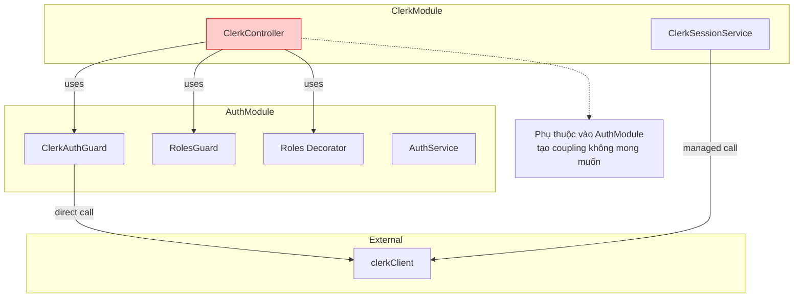
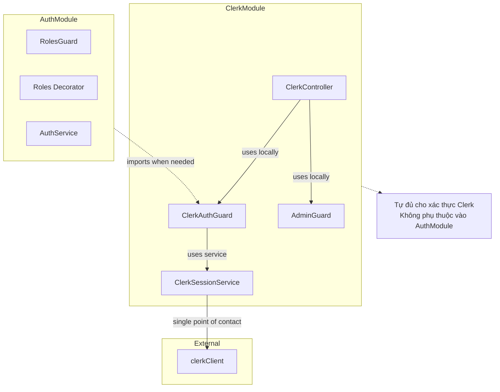

# Kế hoạch Tổng hợp Tái cấu trúc ClerkAuthGuard và Hệ thống Xác thực

**Tác giả:** Nguyen Thanh Hung  
**Email:** nthungdev.140503@gmail.com  
**Phiên bản:** 1.0  
**Ngày cập nhật:** 2024-12-20  

---

## Mục lục

- [Tổng quan Dự án](#tổng-quan-dự-án)
- [Phân tích Hiện trạng](#phân-tích-hiện-trạng)
- [Giải pháp Kiến trúc](#giải-pháp-kiến-trúc)
- [Kế hoạch Triển khai Chi tiết](#kế-hoạch-triển-khai-chi-tiết)
- [Timeline và Milestone](#timeline-và-milestone)
- [Rủi ro và Mitigation](#rủi-ro-và-mitigation)
- [Kết luận](#kết-luận)

---

## Tổng quan Dự án

### Mục tiêu Chính

Tái cấu trúc hệ thống xác thực và phân quyền của ứng dụng để:

- Loại bỏ phụ thuộc vòng tròn giữa `ClerkModule` và `AuthModule`
- Tập trung logic tương tác với Clerk SDK vào `ClerkModule`
- Cải thiện kiến trúc module và tính độc lập của các thành phần
- Giải quyết trùng lặp logic xác thực token

### Phạm vi Ảnh hưởng

- **Module chính**: `ClerkModule`, `AuthModule`
- **Components liên quan**: `ClerkAuthGuard`, `RolesGuard`, `ClerkController`
- **Services**: `ClerkSessionService`, `AuthService`

## Phân tích Hiện trạng

### Vấn đề Được Xác định

#### 1. Trùng lặp Logic Xác thực Token

| Component | Vị trí | Mô tả Vấn đề |
|-----------|--------|--------------|
| `ClerkSessionService` | `src/modules/clerk/clerk.session.service.ts:51-60` | Có phương thức `verifySessionToken(token: string)` thực hiện xác thực |
| `ClerkAuthGuard` | `src/modules/auth/guards/clerk-auth.guard.ts:30,36` | Gọi trực tiếp `clerkClient.verifyToken()` và `clerkClient.sessions.getSession()` |

**Vấn đề**: `ClerkAuthGuard` nên sử dụng `ClerkSessionService.verifySessionToken()` thay vì tự mình gọi `clerkClient` để tập trung logic tương tác với Clerk SDK.

#### 2. Phụ thuộc Không Lý tưởng của ClerkController

`ClerkController` (`src/modules/clerk/clerk.controller.ts`) hiện tại phụ thuộc vào `AuthModule` thông qua:

- `@UseGuards(ClerkAuthGuard)` (dòng 21)
- Import `ClerkAuthGuard` (dòng 14)
- Import `RolesGuard` (dòng 15)
- Sử dụng `@Roles(UserRole.ADMIN)` (dòng 16, 59, 76)

**Vấn đề**: Tạo ra phụ thuộc từ module hạ tầng (`clerk`) sang module nghiệp vụ (`auth`), vi phạm nguyên tắc thiết kế kiến trúc.

### Đánh giá Kiến trúc Hiện tại



## Giải pháp Kiến trúc

### Kiến trúc Mục tiêu



### Nguyên tắc Thiết kế

#### Separation of Concerns
- `ClerkModule`: Chịu trách nhiệm tất cả tương tác với Clerk SDK
- `AuthModule`: Tập trung vào logic nghiệp vụ xác thực và đồng bộ dữ liệu

#### Single Source of Truth
- `ClerkSessionService` là điểm duy nhất tương tác với `clerkClient`
- Tất cả logic xác thực Clerk được đóng gói trong `ClerkModule`

#### Dependency Direction
- Module hạ tầng (`ClerkModule`) độc lập
- Module nghiệp vụ (`AuthModule`) có thể import từ module hạ tầng

## Kế hoạch Triển khai Chi tiết

### Giai đoạn 1: Chuẩn bị Cơ sở hạ tầng

#### Bước 1.1: Tạo Cấu trúc Thư mục- Xong

```bash
# Tạo thư mục guards trong ClerkModule nếu chưa tồn tại
mkdir -p src/modules/clerk/guards/
mkdir -p src/modules/clerk/decorators/
```

**Kiểm tra**: Đảm bảo thư mục `src/modules/clerk/guards/` tồn tại

#### Bước 1.2: Di chuyển ClerkAuthGuard - Xong

```bash
# Di chuyển file từ AuthModule sang ClerkModule
mv src/modules/auth/guards/clerk-auth.guard.ts \
   src/modules/clerk/guards/clerk-auth.guard.ts
```

**Validation**: Xác nhận file đã được di chuyển thành công

### Giai đoạn 2: Tái cấu trúc ClerkAuthGuard

#### Bước 2.1: Cập nhật Import Dependencies - Xong 

**File**: `src/modules/clerk/guards/clerk-auth.guard.ts`

```typescript
// Cập nhật import paths
import { ClerkSessionService } from '../clerk.session.service';
// Kiểm tra và cập nhật các import khác nếu cần
```

#### Bước 2.2: Inject ClerkSessionService - 

**Modifications**:

1. Inject `ClerkSessionService` vào constructor
2. Thay thế các lệnh gọi trực tiếp `clerkClient`
3. Sử dụng `this.clerkSessionService.verifySessionToken(token)`

#### Bước 2.3: Cải tiến ClerkSessionService (nếu cần)

**Potential enhancements**:
- Thêm phương thức `getFullVerifiedSessionDetails(token)` trả về cả session và user
- Hoặc thêm `getUserFromSession(sessionId)` để lấy thông tin user

### Giai đoạn 3: Cập nhật ClerkModule

#### Bước 3.1: Cấu hình Module

**File**: `src/modules/clerk/clerk.module.ts`

```typescript
import { ClerkAuthGuard } from './guards/clerk-auth.guard';

@Module({
  providers: [
    ClerkSessionService,
    ClerkAuthGuard,        // ← Thêm vào providers - Xong
    // ... other providers
  ],
  exports: [
    ClerkSessionService,
    ClerkAuthGuard,        // ← Thêm vào exports - Xong
    // ... other exports
  ],
  // ...
})
export class ClerkModule {}
```

### Giai đoạn 4: Giải quyết Phụ thuộc RolesGuard

#### Phương án A: Kiểm tra Vai trò Trực tiếp (Ưu tiên)

**Điều kiện áp dụng**: Logic phân quyền đơn giản, chỉ kiểm tra admin

**Implementation**:
```typescript
// Trong ClerkController methods
if (req.user.publicMetadata?.role !== UserRole.ADMIN) {
  throw new ForbiddenException('Admin access required');
}
```

**Advantages**:
- Đơn giản, trực tiếp
- Loại bỏ hoàn toàn phụ thuộc vào AuthModule
- Hiệu suất tốt

#### Phương án B: Tạo AdminGuard trong ClerkModule - Đá áp dụng

**Điều kiện áp dụng**: Logic phức tạp hoặc cần tái sử dụng

**Steps**:

1. **Tạo AdminGuard**
   ```bash
   touch src/modules/clerk/guards/admin.guard.ts
   ```

2. **Implementation AdminGuard**
   ```typescript
   @Injectable()
   export class AdminGuard implements CanActivate {
     canActivate(context: ExecutionContext): boolean {
       const request = context.switchToHttp().getRequest();
       const user = request.user;
       
       return user?.publicMetadata?.role === UserRole.ADMIN;
     }
   }
   ```

3. **Tạo Decorator (tùy chọn)**
   ```bash
   touch src/modules/clerk/decorators/admin-only.decorator.ts
   ```

4. **Cập nhật ClerkModule**
   ```typescript
   @Module({
     providers: [
       ClerkSessionService,
       ClerkAuthGuard,
       AdminGuard,          // ← Thêm AdminGuard
     ],
     exports: [
       ClerkSessionService,
       ClerkAuthGuard,
       AdminGuard,          // ← Export AdminGuard
     ],
   })
   export class ClerkModule {}
   ```

5. **Cập nhật ClerkController**
   ```typescript
   // Thay thế
   @UseGuards(RolesGuard)
   @Roles(UserRole.ADMIN)
   
   // Bằng
   @UseGuards(AdminGuard)
   ```

### Giai đoạn 5: Cập nhật References

#### Bước 5.1: Tìm và Cập nhật Import Statements

**Command**:
```bash
# Tìm tất cả file import ClerkAuthGuard từ AuthModule
grep -r "from.*auth.*clerk-auth.guard" src/
```

**Action**: Cập nhật mỗi file để import từ `ClerkModule`

```typescript
// Thay đổi từ:
import { ClerkAuthGuard } from '../auth/guards/clerk-auth.guard';

// Thành:
import { ClerkAuthGuard } from '../clerk/guards/clerk-auth.guard';
// Hoặc thông qua ClerkModule nếu ở module khác
```

#### Bước 5.2: Cập nhật ClerkController

**File**: `src/modules/clerk/clerk.controller.ts`

**Changes**:
1. Xóa import từ `../auth/`
2. Import từ local guards
3. Áp dụng phương án A hoặc B cho role checking

### Giai đoạn 6: Dọn dẹp AuthModule

#### Bước 6.1: Cập nhật AuthModule

**File**: `src/modules/auth/auth.module.ts`

**Actions**:
1. Xóa `ClerkAuthGuard` khỏi `providers` (nếu có)
2. Xóa `ClerkAuthGuard` khỏi `exports` (nếu có)
3. Xóa import statement không sử dụng

#### Bước 6.2: Đánh giá RolesGuard và Roles Decorator

**Criteria for keeping**:
- `AuthModule` vẫn sử dụng cho các controller riêng
- Các module khác (ngoài `ClerkModule`) vẫn cần

**Action**: Giữ lại hoặc xóa bỏ tùy theo kết quả đánh giá

### Giai đoạn 7: Kiểm tra và Validation

#### Bước 7.1: Code Review Checklist

| Aspect | Validation Points |
|--------|------------------|
| **Syntax** | • Không có lỗi TypeScript<br>• Import paths chính xác<br>• Module dependencies hợp lệ |
| **Functionality** | • ClerkAuthGuard hoạt động từ ClerkModule<br>• Role checking logic hoạt động đúng<br>• Authentication flow không bị gián đoạn |
| **Architecture** | • ClerkController không import từ AuthModule<br>• ClerkModule tự đủ cho xác thực<br>• Dependency direction đúng nguyên tắc |

#### Bước 7.2: Testing Strategy

**Unit Tests**:
```bash
# Test ClerkAuthGuard in new location
npm test -- --testPathPattern=clerk-auth.guard.spec.ts

# Test ClerkController without AuthModule dependency
npm test -- --testPathPattern=clerk.controller.spec.ts
```

**Integration Tests**:
```bash
# Test authentication flow end-to-end
npm run test:e2e -- --testNamePattern="authentication"
```

## Timeline và Milestone

### Giai đoạn 1-2: Tuần 1
- [x] Tạo cấu trúc thư mục
- [x] Di chuyển ClerkAuthGuard
- [x] Tái cấu trúc để sử dụng ClerkSessionService

### Giai đoạn 3-4: Tuần 1-2
- [x] Cập nhật ClerkModule configuration
- [x] Implement giải pháp RolesGuard (Phương án A hoặc B)

### Giai đoạn 5-6: Tuần 2
- [x] Cập nhật tất cả references
- [x] Dọn dẹp AuthModule

### Giai đoạn 7: Tuần 2-3
- [x] Code review và testing
- [x] Performance validation
- [x] Documentation update

## Rủi ro và Mitigation

| Rủi ro | Probability | Impact | Mitigation |
|--------|-------------|--------|------------|
| **Breaking changes** | Medium | High | • Comprehensive testing<br>• Staged rollout<br>• Backup plan |
| **Performance regression** | Low | Medium | • Benchmark before/after<br>• Monitor response times<br>• Load testing |
| **Missed dependencies** | Medium | Medium | • Thorough code search<br>• IDE analysis<br>• Peer review |
| **Integration issues** | Low | High | • End-to-end testing<br>• Staging environment validation |

## Kết luận

Kế hoạch tái cấu trúc này sẽ:

1. **Cải thiện kiến trúc**: Loại bỏ phụ thuộc vòng tròn và tạo ra cấu trúc module rõ ràng hơn
2. **Tăng maintainability**: Tập trung logic Clerk vào một module duy nhất
3. **Giảm coupling**: Các module trở nên độc lập hơn
4. **Chuẩn bị mở rộng**: Tạo nền tảng cho các tính năng xác thực phức tạp hơn

### Lợi ích Dài hạn

- **Scalability**: Dễ dàng thêm tính năng xác thực mới
- **Testing**: Module độc lập dễ test hơn  
- **Team collaboration**: Rõ ràng trách nhiệm của từng module
- **Performance**: Giảm overhead từ dependencies không cần thiết

### Next Steps

Sau khi hoàn thành kế hoạch này, team có thể:

1. Implement additional Clerk features trong ClerkModule
2. Tối ưu hóa AuthModule cho business logic riêng biệt
3. Xem xét tạo shared authentication primitives nếu cần
4. Implement advanced authorization patterns

---

**Document Version**: 1.0  
**Last Updated**: 2024-12-20  
**Status**: Ready for Implementation