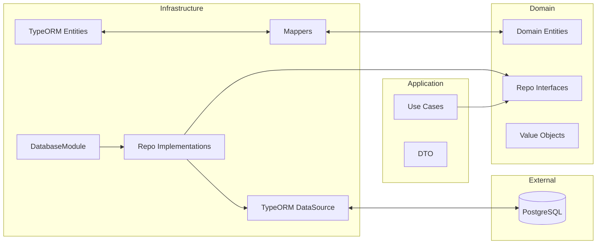
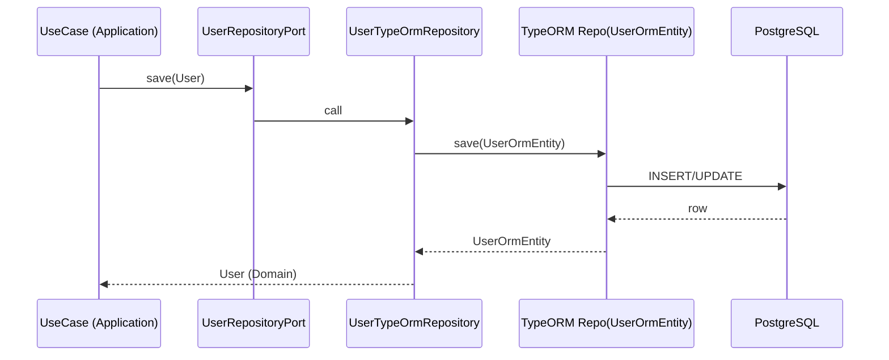
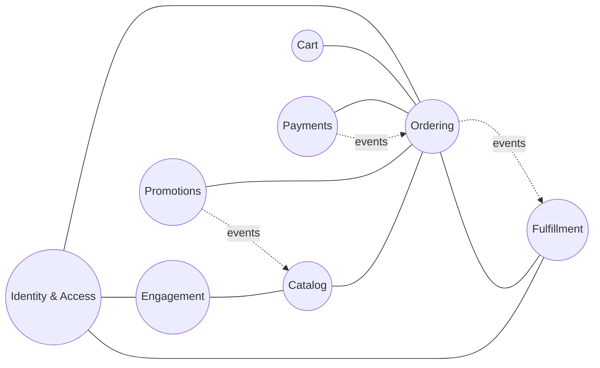
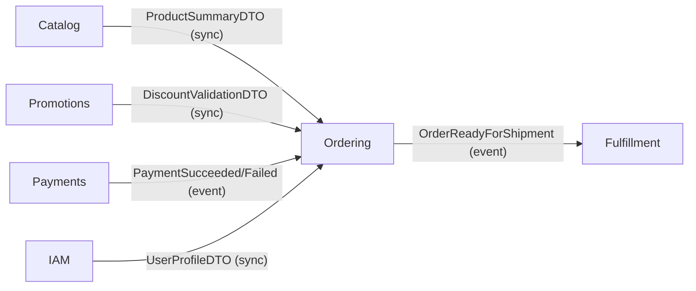

# Kế hoạch triển khai Module Database TypeORM cho NestJS (TheShoeBolt)

Ngày thực hiện: 2025-08-10
Người thực hiện: Augment Agent (mặc định: default_user)
Nguồn tham khảo nội bộ: doc/markdown/TypeORM/Tài liệu tham khỏa/Hướng dẫn chi tiết TypeORM với NestJS_ Từ cơ bản đến nâng cao.md

## 1. Mục tiêu & Phạm vi
- Mục tiêu: Tạo module database sử dụng TypeORM để kết nối và tương tác PostgreSQL cho dự án NestJS hiện tại.
- Phạm vi: Thiết kế theo Clean Architecture (Infrastructure → Application → Domain), cấu hình kết nối, ORM entities, repositories (adapter), mappers, migrations, Docker Compose cho PostgreSQL, và kế hoạch kiểm thử.
- Lưu ý: Đây là tài liệu KẾ HOẠCH. Chưa thay đổi mã nguồn.

## 2. Phân tích cấu trúc hiện tại của dự án (Triage)
- Quan sát workspace hiện tại không có mã nguồn NestJS sẵn sàng. Kế hoạch dưới đây giả định cấu trúc NestJS theo Clean Architecture được chuẩn hóa và có thể điều chỉnh khi import vào repo thực.
- Ràng buộc Clean Architecture:
  - Domain: thuần business, không phụ thuộc TypeORM/NestJS.
  - Application: use case, DTO, cổng (ports) gọi Domain repositories (interfaces), không phụ thuộc TypeORM.
  - Infrastructure: TypeORM Entities, Repositories impl, DataSource/Module, Mappers, cấu hình.
  - Presentation (Interface): Controllers/Modules phụ thuộc vào Application; dùng Infrastructure như plugin qua DI.

## 3. Thiết kế kiến trúc module database theo Clean Architecture
Sử dụng Data Mapper pattern với lớp Mapper chuyển đổi giữa Domain Entity và ORM Entity.



Nguyên tắc phụ thuộc: Presentation/Application phụ thuộc vào Domain. Infrastructure phụ thuộc ngược lên Application/Domain qua interfaces; Domain không phụ thuộc Infrastructure.

## 4. Danh sách thư mục/file dự kiến tạo
- src/domain/
  - users/
    - entities/user.ts (Domain entity)
    - repositories/user.repository.port.ts (interface)
- src/application/
  - users/
    - use-cases/create-user.usecase.ts
    - dto/create-user.dto.ts
- src/infrastructure/database/typeorm/
  - typeorm.module.ts (DatabaseModule)
  - typeorm.config.ts (factory cho forRootAsync)
  - data-source.ts (cho CLI/migrations)
  - orm-entities/
    - user.orm-entity.ts (chỉ dùng trong infra)
  - mappers/
    - user.mapper.ts (Domain <-> ORM)
  - repositories/
    - user.typeorm-repository.ts (implements UserRepositoryPort)
  - migrations/
    - 0000000000000-initial-schema.ts (placeholder)
- config/
  - database.config.ts (schema biến môi trường)
- docker/
  - docker-compose.db.yml (PostgreSQL + adminer/pgadmin tuỳ chọn)

Lưu ý: Tên module có thể mở rộng theo bounded context khác (orders, products, ...).

## 5. Cấu hình TypeORM connection với PostgreSQL
- Biến môi trường khuyến nghị: DB_HOST, DB_PORT, DB_USERNAME, DB_PASSWORD, DB_NAME, DB_SSL, DB_SYNCHRONIZE (false ở prod), DB_LOGGING.
- Sử dụng ConfigModule và TypeOrmModule.forRootAsync để inject cấu hình.

Ví dụ DatabaseModule (rút gọn < 10 dòng):
<augment_code_snippet path="src/infrastructure/database/typeorm/typeorm.module.ts" mode="EXCERPT">
````typescript
@Module({
  imports: [TypeOrmModule.forRootAsync({ useFactory: () => ({
    type: 'postgres', host: process.env.DB_HOST,
    port: Number(process.env.DB_PORT), username: process.env.DB_USERNAME,
    password: process.env.DB_PASSWORD, database: process.env.DB_NAME,
    autoLoadEntities: false, entities: [__dirname + '/orm-entities/*.js'],
    synchronize: false, logging: process.env.DB_LOGGING === 'true',
  }) })],
})
````
</augment_code_snippet>

DataSource cho CLI/migrations:
<augment_code_snippet path="src/infrastructure/database/typeorm/data-source.ts" mode="EXCERPT">
````typescript
export default new DataSource({
  type: 'postgres', host: process.env.DB_HOST,
  port: Number(process.env.DB_PORT), username: process.env.DB_USERNAME,
  password: process.env.DB_PASSWORD, database: process.env.DB_NAME,
  entities: [__dirname + '/orm-entities/*{.ts,.js}'],
  migrations: [__dirname + '/migrations/*{.ts,.js}'],
});
````
</augment_code_snippet>

## 6. Thiết kế Entity, Repository theo DDD (Data Mapper)
- Domain entity: thuần TypeScript, không decorator TypeORM.
- ORM entity: dùng decorator TypeORM, chỉ ở Infrastructure.
- Mapper: chuyển đổi giữa Domain <-> ORM.
- Repository implementation: nhận DataSource/Repository<ORM> và implements Port từ Domain.

Domain entity (rút gọn):
<augment_code_snippet path="src/domain/users/entities/user.ts" mode="EXCERPT">
````typescript
export class User {
  constructor(
    public readonly id: string,
    public username: string,
    public email: string,
  ) {}
}
````
</augment_code_snippet>

ORM entity (rút gọn):
<augment_code_snippet path="src/infrastructure/database/typeorm/orm-entities/user.orm-entity.ts" mode="EXCERPT">
````typescript
@Entity('users')
export class UserOrmEntity {
  @PrimaryGeneratedColumn('uuid') id!: string;
  @Column({ unique: true }) username!: string;
  @Column() email!: string;
}
````
</augment_code_snippet>

Mapper (rút gọn):
<augment_code_snippet path="src/infrastructure/database/typeorm/mappers/user.mapper.ts" mode="EXCERPT">
````typescript
export const toDomain = (o: UserOrmEntity) => new User(o.id, o.username, o.email);
export const toOrm = (d: User): UserOrmEntity => Object.assign(new UserOrmEntity(), d);
````
</augment_code_snippet>

Port (interface) ở Domain:
<augment_code_snippet path="src/domain/users/repositories/user.repository.port.ts" mode="EXCERPT">
````typescript
export interface UserRepositoryPort {
  save(user: User): Promise<User>;
  findById(id: string): Promise<User | null>;
}
````
</augment_code_snippet>

Repository impl (rút gọn):
<augment_code_snippet path="src/infrastructure/database/typeorm/repositories/user.typeorm-repository.ts" mode="EXCERPT">
````typescript
@Injectable()
export class UserTypeOrmRepository implements UserRepositoryPort {
  constructor(@InjectRepository(UserOrmEntity) private repo: Repository<UserOrmEntity>) {}
  async save(u: User) { return toDomain(await this.repo.save(toOrm(u))); }
  async findById(id: string) { const o = await this.repo.findOne({ where:{ id } }); return o? toDomain(o): null; }
}
````
</augment_code_snippet>

Sơ đồ dòng chảy lưu/đọc dữ liệu:


## 7. Migrations
- Tắt synchronize ở mọi môi trường (để đảm bảo an toàn). Dùng migrations để quản trị schema.
- Quy ước thư mục migrations trong src/infrastructure/database/typeorm/migrations/.
- Scripts (dự kiến trong package.json):
  - typeorm: ts-node ./node_modules/typeorm/cli.js --dataSource src/infrastructure/database/typeorm/data-source.ts
  - migration:generate, migration:run, migration:revert

Ví dụ migration khởi tạo (ý tưởng, rút gọn):
<augment_code_snippet path="src/infrastructure/database/typeorm/migrations/0000000000000-initial-schema.ts" mode="EXCERPT">
````typescript
export class InitialSchema0000000000000 implements MigrationInterface {
  async up(q: QueryRunner) { await q.query(`CREATE TABLE IF NOT EXISTS users (id uuid PRIMARY KEY, username varchar UNIQUE, email varchar)`); }
  async down(q: QueryRunner) { await q.query(`DROP TABLE IF EXISTS users`); }
}
````
</augment_code_snippet>

## 8. Cấu hình Docker Compose cho PostgreSQL
Tùy chọn để phát triển cục bộ nhanh chóng.
<augment_code_snippet path="docker/docker-compose.db.yml" mode="EXCERPT">
````yaml
services:
  db:
    image: postgres:16
    environment: [POSTGRES_USER=app, POSTGRES_PASSWORD=app, POSTGRES_DB=app]
    ports: ["5432:5432"]
````
</augment_code_snippet>

Khuyến nghị bổ sung volume, healthcheck, và pgadmin/adminer nếu cần.

## 9. Tích hợp vào NestJS Modules
- DatabaseModule (Infrastructure) được import ở AppModule nhưng cung cấp providers là các repository implementations.
- Application layer inject các ports (UserRepositoryPort) và nhận impl từ Infrastructure qua DI token.

Ví dụ binding token (rút gọn):
<augment_code_snippet path="src/infrastructure/database/typeorm/typeorm.module.ts" mode="EXCERPT">
````typescript
providers: [{ provide: 'UserRepositoryPort', useClass: UserTypeOrmRepository }],
exports: ['UserRepositoryPort']
````
</augment_code_snippet>

## 10. Các bước triển khai chi tiết (ưu tiên)
1) Khung thư mục và DI token cho Ports.
2) ConfigModule + DatabaseModule (forRootAsync) + DataSource cho CLI.
3) Tạo ORM entities nhỏ nhất và mappers tương ứng với domain tối thiểu.
4) Implement repositories (infra) cho các ports quan trọng (Users đầu tiên).
5) Viết migrations tương ứng và chạy trên môi trường dev.
6) Docker compose cho PostgreSQL phục vụ dev/test cục bộ.
7) Bổ sung scripts package.json cho TypeORM CLI và test.
8) Tối ưu logging, ssl (tùy env), index, constraints.

## 11. Kế hoạch Testing
- Mục tiêu tuân thủ yêu cầu testing của dự án (Unit, Component):
  - Unit tests: mappers (thuần TS), repository với mock TypeORM repo, use case với mock port.
  - Component tests: khởi tạo Nest TestingModule với DatabaseModule + Postgres thật qua Testcontainers hoặc docker-compose; chạy migrations trước tests.
- Đề xuất công cụ: Jest, @nestjs/testing, testcontainers (hoặc docker-compose + scripts). Giữ log gọn, chỉ throw đủ thông tin.

Ví dụ unit test mapper (rút gọn):
<augment_code_snippet path="test/unit/mappers/user.mapper.spec.ts" mode="EXCERPT">
````typescript
it('toDomain chuyển đúng', () => {
  const orm = Object.assign(new UserOrmEntity(), { id:'1', username:'u', email:'e' });
  const d = toDomain(orm);
  expect(d.username).toBe('u');
});
````
</augment_code_snippet>

Ví dụ component test Repository (rút gọn):
<augment_code_snippet path="test/component/repositories/user.typeorm-repository.spec.ts" mode="EXCERPT">
````typescript
it('save + findById', async () => {
  const saved = await repo.save(new User('', 'u1', 'e1'));
  const found = await repo.findById(saved.id);
  expect(found?.email).toBe('e1');
});
````
</augment_code_snippet>

Chạy tests: đọc scripts trong package.json; ưu tiên chạy từng file khi log dài.

## 12. Bảo mật, Hiệu năng, Vận hành
- Bảo mật: dùng biến môi trường, không bật synchronize ở prod, quyền DB tối thiểu, SSL theo env, chống SQL injection (TypeORM param binding).
- Hiệu năng: chỉ select cột cần thiết, index cho khóa tìm kiếm, batch operations, connection pool.
- Vận hành: migrations có versioning, backup DB, quan sát qua logs.

## 13. Definition of Done (DoD) theo Phase
- Phase 1: Khởi tạo hạ tầng
  - DoD: DatabaseModule forRootAsync chạy được với .env; DataSource CLI chạy lệnh typeorm --help; Docker DB up được; tài liệu ENV.
- Phase 2: Domain/Infra hợp đồng
  - DoD: Ports (interfaces) định nghĩa; ORM entity + mapper tương ứng; Repository impl cho Users pass unit tests mapper.
- Phase 3: Migrations
  - DoD: Migration initial-schema tạo bảng users; chạy migration:run thành công; revert hoạt động.
- Phase 4: Component Tests
  - DoD: Test repository với Postgres thật pass; cấu hình teardown/cleanup; log gọn gàng.
- Phase 5: Tối ưu & Bảo mật
  - DoD: Index cần thiết; tắt synchronize; policy SSL theo env; scripts test/ci cập nhật; README hướng dẫn.

## 14. Rủi ro & Giảm thiểu
- Rủi ro sai phụ thuộc layer: Domain dùng decorator TypeORM.
  - Giảm thiểu: Bắt buộc tách Domain entity và ORM entity; review dependency graph.
- Rủi ro dùng synchronize gây mất dữ liệu.
  - Giảm thiểu: synchronize=false; bắt buộc migrations.
- Rủi ro khó kiểm thử với DB thật.
  - Giảm thiểu: phân tầng rõ ràng; unit test nhiều; component test dùng Testcontainers/docker-compose.

## 15. Kế hoạch thực thi & Timeline đề xuất
- Tuần 1: Phase 1-2 (hạ tầng + hợp đồng + Users repo tối thiểu).
- Tuần 2: Phase 3-4 (migrations + component tests) và hoàn thiện scripts.
- Tuần 3: Phase 5 (tối ưu, bảo mật, tài liệu hoá, mở rộng thêm bounded contexts).

## 16. Ghi chú
- Khi triển khai, luôn đối chiếu tài liệu tham khảo nội bộ (đường dẫn ở đầu tài liệu) cho cú pháp và best practices TypeORM/NestJS.
- Mọi thay đổi cấu trúc mã nguồn sẽ được trình bày để xin chấp thuận trước khi thực hiện (tuân thủ quy ước của dự án).


## 17. Ánh xạ ERD vào Bounded Contexts và kiến trúc chi tiết

### 17.1. Bounded Contexts chính và Ownership (từ ERD)
- Identity & Access (IAM): User, Role, Permission, UserRole, RolePermission, Address
- Catalog: Product, Category, Brand, ProductImage, Collection, CollectionProduct
- Customer Engagement: Review, Wishlist, WishlistItem, Favourite, Feedback
- Ordering: Order, OrderDetail, OrderStatusHistory
- Cart: Cart, CartItem
- Payments: PaymentMethod, Payment
- Promotions: Promotion, DiscountCode, DiscountCodeUses, PromotionProduct
- Fulfillment: Shipping

Sơ đồ Context Map (tổng quan):


### 17.2. Kiến trúc chi tiết từng BC (Clean Architecture)
Nguyên tắc chung: Domain (thuần TS) ↔ Application ↔ Infrastructure (TypeORM). Mỗi BC có thư mục riêng: `src/contexts/<bc>/{domain,application,infrastructure,interface}`.

- IAM
  - Domain: User, Role, Permission; Ports: UserRepositoryPort, RoleRepositoryPort
  - Infra: UserOrmEntity, RoleOrmEntity; Mappers; Repositories; Migrations (schema `iam` tuỳ chọn)
  - Ví dụ User domain vs ORM:
    - Domain: `id, clerkUserId?, username, email`
    - ORM: cột unique cho `clerk_user_id`, `username`, `email`
- Catalog
  - Domain: Product (attributes: Record), Category, Brand
  - Infra: ProductOrmEntity (JSONB attributes + GIN index), ProductImageOrmEntity; Migrations (schema `catalog`)
- Ordering
  - Domain: Order, OrderItem, OrderStatusHistory; Ports: OrderRepositoryPort
  - Infra: OrderOrmEntity, OrderDetailOrmEntity (PK: order_id+product_id), OrderStatusHistoryOrmEntity
  - Mapper xử lý priceAtPurchase dạng decimal → number
- Cart
  - Domain: Cart, CartItem; Port: CartRepositoryPort
  - Infra: CartOrmEntity, CartItemOrmEntity (PK: cart_id+product_id)
- Payments
  - Domain: Payment, PaymentMethod
  - Infra: PaymentOrmEntity (idempotency_key UK), PaymentMethodOrmEntity
- Promotions
  - Domain: DiscountCode, DiscountCodeUse, Promotion
  - Infra: DiscountCodeOrmEntity, DiscountCodeUsesOrmEntity (PK kép), PromotionOrmEntity, PromotionProductOrmEntity
- Fulfillment
  - Domain: Shipping
  - Infra: ShippingOrmEntity (FK: order_id, address_id)

Ví dụ Port/Repo (Ordering):
<augment_code_snippet path="src/contexts/ordering/domain/repositories/order.repository.port.ts" mode="EXCERPT">
````typescript
export interface OrderRepositoryPort {
  save(order: Order): Promise<Order>;
  findById(id: string): Promise<Order | null>;
}
````
</augment_code_snippet>

### 17.3. Hợp đồng tích hợp giữa các BC
- DTOs (sync):
  - Catalog → Ordering: ProductSummaryDTO { id, name, price }
  - Promotions → Ordering: DiscountValidationDTO { code, eligible, amount }
  - IAM → Ordering: UserProfileDTO { id, email }
- Domain events (async):
  - Payments → Ordering: PaymentSucceeded/Failed
  - Ordering → Fulfillment: OrderReadyForShipment
- Anti-Corruption Layer: Ordering dùng adapter/DTO khi áp khuyến mãi phức tạp, không import domain Promotions.

Sơ đồ tích hợp:


### 17.4. Migration strategy theo BC
- Mỗi BC có thư mục migrations riêng: `src/contexts/<bc>/infrastructure/database/typeorm/migrations`
- Tuỳ chọn schema Postgres per BC (iam.*, catalog.*, ordering.*, ...)
- Thứ tự chạy: IAM → Catalog → Ordering → Cart → Payments → Promotions → Fulfillment → Engagement
- Index chiến lược: JSONB GIN (Catalog.Product.attributes), UK cho idempotency_key (Payments), composite PK cho bảng liên kết

### 17.5. Testing strategy theo BC
- Unit: Domain entities/VO, mappers, domain services; repo impl với mock TypeORM
- Component: TestingModule cho từng BC + Postgres thật (docker-compose/testcontainers); chạy migrations BC trước test; log gọn

Ví dụ unit test mapper (Catalog):
<augment_code_snippet path="test/unit/catalog/mappers/product.mapper.spec.ts" mode="EXCERPT">
````typescript
it('toDomain giữ nguyên attributes', () => {
  const orm = Object.assign(new ProductOrmEntity(), { id:'p1', name:'N', price:'10.00', attributes:{ sizes:['40'] } });
  const d = toDomain(orm);
  expect((d.attributes as any).sizes).toContain('40');
});
````
</augment_code_snippet>

### 17.6. Cập nhật thứ tự ưu tiên triển khai
1) IAM + Catalog (nền tảng)
2) Ordering + Cart (luồng mua hàng)
3) Payments (giao dịch)
4) Promotions (giảm giá)
5) Fulfillment (giao hàng)
6) Engagement (đánh giá, wishlist, favourite, feedback)

### 17.7. Definition of Done (mở rộng theo BC)
- IAM: migrations users/roles/permissions/address; repo User pass unit & component
- Catalog: products/categories/brands/images/collections; JSONB indexes; repo Product pass tests
- Ordering: orders/order_details/status_history; snapshot giá; repo Order pass tests
- Cart: carts/cart_items; repo Cart pass tests
- Payments: payments/payment_methods; idempotency; repo Payment pass tests
- Promotions: promotions/discount_codes/uses; validate DTO; repo DiscountCode pass tests
- Fulfillment: shipping; event consumption từ Ordering; repo Shipping pass tests
