# Báo cáo Phân tích Cơ sở dữ liệu TheShoe Hiện Tại
*Tác giả: Cline*
*Ngày: 2025-07-18*
*Phiên bản: 1.0*

## Tóm tắt Báo cáo

Báo cáo này trình bày kết quả phân tích toàn diện cơ sở dữ liệu PostgreSQL của hệ thống TheShoe, tập trung vào file [`sql/theshoe.sql`](sql/theshoe.sql) và so sánh nó với các tài liệu thiết kế database trong thư mục [`doc/pdf/Tài liệu thiết kế hệ thống/pttk/Database`](doc/pdf/Tài liệu thiết kế hệ thống/pttk/Database). Mục tiêu là đánh giá tính đầy đủ, chính xác của schema hiện tại, xác định các điểm khác biệt so sánh với thiết kế, và đề xuất các cải tiến nhằm tối ưu hóa hiệu suất và khả năng mở rộng của hệ thống.

Các tài liệu thiết kế đã được phân tích bao gồm:
* [`Phân Tích ERD Hệ Thống Web Bán Giày (Report).pdf`](doc/pdf/Tài liệu thiết kế hệ thống/pttk/Database/Phân%20Tích%20ERD%20Hệ%20Thống%20Web%20Bán%20Giày%20(Report).pdf)
* [`Báo cáo Đề xuất Prepared Statements cho Hệ thống TheShoe.pdf`](doc/pdf/Tài liệu thiết kế hệ thống/pttk/Database/Báo%20cáo%20Đề%20xuất%20Prepared%20Statements%20cho%20Hệ%20thống%20TheShoe.pdf)
* [`Báo cáo Phân tích Cột Dữ liệu Tiềm năng cho Indexing.pdf`](doc/pdf/Tài liệu thiết kế hệ thống/pttk/Database/Báo%20cáo%20Phân%20tích%20Cột%20Dữ%20liệu%20Tiềm%20năng%20cho%20Indexing.pdf)
* [`StoreProcedure_Function.pdf`](doc/pdf/Tài liệu thiết kế hệ thống/pttk/Database/StoreProcedure_Function.pdf)

## Nội dung báo cáo

### Sơ đồ Database hiện tại (Mermaid ERD)

Dưới đây là sơ đồ Entity Relationship Diagram (ERD) của cơ sở dữ liệu TheShoe được trích xuất từ file [`sql/theshoe.sql`](sql/theshoe.sql):

```mermaid
erDiagram
    User ||--o{ UserRole : has
    Role ||--o{ UserRole : has
    User ||--o{ Order : places
    User ||--o{ Address : has
    User ||--o{ Review : writes
    User ||--|| Wishlist : has
    User ||--|| Cart : has
    User ||--o{ Shipping : is_shipper_for
    Category ||--o{ Product : contains
    Product ||--o{ OrderDetail : part_of
    Product ||--o{ Review : reviewed_in
    Product ||--o{ CartItem : contains
    Product ||--o{ PromotionProduct : applies_to
    DiscountCode ||--o{ Order : applies_to
    Order ||--o{ OrderDetail : contains
    PaymentMethod ||--o{ Payment : used_for
    Order ||--o{ Payment : has
    Order ||--|| Shipping : has
    Cart ||--o{ CartItem : contains
    Promotion ||--o{ PromotionProduct : applies_to
    Permission ||--o{ RolePermission : has
    Role ||--o{ RolePermission : has

    User {
        UUID id PK
        VARCHAR name
        VARCHAR email UK
        VARCHAR sodienthoai UK
        VARCHAR password
        TIMESTAMP created_at
        TIMESTAMP updated_at
    }
    Role {
        UUID id PK
        VARCHAR name
        TEXT description
        TIMESTAMP created_at
        TIMESTAMP updated_at
    }
    UserRole {
        UUID user_id PK, FK
        UUID role_id PK, FK
    }
    Category {
        UUID id PK
        VARCHAR name
        TEXT description
        TIMESTAMP created_at
        TIMESTAMP updated_at
    }
    Product {
        UUID id PK
        VARCHAR name
        TEXT description
        DECIMAL stock_price
        DECIMAL price
        INT stock_quantity
        UUID category_id FK
        TIMESTAMP created_at
        TIMESTAMP updated_at
    }
    DiscountCode {
        UUID id PK
        VARCHAR code UK
        DECIMAL discount_percentage
        INT max_uses
        INT uses_count
        DECIMAL min_order_value
        DATE start_date
        DATE end_date
    }
    Order {
        UUID id PK
        UUID user_id FK
        VARCHAR status
        DECIMAL total_amount
        UUID discount_code_id FK
        TIMESTAMP created_at
        TIMESTAMP updated_at
    }
    OrderDetail {
        UUID order_id PK, FK
        UUID product_id PK, FK
        INT quantity
        DECIMAL price_at_purchase
    }
    Address {
        UUID id PK
        UUID user_id FK
        VARCHAR street
        VARCHAR city
        VARCHAR postal_code
        BOOLEAN is_default
        TIMESTAMP created_at
        TIMESTAMP updated_at
    }
    PaymentMethod {
        UUID id PK
        VARCHAR code UK
        VARCHAR name
        VARCHAR provider
        NUMERIC fee_percent
        BOOLEAN is_active
        TIMESTAMP created_at
    }
    Payment {
        UUID id PK
        UUID order_id FK
        UUID payment_method_id FK
        DECIMAL amount
        VARCHAR status
        VARCHAR provider_txn_id
        DECIMAL provider_fee
        JSONB metadata
        TIMESTAMP paid_at
        UUID idempotency_key UK
        TIMESTAMP created_at
        TIMESTAMP updated_at
    }
    Shipping {
        UUID id PK
        UUID order_id FK
        UUID address_id FK
        VARCHAR status
        UUID shipper_id FK
        TIMESTAMP created_at
        TIMESTAMP updated_at
    }
    Promotion {
        UUID id PK
        VARCHAR name
        TEXT description
        DECIMAL discount_percentage
        DATE start_date
        DATE end_date
        TIMESTAMP created_at
        TIMESTAMP updated_at
    }
    Review {
        UUID id PK
        UUID product_id FK
        UUID user_id FK
        INT rating
        TEXT comment
        TIMESTAMP created_at
    }
    Wishlist {
        UUID id PK
        UUID user_id FK
        TIMESTAMP created_at
        TIMESTAMP updated_at
    }
    Cart {
        UUID id PK
        UUID user_id FK
        TIMESTAMP created_at
        TIMESTAMP updated_at
    }
    CartItem {
        UUID cart_id PK, FK
        UUID product_id PK, FK
        INT quantity
    }
    PromotionProduct {
        UUID promotion_id PK, FK
        UUID product_id PK, FK
    }
    Permission {
        UUID id PK
        VARCHAR name
        TEXT description
        TIMESTAMP created_at
        TIMESTAMP updated_at
    }
    RolePermission {
        UUID role_id PK, FK
        UUID permission_id PK, FK
    }
```



### Danh sách các bảng hiện tại

Dưới đây là danh sách các bảng được định nghĩa trong file [`sql/theshoe.sql`](sql/theshoe.sql), cùng với mục đích và số lượng cột của chúng:

| Tên bảng | Mục đích | Số lượng cột |
|---|---|---|
| `User` | Lưu trữ thông tin người dùng (khách hàng, quản trị viên, shipper). | 7 |
| `Role` | Định nghĩa các vai trò trong hệ thống. | 5 |
| `UserRole` | Bảng trung gian gán vai trò cho người dùng (N:M). | 2 |
| `Category` | Phân loại sản phẩm. | 5 |
| `Product` | Lưu trữ thông tin chi tiết về sản phẩm. | 8 |
| `DiscountCode` | Quản lý các mã giảm giá. | 8 |
| `Order` | Lưu trữ thông tin về các đơn hàng. | 7 |
| `OrderDetail` | Chi tiết các sản phẩm trong mỗi đơn hàng (N:M). | 4 |
| `Address` | Lưu trữ địa chỉ giao hàng của người dùng. | 7 |
| `PaymentMethod` | Bảng master quản lý các phương thức thanh toán. | 6 |
| `Payment` | Bảng detail lưu trữ thông tin thanh toán chi tiết. | 10 |
| `Shipping` | Quản lý thông tin vận chuyển của đơn hàng. | 7 |
| `Promotion` | Quản lý các chương trình khuyến mãi. | 8 |
| `Review` | Lưu trữ đánh giá của người dùng về sản phẩm. | 6 |
| `Wishlist` | Lưu trữ danh sách mong muốn của người dùng. | 4 |
| `Cart` | Lưu trữ thông tin giỏ hàng của người dùng. | 4 |
| `CartItem` | Chi tiết các sản phẩm trong giỏ hàng (N:M). | 3 |
| `PromotionProduct` | Bảng trung gian áp dụng khuyến mãi cho sản phẩm (N:M). | 2 |
| `Permission` | Định nghĩa các quyền truy cập. | 5 |
| `RolePermission` | Bảng trung gian gán quyền cho vai trò (N:M). | 2 |

### Phân tích mối quan hệ, ràng buộc và Index

File [`sql/theshoe.sql`](sql/theshoe.sql) đã triển khai các mối quan hệ thông qua khóa chính (PRIMARY KEY) và khóa ngoại (FOREIGN KEY), cùng với các ràng buộc `UNIQUE` và `CHECK` để đảm bảo tính toàn vẹn dữ liệu.

*   **Khóa chính (PRIMARY KEY)**: Mỗi bảng đều có một cột `id` (kiểu UUID) làm khóa chính, tự động tạo giá trị bằng `gen_random_uuid()`. Các bảng trung gian sử dụng khóa chính tổ hợp từ các khóa ngoại.
*   **Khóa ngoại (FOREIGN KEY)**: Các mối quan hệ 1:N và N:M được thiết lập rõ ràng thông qua các khóa ngoại, ví dụ: `Product.category_id` tham chiếu đến `Category.id`, `Order.user_id` tham chiếu đến `User.id`.
*   **Ràng buộc `UNIQUE`**: Đảm bảo tính duy nhất cho các cột như `User.email`, `User.sodienthoai`, `DiscountCode.code`, `Cart.user_id`, `Wishlist.user_id`.
*   **Ràng buộc `CHECK`**: Đảm bảo giá trị hợp lệ cho các cột trạng thái như `Order.status`, `Payment.method`, `Payment.status`, `Shipping.status`, và `Review.rating`.
*   **Indexes**: File SQL đã tạo nhiều index để tối ưu hóa truy vấn, bao gồm:
    *   Index trên các cột khóa ngoại (ví dụ: `idx_order_user` trên `Order.user_id`).
    *   Index trên các cột thường xuyên được lọc (ví dụ: `idx_order_status` trên `Order.status`).
    *   Index tổng hợp (composite index) cho các truy vấn kết hợp (ví dụ: `idx_address_user_default` trên `Address (user_id, is_default)`).
    *   Full-Text Search index cho các cột tìm kiếm như `Product.name` và `Category.name` sử dụng `to_tsvector` và `unaccent` để hỗ trợ tiếng Việt.

### So sánh với thiết kế và các vấn đề phát hiện

Dựa trên phân tích, có một số điểm khác biệt và vấn đề giữa file [`sql/theshoe.sql`](sql/theshoe.sql) và tài liệu thiết kế [`Phân Tích ERD Hệ Thống Web Bán Giày (Report).pdf`](doc/pdf/Tài liệu thiết kế hệ thống/pttk/Database/Phân%20Tích%20ERD%20Hệ%20Thống%20Web%20Bán%20Giày%20(Report).pdf):

| Vấn đề | Mô tả chi tiết | Tác động |
|---|---|---|
| **Thiếu bảng** | Các bảng `Collection`, `Favourite`, `ProductImage`, `WishlistItem`, `CollectionProduct`, `DiscountCodeUses` không có trong file SQL. | Hệ thống không thể triển khai các tính năng liên quan đến bộ sưu tập sản phẩm, danh sách yêu thích, quản lý hình ảnh sản phẩm chi tiết, và việc áp dụng nhiều mã giảm giá cho một đơn hàng. |
| **Khác biệt cấu trúc bảng `Product`** | SQL có cột `stock_price` nhưng thiết kế không đề cập. SQL thiếu các cột `tags`, `color`, `size`, `material` so với thiết kế. | Thiếu thông tin chi tiết về sản phẩm, ảnh hưởng đến khả năng lọc, tìm kiếm và hiển thị sản phẩm đa dạng. Cần làm rõ mục đích của `stock_price`. |
| **Khác biệt cấu trúc bảng `DiscountCode`** | SQL thiếu cột `discount_type` (phần trăm/số tiền) và các trường `created_at`, `updated_at`. | Giới hạn khả năng quản lý các loại mã giảm giá khác nhau và thiếu thông tin theo dõi thời gian tạo/cập nhật. |
| **Khác biệt cấu trúc bảng `Order`** | SQL thiếu các cột `contact_name`, `contact_phone`, `contact_address`, `contact_email` cho khách vãng lai. | Không thể lưu trữ đầy đủ thông tin liên hệ cho các đơn hàng của khách không đăng nhập. |
| **Mối quan hệ `Order - DiscountCode`** | Thiết kế đề xuất N:M (qua `DiscountCodeUses`), nhưng SQL triển khai 1:N (FK `discount_code_id` trong bảng `Order`). | Một đơn hàng chỉ có thể áp dụng một mã giảm giá duy nhất, trái với thiết kế ban đầu cho phép nhiều mã. |
| **Khác biệt cấu trúc bảng `Address`** | SQL thiếu các cột `state`, `country`. | Thiếu thông tin địa chỉ chi tiết, có thể ảnh hưởng đến việc vận chuyển và phân tích dữ liệu địa lý. |
| **Thiếu trường `updated_at`** | Các bảng `Payment` và `Review` thiếu trường `updated_at`. | Khó khăn trong việc theo dõi thời gian cập nhật cuối cùng của các bản ghi này. |

### Đề xuất cải thiện

Dựa trên các phân tích và vấn đề đã phát hiện, các đề xuất cải thiện sau đây được đưa ra:

#### Cải thiện Schema

*   **Bổ sung các bảng thiếu:**
    *   `Collection`:
        ```sql
        CREATE TABLE "Collection" (
            id UUID PRIMARY KEY DEFAULT gen_random_uuid(),
            name VARCHAR(100) NOT NULL,
            description TEXT,
            created_at TIMESTAMP DEFAULT CURRENT_TIMESTAMP,
            updated_at TIMESTAMP DEFAULT CURRENT_TIMESTAMP
        );
        ```
    *   `Favourite`:
        ```sql
        CREATE TABLE "Favourite" (
            id UUID PRIMARY KEY DEFAULT gen_random_uuid(),
            user_id UUID REFERENCES "User"(id) NOT NULL,
            product_id UUID REFERENCES "Product"(id) NOT NULL,
            created_at TIMESTAMP DEFAULT CURRENT_TIMESTAMP,
            PRIMARY KEY (user_id, product_id) -- Composite PK for uniqueness
        );
        ```
    *   `ProductImage`:
        ```sql
        CREATE TABLE "ProductImage" (
            id UUID PRIMARY KEY DEFAULT gen_random_uuid(),
            product_id UUID REFERENCES "Product"(id) NOT NULL,
            image_url VARCHAR(255) NOT NULL,
            is_primary BOOLEAN DEFAULT false,
            created_at TIMESTAMP DEFAULT CURRENT_TIMESTAMP,
            updated_at TIMESTAMP DEFAULT CURRENT_TIMESTAMP
        );
        ```
    *   `WishlistItem`:
        ```sql
        CREATE TABLE "WishlistItem" (
            wishlist_id UUID REFERENCES "Wishlist"(id),
            product_id UUID REFERENCES "Product"(id),
            PRIMARY KEY (wishlist_id, product_id)
        );
        ```
    *   `CollectionProduct`:
        ```sql
        CREATE TABLE "CollectionProduct" (
            collection_id UUID REFERENCES "Collection"(id),
            product_id UUID REFERENCES "Product"(id),
            PRIMARY KEY (collection_id, product_id)
        );
        ```
    *   `DiscountCodeUses`:
        ```sql
        CREATE TABLE "DiscountCodeUses" (
            discount_code_id UUID REFERENCES "DiscountCode"(id),
            order_id UUID REFERENCES "Order"(id),
            used_at TIMESTAMP DEFAULT CURRENT_TIMESTAMP,
            PRIMARY KEY (discount_code_id, order_id)
        );
        ```

*   **Điều chỉnh cấu trúc bảng hiện có:**
    *   **Product**:
        ```sql
        ALTER TABLE "Product"
        ADD COLUMN IF NOT EXISTS tags TEXT, -- Hoặc JSONB nếu cần cấu trúc phức tạp
        ADD COLUMN IF NOT EXISTS color VARCHAR(50),
        ADD COLUMN IF NOT EXISTS size VARCHAR(50),
        ADD COLUMN IF NOT EXISTS material VARCHAR(100);
        -- Cân nhắc đổi tên stock_price thành cost_price nếu đó là giá nhập kho
        -- ALTER TABLE "Product" RENAME COLUMN stock_price TO cost_price;
        ```
    *   **DiscountCode**:
        ```sql
        ALTER TABLE "DiscountCode"
        ADD COLUMN IF NOT EXISTS discount_type VARCHAR(20) CHECK (discount_type IN ('percentage', 'amount')),
        ADD COLUMN IF NOT EXISTS created_at TIMESTAMP DEFAULT CURRENT_TIMESTAMP,
        ADD COLUMN IF NOT EXISTS updated_at TIMESTAMP DEFAULT CURRENT_TIMESTAMP;
        ```
    *   **Order**:
        ```sql
        ALTER TABLE "Order"
        ADD COLUMN IF NOT EXISTS contact_name VARCHAR(100),
        ADD COLUMN IF NOT EXISTS contact_phone VARCHAR(20),
        ADD COLUMN IF NOT EXISTS contact_address TEXT,
        ADD COLUMN IF NOT EXISTS contact_email VARCHAR(255);
        -- Xóa FK discount_code_id nếu chuyển sang N:M với DiscountCodeUses
        -- ALTER TABLE "Order" DROP CONSTRAINT IF EXISTS "Order_discount_code_id_fkey";
        -- ALTER TABLE "Order" DROP COLUMN IF EXISTS discount_code_id;
        ```
    *   **Address**:
        ```sql
        ALTER TABLE "Address"
        ADD COLUMN IF NOT EXISTS state VARCHAR(100),
        ADD COLUMN IF NOT EXISTS country VARCHAR(100);
        ```
    *   **Payment**:
        ```sql
        ALTER TABLE "Payment"
        ADD COLUMN IF NOT EXISTS updated_at TIMESTAMP DEFAULT CURRENT_TIMESTAMP;
        ```
    *   **Review**:
        ```sql
        ALTER TABLE "Review"
        ADD COLUMN IF NOT EXISTS updated_at TIMESTAMP DEFAULT CURRENT_TIMESTAMP;
        ```

#### Chiến lược Indexing

*   **Ưu tiên Index cho Khóa ngoại (FK):** Đảm bảo tất cả các cột khóa ngoại đều có index.
*   **Index cho các cột mới thêm:**
    *   `Product.tags`: Sử dụng GIN index nếu kiểu dữ liệu là JSONB hoặc TEXT array.
    *   `Product.color`, `Product.size`, `Product.material`: B-tree index nếu thường xuyên lọc theo các thuộc tính này.
*   **Composite Index:** Tiếp tục rà soát và bổ sung các composite index dựa trên các truy vấn phổ biến.
*   **Kiểm tra hiệu quả:** Luôn sử dụng `EXPLAIN ANALYZE` để đánh giá hiệu quả của các index mới và điều chỉnh nếu cần.

#### Tối ưu hóa

*   **Sử dụng Prepared Statements:** Tiếp tục áp dụng và mở rộng việc sử dụng Prepared Statements cho các truy vấn thường xuyên.
*   **Tuân thủ Clean Architecture cho SP/Functions:** Đảm bảo logic nghiệp vụ nằm ở tầng ứng dụng. Các SP/Functions hiện có trong [`theshoe.sql`](sql/theshoe.sql) nhìn chung tuân thủ nguyên tắc này.
*   **Tối ưu hóa truy vấn:**
    *   Tránh `SELECT *` trong các truy vấn lớn.
    *   Sử dụng `LIMIT` và `OFFSET` cho phân trang.
    *   Cân nhắc sử dụng `CTE` cho các truy vấn phức tạp.
*   **Quản lý Transaction:** Đảm bảo các thao tác liên quan đến nhiều bảng được thực hiện trong một transaction.

## Kết luận

Phân tích cho thấy file [`sql/theshoe.sql`](sql/theshoe.sql) đã xây dựng một nền tảng cơ sở dữ liệu vững chắc với các bảng cơ bản và index hợp lý. Tuy nhiên, có những điểm khác biệt đáng kể so với tài liệu thiết kế, đặc biệt là việc thiếu một số bảng và cột quan trọng, cũng như sự khác biệt trong cách triển khai mối quan hệ N:M.

Việc thực hiện các đề xuất cải thiện về schema sẽ giúp hệ thống TheShoe hỗ trợ đầy đủ các tính năng đã được thiết kế, đồng thời cải thiện khả năng quản lý và mở rộng. Các đề xuất về indexing và tối ưu hóa sẽ đảm bảo hiệu suất hệ thống được duy trì và cải thiện khi lượng dữ liệu và truy cập tăng lên.

## Next Steps

1.  Thảo luận và xác nhận các đề xuất cải thiện schema với nhóm phát triển.
2.  Cập nhật file [`sql/theshoe.sql`](sql/theshoe.sql) để bổ sung các bảng, cột và điều chỉnh mối quan hệ theo đề xuất.
3.  Triển khai các index mới và kiểm tra hiệu suất bằng `EXPLAIN ANALYZE`.
4.  Đảm bảo logic nghiệp vụ được xử lý đúng ở tầng ứng dụng, không đưa vào database SP/Functions.