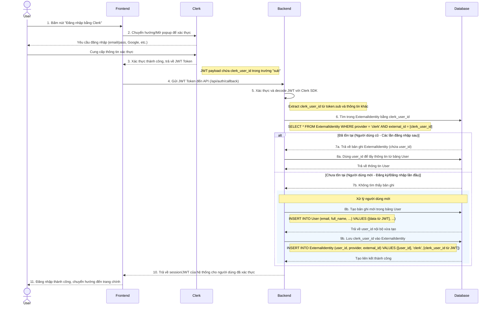

# Phân tích ERD hệ thống web bán giày

## 1. Giới thiệu

Tài liệu này trình bày phân tích thiết kế Cơ sở dữ liệu của hệ thống web bán giày, sử dụng mô hình Thực thể - Quan hệ (ERD).

## 2. Phân tích ERD

### 2.1. Bước 1: Xác định tập thực thể

Tập thực thể đầy đủ của hệ thống bao gồm:

1.  **User (Người dùng)**: Đại diện cho các vai trò như "khách hàng", "quản trị viên", "shipper".
2.  **Role (Vai trò)**: Các vai trò trong hệ thống như "admin", "customer", "shipper".
3.  **Permission (Quyền)**: Đại diện cho các quyền truy cập như "xem sản phẩm", "quản lý đơn hàng".
4.  **Product (Sản phẩm)**: Đại diện cho sản phẩm trong hệ thống.
5.  **Category (Danh mục)**: Phân loại sản phẩm.
6.  **Brand (Thương hiệu)**: Thương hiệu của sản phẩm (Nike, Adidas, Converse, v.v.).
7.  **Order (Đơn hàng)**: Thông tin về đơn hàng của người dùng.
8.  **Cart (Giỏ hàng)**: Giỏ hàng của người dùng.
9.  **Address (Địa chỉ)**: Địa chỉ giao hàng hoặc thông tin liên hệ của người dùng.
10. **Payment (Thanh toán)**: Thông tin thanh toán của đơn hàng.
11. **PaymentMethod (Phương thức thanh toán)**: Các phương thức thanh toán được hỗ trợ.
12. **Shipping (Giao hàng)**: Thông tin vận chuyển liên quan đến đơn hàng.
13. **Promotion (Khuyến mãi)**: Các chương trình khuyến mãi.
14. **DiscountCode (Mã giảm giá)**: Mã giảm giá áp dụng cho đơn hàng.
15. **Review (Đánh giá)**: Đánh giá của người dùng về sản phẩm.
16. **Wishlist (Danh sách mong muốn)**: Danh sách sản phẩm người dùng muốn nhận thông báo.
17. **ProductImage (Hình ảnh sản phẩm)**: Lưu trữ hình ảnh của sản phẩm.
18. **Collection (Bộ sưu tập)**: Đại diện cho các bộ sưu tập sản phẩm (VD: mùa hè, mùa đông).
19. **Favourite (Yêu thích)**: Danh sách sản phẩm yêu thích của người dùng.
20. **Feedback (Phản hồi)**: Phản hồi của khách hàng về dịch vụ.
21. **OrderStatusHistory (Lịch sử trạng thái đơn hàng)**: Theo dõi lịch sử thay đổi trạng thái đơn hàng.
22. **ExternalIdentity (Định danh bên ngoài)**: Mapping giữa User nội bộ và các identity providers bên ngoài (Clerk, Google, Facebook, etc.).


### 2.2. Bước 2: Xác định mối quan hệ

*   **User - Role**: Một người dùng có thể có nhiều vai trò, một vai trò có thể được gán cho nhiều người dùng (N:M). Cần bảng trung gian **UserRole**.
*   **Role - Permission**: Một vai trò có thể có nhiều quyền, một quyền có thể được gán cho nhiều vai trò (N:M). Cần bảng trung gian **RolePermission**.
*   **User - Address**: Một người dùng có thể có nhiều địa chỉ (1:N).
*   **User - Order**: Một người dùng có thể đặt nhiều đơn hàng (1:N). Lưu ý: Đơn hàng của khách vãng lai sẽ có user_id = NULL.
*   **User - Cart**: Một người dùng có một giỏ hàng (1:1).
*   **User - Wishlist**: Một người dùng có một danh sách mong muốn (1:1).
*   **User - Favourite**: Một người dùng có thể có nhiều sản phẩm yêu thích (1:N).
*   **User - Feedback**: Một người dùng có thể gửi nhiều phản hồi (1:N).
*   **User - ExternalIdentity**: Một người dùng có thể có nhiều external identities từ các providers khác nhau (1:N).
*   **Product - Category**: Một sản phẩm thuộc một danh mục, một danh mục có thể chứa nhiều sản phẩm (1:N).
*   **Product - Brand**: Một sản phẩm thuộc một thương hiệu, một thương hiệu có thể có nhiều sản phẩm (N:1).
*   **Product - Review**: Một sản phẩm có thể có nhiều đánh giá, một đánh giá thuộc về một sản phẩm (1:N).
*   **Product - ProductImage**: Một sản phẩm có thể có nhiều hình ảnh, một hình ảnh thuộc về một sản phẩm (1:N).
*   **Product - Favourite**: Một sản phẩm có thể được nhiều người yêu thích, một mục yêu thích thuộc về một sản phẩm (1:N).
*   **Collection - Product**: Một bộ sưu tập có thể chứa nhiều sản phẩm, một sản phẩm có thể thuộc nhiều bộ sưu tập (N:M). Cần bảng trung gian **CollectionProduct**.
*   **Order - Product**: Một đơn hàng có thể chứa nhiều sản phẩm, một sản phẩm có thể xuất hiện trong nhiều đơn hàng (N:M). Cần bảng trung gian **OrderDetail**.
*   **Order - DiscountCode**: Một đơn hàng có thể sử dụng một hoặc nhiều mã giảm giá, một mã giảm giá có thể được sử dụng cho nhiều đơn hàng (N:M). Cần bảng trung gian **DiscountCodeUses**.
*   **Order - OrderStatusHistory**: Một đơn hàng có thể có nhiều lịch sử thay đổi trạng thái (1:N).
*   **Order - Address**: Một đơn hàng có thể có một địa chỉ giao hàng, một địa chỉ có thể được sử dụng cho nhiều đơn hàng (1:N).
*   **Order - Payment**: Một đơn hàng có thể có nhiều thanh toán (trong trường hợp thanh toán thất bại và thử lại), một thanh toán thuộc về một đơn hàng (1:N).
*   **Payment - PaymentMethod**: Một thanh toán sử dụng một phương thức thanh toán, một phương thức thanh toán có thể được sử dụng cho nhiều thanh toán (N:1).
*   **Wishlist - Product**: Một danh sách mong muốn có thể chứa nhiều sản phẩm, một sản phẩm có thể nằm trong nhiều danh sách mong muốn (N:M). Cần bảng trung gian **WishlistItem**.

Ghi chú về Review: - Để đảm bảo rằng chỉ những người dùng đã mua sản phẩm mới có thể đánh giá, logic kiểm tra sẽ được thực hiện trong ứng dụng bằng cách kiểm tra lịch sử mua hàng của người dùng (qua Order và OrderDetail) trước khi cho phép viết đánh giá. Không cần thêm mối quan hệ trực tiếp giữa Review và Order trong ERD.

### 2.3. Bước 3: Xác định thuộc tính cho thực thể

*   **User**:
    *   `id` (PK): Mã người dùng.
    *   `username`: Tên đăng nhập.
    *   `email`: Email người dùng.
    *   `password`: Mật khẩu (mã hóa).
    *   `full_name`: Họ và tên.
    *   `phone`: Số điện thoại.
    *   `avatar_url`: Hình đại diện người dùng.
    *   `date_of_birth`: Ngày sinh.
    *   `gender`: Giới tính (male, female, other).
    *   `last_login_at`: Lần đăng nhập cuối.
    *   `is_active`: Trạng thái tài khoản.
    *   `email_verified`: Trạng thái xác thực email.
    *   `created_at`: Thời gian tạo.
    *   `updated_at`: Thời gian cập nhật.
*   **Product**:
    *   `id` (PK): Mã sản phẩm.
    *   `category_id` (FK): Mã danh mục.
    *   `brand_id` (FK): Mã thương hiệu.
    *   `name`: Tên sản phẩm.
    *   `description`: Mô tả.
    *   `price`: Giá sản phẩm.
    *   `stock_price`: Giá gốc.
    *   `stock_quantity`: Số lượng tồn kho.
    *   `sku`: Mã sản phẩm duy nhất.
    *   `weight`: Trọng lượng sản phẩm.
    *   `dimensions`: Kích thước sản phẩm (L x W x H).
    *   `is_featured`: Sản phẩm nổi bật.
    *   `is_active`: Trạng thái sản phẩm.
    *   `meta_title`: SEO title.
    *   `meta_description`: SEO description.
    *   `attributes`: Thuộc tính sản phẩm (JSONB - sizes, colors, materials, tags).
    *   `created_at`: Thời gian tạo.
    *   `updated_at`: Thời gian cập nhật.
*   **Category**:
    *   `id` (PK): Mã danh mục.
    *   `name`: Tên danh mục.
    *   `description`: Mô tả.
    *   `created_at`: Thời gian tạo.
    *   `updated_at`: Thời gian cập nhật.
*   **Order**:
    *   `id` (PK): Mã đơn hàng.
    *   `user_id` (FK, nullable): Mã người dùng (NULL nếu là khách vãng lai).
    *   `status`: Trạng thái (chờ xử lý, đang giao, đã giao, đã hủy).
    *   `total_amount`: Tổng tiền.
    *   `discount_code_id` (FK, nullable): Mã giảm giá (nếu có).
    *   `guest_email`: Email khách vãng lai.
    *   `guest_phone`: Số điện thoại khách vãng lai.
    *   `contact_name`: Tên liên hệ (cho khách vãng lai).
    *   `contact_phone`: Số điện thoại (cho khách vãng lai).
    *   `contact_address`: Địa chỉ (cho khách vãng lai).
    *   `contact_email`: Email (cho khách vãng lai).
    *   `tax_amount`: Số tiền thuế.
    *   `shipping_cost`: Phí vận chuyển.
    *   `notes`: Ghi chú đơn hàng.
    *   `estimated_delivery_date`: Ngày giao hàng dự kiến.
    *   `order_source`: Nguồn đơn hàng (web, mobile, admin).
    *   `created_at`: Thời gian tạo.
    *   `updated_at`: Thời gian cập nhật.
*   **Cart**:
    *   `id` (PK): Mã giỏ hàng.
    *   `user_id` (FK): Mã người dùng.
    *   `created_at`: Thời gian tạo.
    *   `updated_at`: Thời gian cập nhật.
*   **Address**:
    *   `id` (PK): Mã địa chỉ.
    *   `user_id` (FK): Mã người dùng.
    *   `street`: Đường.
    *   `city`: Thành phố.
    *   `state`: Tỉnh/Bang.
    *   `postal_code`: Mã bưu điện.
    *   `country`: Quốc gia.
    *   `is_default`: Địa chỉ mặc định (true/false).
    *   `created_at`: Thời gian tạo.
    *   `updated_at`: Thời gian cập nhật.
*   **PaymentMethod**:
    *   `id` (PK): Mã phương thức thanh toán.
    *   `code` (UK): Mã định danh duy nhất (stripe, vnpay, cod, momo).
    *   `name`: Tên hiển thị của phương thức thanh toán.
    *   `provider`: Nhà cung cấp dịch vụ thanh toán (Stripe, VNPay, MoMo).
    *   `fee_percent`: Phần trăm phí giao dịch của provider.
    *   `is_active`: Trạng thái kích hoạt của phương thức thanh toán.
    *   `created_at`: Thời gian tạo.
*   **Payment**:
    *   `id` (PK): Mã thanh toán.
    *   `order_id` (FK): Mã đơn hàng.
    *   `payment_method_id` (FK): Mã phương thức thanh toán.
    *   `amount`: Số tiền thanh toán.
    *   `status`: Trạng thái (pending, processing, success, failed, cancelled, refunded).
    *   `provider_txn_id`: ID giao dịch từ provider.
    *   `provider_fee`: Phí thực tế từ provider.
    *   `metadata`: Dữ liệu JSON từ provider.
    *   `paid_at`: Thời điểm thanh toán thành công.
    *   `idempotency_key`: Key đảm bảo tính idempotent.
    *   `created_at`: Thời gian tạo.
    *   `updated_at`: Thời gian cập nhật.
*   **Shipping**:
    *   `id` (PK): Mã giao hàng.
    *   `order_id` (FK): Mã đơn hàng.
    *   `address_id` (FK): Mã địa chỉ giao hàng.
    *   `status`: Trạng thái (chờ giao, đang giao, đã giao).
    *   `shipper_id` (FK, nullable): Mã shipper (liên kết đến User).
    *   `created_at`: Thời gian tạo.
    *   `updated_at`: Thời gian cập nhật.
*   **Promotion**:
    *   `id` (PK): Mã khuyến mãi.
    *   `name`: Tên chương trình.
    *   `description`: Mô tả.
    *   `discount_percentage`: Phần trăm giảm giá.
    *   `start_date`: Ngày bắt đầu.
    *   `end_date`: Ngày kết thúc.
    *   `created_at`: Thời gian tạo.
    *   `updated_at`: Thời gian cập nhật.
*   **DiscountCode**:
    *   `id` (PK): Mã giảm giá.
    *   `code` (UK): Mã duy nhất.
    *   `discount_type`: Loại giảm giá (phần trăm, số tiền).
    *   `discount_percentage`: Phần trăm giảm giá.
    *   `max_uses`: Số lần sử dụng tối đa.
    *   `uses_count`: Số lần đã sử dụng.
    *   `min_order_value`: Giá trị đơn hàng tối thiểu.
    *   `is_active`: Trạng thái kích hoạt mã.
    *   `user_limit`: Giới hạn số lần sử dụng per user.
    *   `start_date`: Ngày bắt đầu.
    *   `end_date`: Ngày kết thúc.
    *   `created_at`: Thời gian tạo.
    *   `updated_at`: Thời gian cập nhật.
*   **Review**:
    *   `id` (PK): Mã đánh giá.
    *   `product_id` (FK): Mã sản phẩm.
    *   `user_id` (FK): Mã người dùng.
    *   `rating`: Điểm đánh giá.
    *   `comment`: Bình luận.
    *   `created_at`: Thời gian tạo.
    *   `updated_at`: Thời gian cập nhật.
*   **Wishlist**:
    *   `id` (PK): Mã danh sách mong muốn.
    *   `user_id` (FK): Mã người dùng.
    *   `created_at`: Thời gian tạo.
    *   `updated_at`: Thời gian cập nhật.
*   **WishlistItem**:
    *   `wishlist_id` (PK, FK): Mã danh sách mong muốn.
    *   `product_id` (PK, FK): Mã sản phẩm.
*   **ProductImage**:
    *   `id` (PK): Mã hình ảnh.
    *   `product_id` (FK): Mã sản phẩm.
    *   `image_url`: Đường dẫn hình ảnh.
    *   `is_primary`: Hình ảnh chính (true/false).
    *   `created_at`: Thời gian tạo.
    *   `updated_at`: Thời gian cập nhật.
*   **Collection**:
    *   `id` (PK): Mã bộ sưu tập.
    *   `name`: Tên bộ sưu tập.
    *   `description`: Mô tả.
    *   `created_at`: Thời gian tạo.
    *   `updated_at`: Thời gian cập nhật.
*   **Favourite**:
    *   `id` (PK): Mã yêu thích.
    *   `user_id` (FK): Mã người dùng.
    *   `product_id` (FK): Mã sản phẩm.
    *   `created_at`: Thời gian tạo.
*   **Brand**:
    *   `id` (PK): Mã thương hiệu.
    *   `name`: Tên thương hiệu.
    *   `description`: Mô tả thương hiệu.
    *   `logo_url`: Đường dẫn logo thương hiệu.
    *   `is_active`: Trạng thái kích hoạt.
    *   `created_at`: Thời gian tạo.
    *   `updated_at`: Thời gian cập nhật.
*   **Feedback**:
    *   `id` (PK): Mã phản hồi.
    *   `user_id` (FK): Mã người dùng.
    *   `subject`: Chủ đề phản hồi.
    *   `content`: Nội dung phản hồi.
    *   `status`: Trạng thái (pending, in_progress, resolved).
    *   `admin_response`: Phản hồi từ admin.
    *   `created_at`: Thời gian tạo.
    *   `updated_at`: Thời gian cập nhật.
*   **OrderStatusHistory**:
    *   `id` (PK): Mã lịch sử trạng thái.
    *   `order_id` (FK): Mã đơn hàng.
    *   `old_status`: Trạng thái cũ.
    *   `new_status`: Trạng thái mới.
    *   `changed_by` (FK): Người thay đổi.
    *   `notes`: Ghi chú.
    *   `changed_at`: Thời gian thay đổi.

▪ **Bảng trung gian**:

*   **OrderDetail**:
    *   `order_id` (PK, FK): Mã đơn hàng.
    *   `product_id` (PK, FK): Mã sản phẩm.
    *   `quantity`: Số lượng.
    *   `price_at_purchase`: Giá tại thời điểm mua.
*   **CartItem**:
    *   `cart_id` (PK, FK): Mã giỏ hàng.
    *   `product_id` (PK, FK): Mã sản phẩm.
    *   `quantity`: Số lượng.
*   **PromotionProduct**:
    *   `promotion_id` (PK, FK): Mã khuyến mãi.
    *   `product_id` (PK, FK): Mã sản phẩm.
*   **UserRole**:
    *   `user_id` (PK, FK): Mã người dùng.
    *   `role_id` (PK, FK): Mã vai trò.
*   **RolePermission**:
    *   `role_id` (PK, FK): Mã vai trò.
    *   `permission_id` (PK, FK): Mã quyền.
*   **DiscountCodeUses**:
    *   `discount_code_id` (PK, FK): Mã giảm giá.
    *   `order_id` (PK, FK): Mã đơn hàng.
    *   `used_at`: Thời gian sử dụng.
*   **WishlistItem**:
    *   `wishlist_id` (PK, FK): Mã danh sách mong muốn.
    *   `product_id` (PK, FK): Mã sản phẩm.
*   **CollectionProduct**:
    *   `collection_id` (PK, FK): Mã bộ sưu tập.
    *   `product_id` (PK, FK): Mã sản phẩm.

### 2.4. Bước 4: Quyết định miền giá trị cho thuộc tính

*   **User**:
    *   `id`: UUID hoặc INT AUTO_INCREMENT.
    *   `username`: VARCHAR(50) UNIQUE.
    *   `email`: VARCHAR(255) UNIQUE.
    *   `password`: VARCHAR(255).
    *   `full_name`: VARCHAR(100).
    *   `phone`: VARCHAR(20).
    *   `avatar_url`: VARCHAR(255).
    *   `date_of_birth`: DATE.
    *   `gender`: VARCHAR(10) CHECK (gender IN ('male', 'female', 'other')).
    *   `last_login_at`: TIMESTAMP.
    *   `is_active`: BOOLEAN DEFAULT true.
    *   `email_verified`: BOOLEAN DEFAULT false.
    *   `created_at`, `updated_at`: TIMESTAMP.
*   **Product**:
    *   `id`: UUID hoặc INT AUTO_INCREMENT.
    *   `category_id`: UUID hoặc INT.
    *   `brand_id`: UUID hoặc INT.
    *   `name`: VARCHAR(200).
    *   `description`: TEXT.
    *   `price`: DECIMAL(10,2).
    *   `stock_price`: DECIMAL(10,2).
    *   `stock_quantity`: INT.
    *   `sku`: VARCHAR(100) UNIQUE.
    *   `weight`: DECIMAL(8,2).
    *   `dimensions`: VARCHAR(100).
    *   `is_featured`: BOOLEAN DEFAULT false.
    *   `is_active`: BOOLEAN DEFAULT true.
    *   `meta_title`: VARCHAR(200).
    *   `meta_description`: TEXT.
    *   `attributes`: JSONB DEFAULT '{}' (sizes, colors, materials, tags).
    *   `created_at`, `updated_at`: TIMESTAMP.
*   **Role**:
    *   `id`: UUID hoặc INT AUTO_INCREMENT.
    *   `name`: VARCHAR(50).
    *   `description`: TEXT.
    *   `created_at`, `updated_at`: TIMESTAMP.
*   **Permission**:
    *   `id`: UUID hoặc INT AUTO_INCREMENT.
    *   `name`: VARCHAR(50).
    *   `description`: TEXT.
    *   `created_at`, `updated_at`: TIMESTAMP.
*   **UserRole**:
    *   `user_id`: UUID hoặc INT (tương ứng với User.id).
    *   `role_id`: UUID hoặc INT (tương ứng với Role.id).
*   **RolePermission**:
    *   `role_id`: UUID hoặc INT (tương ứng với Role.id).
    *   `permission_id`: UUID hoặc INT (tương ứng với Permission.id).
*   **DiscountCodeUses**:
    *   `discount_code_id`: UUID hoặc INT (tương ứng với DiscountCode.id).
    *   `order_id`: UUID hoặc INT (tương ứng với Order.id).
    *   `used_at`: TIMESTAMP.
*   **WishlistItem**:
    *   `wishlist_id`: UUID hoặc INT (tương ứng với Wishlist.id).
    *   `product_id`: UUID hoặc INT (tương ứng với Product.id).
*   **ProductImage**:
    *   `id`: UUID hoặc INT AUTO_INCREMENT.
    *   `product_id`: UUID hoặc INT (tương ứng với Product.id).
    *   `image_url`: VARCHAR(255).
    *   `is_primary`: BOOLEAN.
    *   `created_at`, `updated_at`: TIMESTAMP.
*   **Collection**:
    *   `id`: UUID hoặc INT AUTO_INCREMENT.
    *   `name`: VARCHAR(100).
    *   `description`: TEXT.
    *   `created_at`, `updated_at`: TIMESTAMP.
*   **Favourite**:
    *   `id`: UUID hoặc INT AUTO_INCREMENT.
    *   `user_id`: UUID hoặc INT (tương ứng với User.id).
    *   `product_id`: UUID hoặc INT (tương ứng với Product.id).
    *   `created_at`: TIMESTAMP.
*   **CollectionProduct**:
    *   `collection_id`: UUID hoặc INT (tương ứng với Collection.id).
    *   `product_id`: UUID hoặc INT (tương ứng với Product.id).
*   **Brand**:
    *   `id`: UUID hoặc INT AUTO_INCREMENT.
    *   `name`: VARCHAR(100) UNIQUE.
    *   `description`: TEXT.
    *   `logo_url`: VARCHAR(255).
    *   `is_active`: BOOLEAN DEFAULT true.
    *   `created_at`, `updated_at`: TIMESTAMP.
*   **Feedback**:
    *   `id`: UUID hoặc INT AUTO_INCREMENT.
    *   `user_id`: UUID hoặc INT (tương ứng với User.id).
    *   `subject`: VARCHAR(200).
    *   `content`: TEXT.
    *   `status`: VARCHAR(20) CHECK (status IN ('pending', 'in_progress', 'resolved')).
    *   `admin_response`: TEXT.
    *   `created_at`, `updated_at`: TIMESTAMP.
*   **OrderStatusHistory**:
    *   `id`: UUID hoặc INT AUTO_INCREMENT.
    *   `order_id`: UUID hoặc INT (tương ứng với Order.id).
    *   `old_status`: VARCHAR(20).
    *   `new_status`: VARCHAR(20).
    *   `changed_by`: UUID hoặc INT (tương ứng với User.id).
    *   `notes`: TEXT.
    *   `changed_at`: TIMESTAMP.
*   **Category**:
    *   `id`: UUID hoặc INT AUTO_INCREMENT.
    *   `name`: VARCHAR(100) UNIQUE.
    *   `description`: TEXT.
    *   `created_at`, `updated_at`: TIMESTAMP.
*   **Order**:
    *   `id`: UUID hoặc INT AUTO_INCREMENT.
    *   `user_id`: UUID hoặc INT (nullable, tương ứng với User.id).
    *   `status`: VARCHAR(20) CHECK (status IN ('pending', 'processing', 'shipped', 'delivered', 'cancelled')).
    *   `total_amount`: DECIMAL(12,2).
    *   `discount_code_id`: UUID hoặc INT (nullable, tương ứng với DiscountCode.id).
    *   `guest_email`: VARCHAR(255).
    *   `guest_phone`: VARCHAR(20).
    *   `contact_name`: VARCHAR(100).
    *   `contact_phone`: VARCHAR(20).
    *   `contact_address`: TEXT.
    *   `contact_email`: VARCHAR(255).
    *   `tax_amount`: DECIMAL(10,2).
    *   `shipping_cost`: DECIMAL(10,2).
    *   `notes`: TEXT.
    *   `estimated_delivery_date`: DATE.
    *   `order_source`: VARCHAR(20) CHECK (order_source IN ('web', 'mobile', 'admin')).
    *   `created_at`, `updated_at`: TIMESTAMP.
*   **Cart**:
    *   `id`: UUID hoặc INT AUTO_INCREMENT.
    *   `user_id`: UUID hoặc INT (tương ứng với User.id).
    *   `created_at`, `updated_at`: TIMESTAMP.
*   **Address**:
    *   `id`: UUID hoặc INT AUTO_INCREMENT.
    *   `user_id`: UUID hoặc INT (tương ứng với User.id).
    *   `street`: VARCHAR(255).
    *   `city`: VARCHAR(100).
    *   `state`: VARCHAR(100).
    *   `postal_code`: VARCHAR(20).
    *   `country`: VARCHAR(100).
    *   `is_default`: BOOLEAN DEFAULT false.
    *   `created_at`, `updated_at`: TIMESTAMP.
*   **PaymentMethod**:
    *   `id`: UUID hoặc INT AUTO_INCREMENT.
    *   `code`: VARCHAR(50) UNIQUE.
    *   `name`: VARCHAR(100).
    *   `provider`: VARCHAR(100).
    *   `fee_percent`: DECIMAL(5,4).
    *   `is_active`: BOOLEAN DEFAULT true.
    *   `created_at`: TIMESTAMP.
*   **Payment**:
    *   `id`: UUID hoặc INT AUTO_INCREMENT.
    *   `order_id`: UUID hoặc INT (tương ứng với Order.id).
    *   `payment_method_id`: UUID hoặc INT (tương ứng với PaymentMethod.id).
    *   `amount`: DECIMAL(12,2).
    *   `status`: VARCHAR(20) CHECK (status IN ('pending', 'processing', 'success', 'failed', 'cancelled', 'refunded')).
    *   `provider_txn_id`: VARCHAR(255).
    *   `provider_fee`: DECIMAL(10,2).
    *   `metadata`: JSONB DEFAULT '{}' .
    *   `paid_at`: TIMESTAMP.
    *   `idempotency_key`: VARCHAR(255) UNIQUE.
    *   `created_at`, `updated_at`: TIMESTAMP.
*   **Shipping**:
    *   `id`: UUID hoặc INT AUTO_INCREMENT.
    *   `order_id`: UUID hoặc INT (tương ứng với Order.id).
    *   `address_id`: UUID hoặc INT (tương ứng với Address.id).
    *   `status`: VARCHAR(20) CHECK (status IN ('pending', 'in_transit', 'delivered')).
    *   `shipper_id`: UUID hoặc INT (nullable, tương ứng với User.id).
    *   `created_at`, `updated_at`: TIMESTAMP.
*   **Promotion**:
    *   `id`: UUID hoặc INT AUTO_INCREMENT.
    *   `name`: VARCHAR(200).
    *   `description`: TEXT.
    *   `discount_percentage`: DECIMAL(5,2).
    *   `start_date`: TIMESTAMP.
    *   `end_date`: TIMESTAMP.
    *   `created_at`, `updated_at`: TIMESTAMP.
*   **DiscountCode**:
    *   `id`: UUID hoặc INT AUTO_INCREMENT.
    *   `code`: VARCHAR(50) UNIQUE.
    *   `discount_type`: VARCHAR(20) CHECK (discount_type IN ('percentage', 'fixed_amount')).
    *   `discount_percentage`: DECIMAL(5,2).
    *   `max_uses`: INT.
    *   `uses_count`: INT DEFAULT 0.
    *   `min_order_value`: DECIMAL(12,2).
    *   `is_active`: BOOLEAN DEFAULT true.
    *   `user_limit`: INT.
    *   `start_date`: TIMESTAMP.
    *   `end_date`: TIMESTAMP.
    *   `created_at`, `updated_at`: TIMESTAMP.
*   **Review**:
    *   `id`: UUID hoặc INT AUTO_INCREMENT.
    *   `product_id`: UUID hoặc INT (tương ứng với Product.id).
    *   `user_id`: UUID hoặc INT (tương ứng với User.id).
    *   `rating`: INT CHECK (rating >= 1 AND rating <= 5).
    *   `comment`: TEXT.
    *   `created_at`, `updated_at`: TIMESTAMP.
*   **Wishlist**:
    *   `id`: UUID hoặc INT AUTO_INCREMENT.
    *   `user_id`: UUID hoặc INT (tương ứng với User.id).
    *   `created_at`, `updated_at`: TIMESTAMP.
*   **ExternalIdentity**:
    *   `id`: UUID hoặc INT AUTO_INCREMENT.
    *   `user_id`: UUID hoặc INT (tương ứng với User.id).
    *   `provider`: VARCHAR(50).
    *   `external_id`: VARCHAR(255).
    *   `metadata`: JSONB DEFAULT '{}' .
    *   `created_at`, `updated_at`: TIMESTAMP.
    *   UNIQUE(provider, external_id).
*   **OrderDetail**:
    *   `order_id`: UUID hoặc INT (tương ứng với Order.id).
    *   `product_id`: UUID hoặc INT (tương ứng với Product.id).
    *   `quantity`: INT CHECK (quantity > 0).
    *   `price_at_purchase`: DECIMAL(10,2).
*   **CartItem**:
    *   `cart_id`: UUID hoặc INT (tương ứng với Cart.id).
    *   `product_id`: UUID hoặc INT (tương ứng với Product.id).
    *   `quantity`: INT CHECK (quantity > 0).
*   **PromotionProduct**:
    *   `promotion_id`: UUID hoặc INT (tương ứng với Promotion.id).
    *   `product_id`: UUID hoặc INT (tương ứng với Product.id).

### 2.5. Bước 5: Xác định thuộc tính khóa

*   **User**: Khóa chính: `id`, khóa duy nhất: `username`, `email`.
*   **Product**: Khóa chính: `id`, khóa ngoại: `category_id` → `Category.id`, `brand_id` → `Brand.id`, khóa duy nhất: `sku`.
*   **Brand**: Khóa chính: `id`, khóa duy nhất: `name`.
*   **Role**: Khóa chính: `id`.
*   **Permission**: Khóa chính: `id`.
*   **UserRole**: Khóa chính tổ hợp: (`user_id`, `role_id`), khóa ngoại: `user_id` → `User.id`, `role_id` → `Role.id`.
*   **RolePermission**: Khóa chính tổ hợp: (`role_id`, `permission_id`), khóa ngoại: `role_id` → `Role.id`, `permission_id` → `Permission.id`.
*   **Category**: Khóa chính: `id`, khóa duy nhất: `name`.
*   **Order**: Khóa chính: `id`, khóa ngoại: `user_id` → `User.id` (nullable), `discount_code_id` → `DiscountCode.id` (nullable).
*   **Cart**: Khóa chính: `id`, khóa ngoại: `user_id` → `User.id`.
*   **Address**: Khóa chính: `id`, khóa ngoại: `user_id` → `User.id`.
*   **PaymentMethod**: Khóa chính: `id`, khóa duy nhất: `code`.
*   **Payment**: Khóa chính: `id`, khóa ngoại: `order_id` → `Order.id`, `payment_method_id` → `PaymentMethod.id`, khóa duy nhất: `idempotency_key`.
*   **Shipping**: Khóa chính: `id`, khóa ngoại: `order_id` → `Order.id`, `address_id` → `Address.id`, `shipper_id` → `User.id` (nullable).
*   **Promotion**: Khóa chính: `id`.
*   **DiscountCode**: Khóa chính: `id`, khóa duy nhất: `code`.
*   **DiscountCodeUses**: Khóa chính tổ hợp: (`discount_code_id`, `order_id`), khóa ngoại: `discount_code_id` → `DiscountCode.id`, `order_id` → `Order.id`.
*   **Review**: Khóa chính: `id`, khóa ngoại: `user_id` → `User.id`, `product_id` → `Product.id`.
*   **Wishlist**: Khóa chính: `id`, khóa ngoại: `user_id` → `User.id`.
*   **WishlistItem**: Khóa chính tổ hợp: (`wishlist_id`, `product_id`), khóa ngoại: `wishlist_id` → `Wishlist.id`, `product_id` → `Product.id`.
*   **ProductImage**: Khóa chính: `id`, khóa ngoại: `product_id` → `Product.id`.
*   **Collection**: Khóa chính: `id`.
*   **Favourite**: Khóa chính: `id`, khóa ngoại: `user_id` → `User.id`, `product_id` → `Product.id`.
*   **CollectionProduct**: Khóa chính tổ hợp: (`collection_id`, `product_id`), khóa ngoại: `collection_id` → `Collection.id`, `product_id` → `Product.id`.
*   **Feedback**: Khóa chính: `id`, khóa ngoại: `user_id` → `User.id`.
*   **OrderStatusHistory**: Khóa chính: `id`, khóa ngoại: `order_id` → `Order.id`, `changed_by` → `User.id`.
*   **ExternalIdentity**: Khóa chính: `id`, khóa ngoại: `user_id` → `User.id`, khóa duy nhất tổ hợp: (`provider`, `external_id`).
*   **OrderDetail**: Khóa chính tổ hợp: (`order_id`, `product_id`), khóa ngoại: `order_id` → `Order.id`, `product_id` → `Product.id`.
*   **CartItem**: Khóa chính tổ hợp: (`cart_id`, `product_id`), khóa ngoại: `cart_id` → `Cart.id`, `product_id` → `Product.id`.
*   **PromotionProduct**: Khóa chính tổ hợp: (`promotion_id`, `product_id`), khóa ngoại: `promotion_id` → `Promotion.id`, `product_id` → `Product.id`.

### 2.6. Bước 6: Xác định ràng buộc (tỉ số, min-max, ràng buộc tham gia)

*   **User - Role** (qua UserRole):
    *   Tỉ số: N:M.
    *   Min-max: (0, N) cho User, (0, N) cho Role.
*   **Role - Permission** (qua RolePermission):
    *   Tỉ số: N:M.
    *   Min-max: (0, N) cho Role, (0, N) cho Permission.
*   **User - Address**:
    *   Tỉ số: 1:N.
    *   Min-max: Một người dùng có thể có 0 hoặc nhiều địa chỉ, một địa chỉ thuộc về đúng 1 người dùng.
*   **User - Order**:
    *   Tỉ số: 1:N.
    *   Min-max: Một người dùng có thể có 0 hoặc nhiều đơn hàng, một đơn hàng thuộc về 0 hoặc 1 người dùng (0 nếu là khách vãng lai).
*   **User - Cart**:
    *   Tỉ số: 1:1.
    *   Min-max: Một người dùng có đúng 1 giỏ hàng, một giỏ hàng thuộc về đúng 1 người dùng.
*   **User - Wishlist**:
    *   Tỉ số: 1:1.
    *   Min-max: Một người dùng có đúng 1 danh sách mong muốn, một danh sách thuộc về đúng 1 người dùng.
*   **User - Favourite**:
    *   Tỉ số: 1:N.
    *   Min-max: Một người dùng có thể có 0 hoặc nhiều sản phẩm yêu thích, một mục yêu thích thuộc về đúng 1 người dùng.
*   **Product - Category**:
    *   Tỉ số: N:1.
    *   Min-max: Một sản phẩm thuộc về đúng 1 danh mục, một danh mục có thể có 0 hoặc nhiều sản phẩm.
*   **Product - Brand**:
    *   Tỉ số: N:1.
    *   Min-max: Một sản phẩm thuộc về đúng 1 thương hiệu, một thương hiệu có thể có 0 hoặc nhiều sản phẩm.
*   **User - Feedback**:
    *   Tỉ số: 1:N.
    *   Min-max: Một người dùng có thể gửi 0 hoặc nhiều phản hồi, một phản hồi thuộc về đúng 1 người dùng.
*   **Order - OrderStatusHistory**:
    *   Tỉ số: 1:N.
    *   Min-max: Một đơn hàng có thể có 0 hoặc nhiều lịch sử thay đổi trạng thái, một lịch sử thuộc về đúng 1 đơn hàng.
*   **Product - Review**:
    *   Tỉ số: 1:N.
    *   Min-max: Một sản phẩm có thể có 0 hoặc nhiều đánh giá, một đánh giá thuộc về đúng 1 sản phẩm.
*   **Product - ProductImage**:
    *   Tỉ số: 1:N.
    *   Min-max: Một sản phẩm có thể có 0 hoặc nhiều hình ảnh, một hình ảnh thuộc về đúng 1 sản phẩm.
*   **Product - Favourite**:
    *   Tỉ số: 1:N.
    *   Min-max: Một sản phẩm có thể được 0 hoặc nhiều người yêu thích, một mục yêu thích thuộc về đúng 1 sản phẩm.
*   **Collection - Product** (qua CollectionProduct):
    *   Tỉ số: N:M.
    *   Min-max: Một bộ sưu tập có thể chứa 0 hoặc nhiều sản phẩm, một sản phẩm có thể thuộc 0 hoặc nhiều bộ sưu tập.
*   **Order - Product**:
    *   Tỉ số: N:M (qua OrderDetail).
    *   Min-max: Một đơn hàng có thể chứa 1 hoặc nhiều sản phẩm, một sản phẩm có thể xuất hiện trong 0 hoặc nhiều đơn hàng.
*   **Order - Payment**:
    *   Tỉ số: 1:N.
    *   Min-max: Một đơn hàng có thể có 1 hoặc nhiều thanh toán, một thanh toán thuộc về đúng 1 đơn hàng.
*   **Payment - PaymentMethod**:
    *   Tỉ số: N:1.
    *   Min-max: Một thanh toán sử dụng đúng 1 phương thức thanh toán, một phương thức thanh toán có thể được sử dụng cho nhiều thanh toán.
*   **Order - Shipping**:
    *   Tỉ số: 1:N.
    *   Min-max: Một đơn hàng có thể có 0 hoặc nhiều lô giao hàng, một lô giao hàng thuộc về đúng 1 đơn hàng.
*   **Cart - Product**:
    *   Tỉ số: N:M (qua CartItem).
    *   Min-max: Một giỏ hàng có thể chứa 0 hoặc nhiều sản phẩm, một sản phẩm có thể xuất hiện trong 0 hoặc nhiều giỏ hàng.
*   **Promotion - Product**:
    *   Tỉ số: N:M (qua PromotionProduct).
    *   Min-max: Một chương trình khuyến mãi áp dụng cho 0 hoặc nhiều sản phẩm, một sản phẩm có thể thuộc 0 hoặc nhiều chương trình khuyến mãi.
*   **DiscountCode - Order**:
    *   Tỉ số: N:M.
    *   Min-max: Một mã giảm giá có thể được dùng cho 0 hoặc nhiều đơn hàng, một đơn hàng dùng 0 hoặc nhiều mã giảm giá.
*   **Wishlist - Product**:
    *   Tỉ số: N:M (qua WishlistItem).
    *   Min-max: Một danh sách mong muốn có thể chứa 0 hoặc nhiều sản phẩm, một sản phẩm có thể nằm trong 0 hoặc nhiều danh sách mong muốn.

## 3. Giải Pháp JSONB cho Product Attributes

### 3.1. Tổng quan về JSONB Attributes

Thay vì sử dụng các cột riêng biệt cho `tags`, `color`, `size`, `material`, hệ thống sử dụng cột `attributes` kiểu JSONB để lưu trữ tất cả thuộc tính sản phẩm một cách linh hoạt và hiệu quả.

### 3.2. Cấu trúc JSONB Attributes

```json
{
  "sizes": ["38", "39", "40", "41", "42", "43"],
  "colors": ["Đen", "Trắng", "Xanh Navy", "Nâu"],
  "materials": ["Da thật", "Canvas", "Synthetic"],
  "tags": ["Sport", "Casual", "Limited Edition", "Bestseller"],
  "features": ["Chống nước", "Thoáng khí", "Đế cao su"],
  "style": "Sneaker",
  "season": ["Xuân", "Hè", "Thu", "Đông"]
}
```

### 3.3. Ưu điểm của JSONB

1. **Linh hoạt cao**: Dễ dàng thêm/sửa/xóa thuộc tính mà không cần thay đổi schema
2. **Hiệu suất tốt**: Giảm số lượng JOIN khi truy vấn thuộc tính sản phẩm
3. **Tiết kiệm storage**: JSONB được nén và tối ưu hóa trong PostgreSQL
4. **Truy vấn mạnh mẽ**: Hỗ trợ các toán tử JSONB như @>, ?, ?&, ?|

### 3.4. Ví dụ Truy vấn JSONB

```sql
-- Tìm sản phẩm có size 40
SELECT * FROM "Product" WHERE attributes->'sizes' ? '40';

-- Tìm sản phẩm có màu đen hoặc trắng
SELECT * FROM "Product" WHERE attributes->'colors' ?| array['Đen', 'Trắng'];

-- Tìm sản phẩm có cả tag "Sport" và "Casual"
SELECT * FROM "Product" WHERE attributes->'tags' ?& array['Sport', 'Casual'];

-- Tìm sản phẩm có chất liệu da thật
SELECT * FROM "Product" WHERE attributes @> '{"materials": ["Da thật"]}';
```

### 3.5. Index Tối ưu cho JSONB

```sql
-- Index GIN cho toàn bộ JSONB
CREATE INDEX idx_product_attributes_gin ON "Product" USING GIN (attributes);

-- Index cho các truy vấn thường dùng
CREATE INDEX idx_product_attributes_sizes ON "Product" USING GIN ((attributes->'sizes'));
CREATE INDEX idx_product_attributes_colors ON "Product" USING GIN ((attributes->'colors'));
CREATE INDEX idx_product_attributes_materials ON "Product" USING GIN ((attributes->'materials'));
```

### 3.6. Validation và Constraints

```sql
-- Constraint để đảm bảo cấu trúc JSONB đúng
ALTER TABLE "Product"
ADD CONSTRAINT chk_attrs_json
CHECK (
  attributes IS NULL OR
  (
    jsonb_typeof(attributes) = 'object' AND
    attributes ?& ARRAY['sizes','colors','materials']
  )
);

-- Giới hạn kích thước JSONB
ALTER TABLE "Product"
ADD CONSTRAINT chk_attrs_len
CHECK (octet_length(attributes::text) <= 2048); -- 2KB
```


## 4. ERD hệ thống

```mermaid
erDiagram
    %% Core User Management
    User {
        string id PK
        string username UK
        string email UK
        string password
        string full_name
        string phone
        string avatar_url
        date date_of_birth
        string gender
        timestamp last_login_at
        boolean is_active
        boolean email_verified
        timestamp created_at
        timestamp updated_at
    }
    
    Role {
        string id PK
        string name
        string description
        timestamp created_at
        timestamp updated_at
    }
    
    Permission {
        string id PK
        string name
        string description
        timestamp created_at
        timestamp updated_at
    }
    
    UserRole {
        string user_id PK,FK
        string role_id PK,FK
    }
    
    RolePermission {
        string role_id PK,FK
        string permission_id PK,FK
    }
    
    %% Product Management
    Product {
        string id PK
        string category_id FK
        string brand_id FK
        string name
        text description
        decimal price
        decimal stock_price
        int stock_quantity
        string sku UK
        decimal weight
        string dimensions
        boolean is_featured
        boolean is_active
        string meta_title
        text meta_description
        jsonb attributes
        timestamp created_at
        timestamp updated_at
    }

    Category {
        string id PK
        string name
        text description
        timestamp created_at
        timestamp updated_at
    }

    Brand {
        string id PK
        string name UK
        text description
        string logo_url
        boolean is_active
        timestamp created_at
        timestamp updated_at
    }
    
    ProductImage {
        string id PK
        string product_id FK
        string image_url
        boolean is_primary
        timestamp created_at
        timestamp updated_at
    }
    
    Collection {
        string id PK
        string name
        text description
        timestamp created_at
        timestamp updated_at
    }
    
    CollectionProduct {
        string collection_id PK,FK
        string product_id PK,FK
    }
    
    %% Order Management
    Order {
        string id PK
        string user_id FK "nullable"
        string status
        decimal total_amount
        string discount_code_id FK "nullable"
        string guest_email "for guest"
        string guest_phone "for guest"
        string contact_name "for guest"
        string contact_phone "for guest"
        string contact_address "for guest"
        string contact_email "for guest"
        decimal tax_amount
        decimal shipping_cost
        text notes
        date estimated_delivery_date
        string order_source
        timestamp created_at
        timestamp updated_at
    }
    
    OrderDetail {
        string order_id PK,FK
        string product_id PK,FK
        int quantity
        decimal price_at_purchase
    }
    
    %% Shopping Cart
    Cart {
        string id PK
        string user_id FK
        timestamp created_at
        timestamp updated_at
    }
    
    CartItem {
        string cart_id PK,FK
        string product_id PK,FK
        int quantity
    }
    
    %% Address Management
    Address {
        string id PK
        string user_id FK
        string street
        string city
        string state
        string postal_code
        string country
        boolean is_default
        timestamp created_at
        timestamp updated_at
    }
    
    %% Payment & Shipping
    PaymentMethod {
        string id PK
        string code UK
        string name
        string provider
        decimal fee_percent
        boolean is_active
        timestamp created_at
    }

    Payment {
        string id PK
        string order_id FK
        string payment_method_id FK
        decimal amount
        string status
        string provider_txn_id
        decimal provider_fee
        json metadata
        timestamp paid_at
        string idempotency_key UK
        timestamp created_at
        timestamp updated_at
    }
    
    Shipping {
        string id PK
        string order_id FK
        string address_id FK
        string status
        string shipper_id FK "nullable"
        timestamp created_at
        timestamp updated_at
    }
    
    %% Promotions & Discounts
    Promotion {
        string id PK
        string name
        text description
        decimal discount_percentage
        timestamp start_date
        timestamp end_date
        timestamp created_at
        timestamp updated_at
    }
    
    PromotionProduct {
        string promotion_id PK,FK
        string product_id PK,FK
    }
    
    DiscountCode {
        string id PK
        string code UK
        string discount_type
        decimal discount_percentage
        int max_uses
        int uses_count
        decimal min_order_value
        boolean is_active
        int user_limit
        timestamp start_date
        timestamp end_date
        timestamp created_at
        timestamp updated_at
    }
    
    DiscountCodeUses {
        string discount_code_id PK,FK
        string order_id PK,FK
        timestamp used_at
    }
    
    %% Reviews & Wishlist
    Review {
        string id PK
        string product_id FK
        string user_id FK
        int rating
        text comment
        timestamp created_at
        timestamp updated_at
    }
    
    Wishlist {
        string id PK
        string user_id FK
        timestamp created_at
        timestamp updated_at
    }
    
    WishlistItem {
        string wishlist_id PK,FK
        string product_id PK,FK
    }
    
    Favourite {
        string id PK
        string user_id FK
        string product_id FK
        timestamp created_at
    }

    %% Communication & Feedback

    Feedback {
        string id PK
        string user_id FK
        string subject
        text content
        string status
        text admin_response
        timestamp created_at
        timestamp updated_at
    }

    %% Order History
    OrderStatusHistory {
        string id PK
        string order_id FK
        string old_status
        string new_status
        string changed_by FK
        text notes
        timestamp changed_at
    }
    
    %% Relationships
    %% User Management Relationships
    User ||--o{ UserRole : "has roles"
    Role ||--o{ UserRole : "assigned to users"
    Role ||--o{ RolePermission : "has permissions"
    Permission ||--o{ RolePermission : "granted to roles"
    
    %% User to Other Entities
    User ||--o{ Address : "has addresses"
    User ||--o| Order : "places orders"
    User ||--|| Cart : "has cart"
    User ||--|| Wishlist : "has wishlist"
    User ||--o{ Favourite : "has favourites"
    User ||--o{ Review : "writes reviews"
    User ||--o{ Feedback : "submits feedback"
    User ||--o{ OrderStatusHistory : "changes order status"
    
    %% Product Relationships
    Category ||--o{ Product : "contains products"
    Brand ||--o{ Product : "manufactures products"
    Product ||--o{ ProductImage : "has images"
    Product ||--o{ Review : "receives reviews"
    Product ||--o{ Favourite : "favorited by users"
    
    %% Collection Relationships
    Collection ||--o{ CollectionProduct : "contains products"
    Product ||--o{ CollectionProduct : "belongs to collections"
    
    %% Order Relationships
    Order ||--o{ OrderDetail : "contains items"
    Product ||--o{ OrderDetail : "ordered in orders"
    Order ||--o{ Payment : "has payments"
    PaymentMethod ||--o{ Payment : "used for payments"
    Order ||--o{ Shipping : "has shipments"
    Address ||--o{ Shipping : "delivery address"
    User ||--o{ Shipping : "shipper"
    Order ||--o{ OrderStatusHistory : "has status history"
    
    %% Cart Relationships
    Cart ||--o{ CartItem : "contains items"
    Product ||--o{ CartItem : "added to carts"
    
    %% Promotion Relationships
    Promotion ||--o{ PromotionProduct : "applies to products"
    Product ||--o{ PromotionProduct : "has promotions"
    
    %% Discount Code Relationships
    DiscountCode ||--o{ DiscountCodeUses : "used in orders"
    Order ||--o{ DiscountCodeUses : "uses discount codes"
    
    %% Wishlist Relationships
    Wishlist ||--o{ WishlistItem : "contains items"
    Product ||--o{ WishlistItem : "in wishlists"
```



## 6. Giải pháp External Identity Mapping

### 6.1. Vấn đề phụ thuộc Infrastructure

Trong thiết kế ban đầu, trường `clerk_user_id` tạo ra sự phụ thuộc chặt chẽ vào tầng Infrastructure (Clerk service), vi phạm các nguyên tắc:

- **Dependency Inversion Principle**: Database layer không nên phụ thuộc vào Infrastructure layer
- **Clean Architecture**: Core domain không nên biết về external services
- **Vendor Lock-in**: Khó thay đổi authentication provider

### 6.2. Giải pháp External Identity Mapping

Thay vì lưu trực tiếp `clerk_user_id` trong bảng User, hệ thống sử dụng bảng mapping riêng biệt:

```sql
-- Bảng mapping cho external identity providers
CREATE TABLE "ExternalIdentity" (
    id UUID PRIMARY KEY DEFAULT gen_random_uuid(),
    user_id UUID NOT NULL REFERENCES "User"(id) ON DELETE CASCADE,
    provider VARCHAR(50) NOT NULL, -- 'clerk', 'google', 'facebook', etc.
    external_id VARCHAR(255) NOT NULL, -- ID từ external provider
    metadata JSONB DEFAULT '{}', -- Thông tin bổ sung từ provider
    created_at TIMESTAMP DEFAULT CURRENT_TIMESTAMP,
    updated_at TIMESTAMP DEFAULT CURRENT_TIMESTAMP,
    
    UNIQUE(provider, external_id)
);

-- Index để tối ưu truy vấn
CREATE INDEX idx_external_identity_provider_id ON "ExternalIdentity"(provider, external_id);
CREATE INDEX idx_external_identity_user_id ON "ExternalIdentity"(user_id);
```

### 6.3. Ưu điểm của giải pháp

1. **Tách biệt concerns**: Database core không phụ thuộc vào external services
2. **Linh hoạt**: Hỗ trợ nhiều authentication providers (Clerk, Google, Facebook, etc.)
3. **Dễ migration**: Thay đổi provider không ảnh hưởng đến core data
4. **Clean Architecture**: Tuân thủ nguyên tắc dependency inversion
5. **Extensible**: Dễ dàng thêm metadata từ providers khác nhau

### 6.4. Luồng xử lý Authentication



### 6.5. Cập nhật ERD với ExternalIdentity

Bảng mới được thêm vào:

*   **ExternalIdentity**:
    *   `id` (PK): Mã định danh mapping.
    *   `user_id` (FK): Tham chiếu đến User.id.
    *   `provider`: Tên provider (clerk, google, facebook).
    *   `external_id`: ID từ external provider.
    *   `metadata`: Thông tin bổ sung dạng JSONB.
    *   `created_at`: Thời gian tạo.
    *   `updated_at`: Thời gian cập nhật.

Mối quan hệ:
*   **User - ExternalIdentity**: Một người dùng có thể có nhiều external identities (1:N).

## 7. Phân tích tương tác Cross-Database (SQL - MongoDB)

### 7.1. Tổng quan kiến trúc Hybrid Database

Hệ thống TheShoeBolt sẽ sử dụng kiến trúc hybrid database, kết hợp giữa cơ sở dữ liệu quan hệ (PostgreSQL) cho dữ liệu có cấu trúc và nhất quán cao, và cơ sở dữ liệu NoSQL (MongoDB) cho dữ liệu linh hoạt và có tần suất ghi/đọc cao như tin nhắn.

- **PostgreSQL**: Lưu trữ các bảng như User, Product, Order, Payment, v.v. (dữ liệu chính của hệ thống).
- **MongoDB**: Lưu trữ bảng Message (tin nhắn giữa người dùng và quản trị viên).

### 7.2. Thiết kế bảng Message trong MongoDB

Bảng `Message` trong MongoDB sẽ có cấu trúc linh hoạt hơn, không cần ràng buộc khóa ngoại cứng nhắc như SQL. Tuy nhiên, nó vẫn cần tham chiếu đến `User` (người gửi và người nhận) từ PostgreSQL.

```json
// Cấu trúc tài liệu (document) mẫu trong collection 'messages' (MongoDB)
{
  "_id": ObjectId("..."), // ID tự động của MongoDB
  "sender_id": "UUID_FROM_POSTGRES_USER_TABLE", // Tham chiếu đến User.id trong PostgreSQL
  "receiver_id": "UUID_FROM_POSTGRES_USER_TABLE", // Tham chiếu đến User.id trong PostgreSQL
  "content": "Nội dung tin nhắn...",
  "timestamp": ISODate("2025-08-10T02:30:00Z"), // Thời gian gửi tin nhắn
  "is_read": false,
  "metadata": { // Các trường tùy chọn, linh hoạt
    "attachment_url": "http://...",
    "message_type": "text", // hoặc "image", "file"
    "conversation_id": "UUID_FROM_POSTGRES_CONVERSATION_TABLE_IF_EXISTS" // Nếu có bảng Conversation trong SQL
  }
}
```

### 7.3. Cơ chế tương tác Cross-Database

Để tương tác giữa PostgreSQL và MongoDB, ứng dụng sẽ cần quản lý các tham chiếu và đảm bảo tính toàn vẹn dữ liệu ở mức ứng dụng (application layer).

1.  **Tham chiếu User ID**:
    *   Khi một tin nhắn được gửi, `sender_id` và `receiver_id` trong tài liệu MongoDB sẽ lưu trữ `id` (UUID) của người dùng từ bảng `User` trong PostgreSQL.
    *   Ứng dụng sẽ chịu trách nhiệm kiểm tra sự tồn tại của `user_id` này trong PostgreSQL trước khi tạo tin nhắn mới trong MongoDB.

2.  **Truy vấn dữ liệu**:
    *   Khi hiển thị tin nhắn, ứng dụng sẽ truy vấn collection `messages` trong MongoDB để lấy nội dung tin nhắn.
    *   Sau đó, ứng dụng sẽ sử dụng `sender_id` và `receiver_id` từ kết quả MongoDB để truy vấn bảng `User` trong PostgreSQL (ví dụ: lấy tên người dùng, avatar) để hiển thị thông tin đầy đủ.

3.  **Đồng bộ hóa (nếu cần)**:
    *   Trong trường hợp `User` bị xóa khỏi PostgreSQL, ứng dụng cần có logic để xử lý các tin nhắn liên quan trong MongoDB (ví dụ: ẩn tin nhắn, đánh dấu người dùng là "đã xóa", hoặc xóa tin nhắn liên quan). Điều này thường được xử lý bằng các webhook hoặc event-driven architecture.

### 7.4. Ưu điểm của kiến trúc Hybrid

-   **Hiệu suất cao cho tin nhắn**: MongoDB tối ưu cho việc ghi/đọc dữ liệu không cấu trúc và có tần suất cao, phù hợp cho tính năng chat.
-   **Linh hoạt schema**: Dễ dàng thêm các trường mới vào tài liệu `Message` (ví dụ: `attachment_url`, `message_type`) mà không cần thay đổi schema database.
-   **Khả năng mở rộng**: MongoDB dễ dàng mở rộng theo chiều ngang (horizontal scaling) để xử lý lượng tin nhắn lớn.
-   **Giảm tải cho SQL**: Giảm gánh nặng cho PostgreSQL, giúp nó tập trung vào các giao dịch quan trọng khác.

### 7.5. Nhược điểm và Thách thức

-   **Tính nhất quán dữ liệu**: Đảm bảo tính nhất quán giữa hai hệ thống database là một thách thức. Cần logic ứng dụng mạnh mẽ để xử lý các trường hợp như xóa người dùng.
-   **Phức tạp trong phát triển**: Tăng độ phức tạp trong việc quản lý dữ liệu và truy vấn, đòi hỏi developer phải hiểu rõ cả hai loại database.
-   **Giao dịch phân tán**: Không có giao dịch ACID giữa hai hệ thống, cần cơ chế bù trừ (compensation logic) cho các giao dịch liên quan đến cả hai database.
