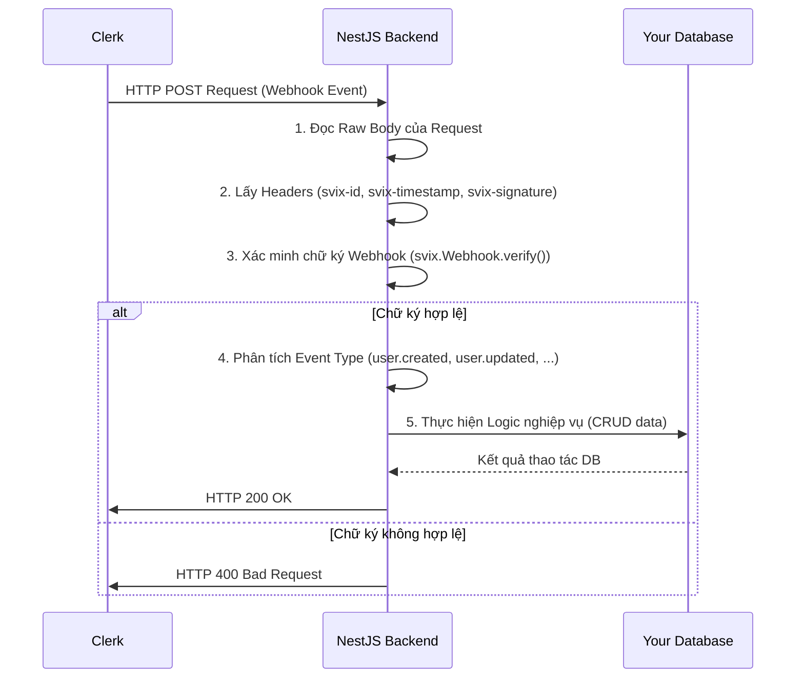

# Hướng Dẫn Chi Tiết Về Webhook Của Clerk Trong NestJS

## 1. Giới thiệu

## 2. Webhook của Clerk là gì?

## 3. Tại sao cần sử dụng Webhook?

## 4. Cấu hình Webhook trong Clerk Dashboard

## 5. Triển khai Webhook Listener trong NestJS

### 5.1. Cài đặt các gói cần thiết

### 5.2. Tạo Webhook Module và Controller

### 5.3. Xác minh chữ ký Webhook (Verify Webhook Signature)

### 5.4. Xử lý các sự kiện Webhook

## 6. Best Practices và Lưu ý Quan trọng

## 7. Kết luận

## 8. Tài liệu tham khảo


## 1. Giới thiệu

Trong các ứng dụng hiện đại, việc đồng bộ hóa dữ liệu người dùng giữa hệ thống xác thực (như Clerk) và backend của ứng dụng là vô cùng quan trọng. Webhook là một cơ chế mạnh mẽ và hiệu quả để đạt được sự đồng bộ này một cách gần như tức thì. Clerk cung cấp một hệ thống webhook toàn diện, cho phép backend của bạn nhận thông báo về các sự kiện quan trọng liên quan đến người dùng, phiên, tổ chức, v.v.

Bài luận này sẽ cung cấp một hướng dẫn chi tiết về cách triển khai và sử dụng webhook của Clerk trong một ứng dụng NestJS. Chúng ta sẽ đi sâu vào cách cấu hình webhook trong Clerk Dashboard, cách xây dựng một webhook listener an toàn và hiệu quả trong NestJS, cách xác minh chữ ký webhook để đảm bảo tính toàn vẹn và xác thực của dữ liệu, và cách xử lý các sự kiện webhook khác nhau để cập nhật dữ liệu trong cơ sở dữ liệu của bạn.


## 2. Webhook của Clerk là gì?

Webhook là một phương pháp giao tiếp _hướng sự kiện_ giữa các ứng dụng. Không giống như các API thông thường yêu cầu bạn phải liên tục thăm dò dữ liệu để có được thông tin "thời gian thực", webhook chỉ gửi dữ liệu khi có một sự kiện kích hoạt nó [1]. Điều này làm cho webhook có vẻ "thời gian thực", nhưng điều quan trọng cần lưu ý là chúng là bất đồng bộ.

Clerk webhooks cho phép bạn nhận thông báo sự kiện từ Clerk, chẳng hạn như khi một người dùng được tạo hoặc cập nhật. Khi một sự kiện xảy ra, Clerk sẽ gửi một yêu cầu HTTP `POST` đến endpoint webhook của bạn được cấu hình cho loại sự kiện đó. Payload mang theo một đối tượng JSON. Sau đó, bạn có thể sử dụng thông tin từ payload JSON của yêu cầu để kích hoạt các hành động trong ứng dụng của mình, chẳng hạn như gửi thông báo hoặc cập nhật cơ sở dữ liệu [1].

Clerk sử dụng [Svix](https://www.svix.com/) để gửi các webhook của mình. Svix là một dịch vụ chuyên biệt để gửi và quản lý webhook một cách đáng tin cậy và an toàn. Điều này có nghĩa là các webhook từ Clerk sẽ tuân theo các tiêu chuẩn bảo mật và độ tin cậy cao mà Svix cung cấp, bao gồm việc ký các yêu cầu webhook để đảm bảo tính xác thực và toàn vẹn của dữ liệu [1].

**Cấu trúc Payload của Webhook:**

Payload của một webhook là một đối tượng JSON chứa các thuộc tính sau [1]:

*   `data`: Chứa payload thực tế được gửi bởi Clerk. Payload có thể là một đối tượng khác nhau tùy thuộc vào loại `event`. Ví dụ, đối với các sự kiện `user.*`, payload sẽ luôn là đối tượng [User](https://clerk.com/docs/references/backend/users/overview).
*   `object`: Luôn được đặt thành `event`.
*   `type`: Loại sự kiện đã kích hoạt webhook (ví dụ: `user.created`, `user.updated`, `user.deleted`).
*   `timestamp`: Dấu thời gian (timestamp) tính bằng mili giây khi sự kiện xảy ra.
*   `instance_id`: Định danh của instance Clerk của bạn.

**Ví dụ về payload của sự kiện `user.created`:**

```json
{
  "data": {
    "id": "user_2f9241L8k4L0s8L8k4L0s8L8k4L0s8L8",
    "first_name": "John",
    "last_name": "Doe",
    "email_addresses": [
      {
        "id": "ema_2f9241L8k4L0s8L8k4L0s8L8k4L0s8L8",
        "email_address": "john.doe@example.com",
        "verified": true,
        "primary": true
      }
    ],
    "created_at": 1678886400000,
    "updated_at": 1678886400000,
    "external_id": null,
    "gender": null,
    "image_url": "https://www.gravatar.com/avatar?d=mp",
    "last_sign_in_at": null,
    "phone_numbers": [],
    "profile_image_url": "https://www.gravatar.com/avatar?d=mp",
    "public_metadata": {},
    "private_metadata": {},
    "unsafe_metadata": {},
    "username": null
  },
  "object": "event",
  "type": "user.created",
  "timestamp": 1678886400000,
  "instance_id": "ins_2f9241L8k4L0s8L8k4L0s8L8k4L0s8L8"
}
```

Điều quan trọng là payload của webhook phải luôn được coi là không an toàn cho đến khi bạn xác thực webhook đến. Webhook sẽ có nguồn gốc từ một máy chủ khác và được gửi đến ứng dụng của bạn dưới dạng yêu cầu POST. Một kẻ tấn công có thể giả mạo một sự kiện webhook để cố gắng giành quyền truy cập vào ứng dụng hoặc dữ liệu của bạn [1]. Do đó, việc xác minh chữ ký webhook là một bước bảo mật không thể thiếu.


## 3. Tại sao cần sử dụng Webhook?

Việc sử dụng webhook để đồng bộ hóa dữ liệu từ Clerk vào backend của bạn mang lại nhiều lợi ích quan trọng, đặc biệt là trong việc duy trì tính nhất quán của dữ liệu và kích hoạt các quy trình nghiệp vụ:

### 3.1. Đồng bộ hóa dữ liệu thời gian thực (gần như)

Webhook cho phép bạn nhận các cập nhật dữ liệu từ Clerk ngay lập tức khi một sự kiện xảy ra (ví dụ: người dùng mới đăng ký, thông tin người dùng được cập nhật, người dùng bị xóa). Điều này giúp giữ cho cơ sở dữ liệu nội bộ của bạn luôn được đồng bộ với dữ liệu của Clerk mà không cần phải thực hiện các cuộc gọi API định kỳ (polling), vốn kém hiệu quả và có thể dẫn đến độ trễ trong việc cập nhật dữ liệu [1].

Clerk cung cấp nhiều loại sự kiện khác nhau, nhưng ba sự kiện chính thường được sử dụng để đồng bộ hóa dữ liệu người dùng bao gồm [2]:

*   **`user.created`**: Kích hoạt khi một người dùng mới đăng ký trong ứng dụng hoặc được tạo thông qua Clerk Dashboard hoặc Backend API. Lắng nghe sự kiện này cho phép chèn thông tin người dùng ban đầu vào cơ sở dữ liệu của bạn.
*   **`user.updated`**: Kích hoạt khi thông tin người dùng được cập nhật thông qua các thành phần của Clerk, Clerk Dashboard hoặc Backend API. Lắng nghe sự kiện này giúp giữ dữ liệu được đồng bộ giữa Clerk và cơ sở dữ liệu bên ngoài của bạn. Nên chỉ đồng bộ những gì bạn cần để đơn giản hóa quá trình này.
*   **`user.deleted`**: Kích hoạt khi người dùng xóa tài khoản của họ, hoặc tài khoản của họ bị xóa thông qua Clerk Dashboard hoặc Backend API. Lắng nghe sự kiện này cho phép bạn xóa người dùng khỏi cơ sở dữ liệu của mình hoặc thêm cờ `deleted: true`.

### 3.2. Kích hoạt các quy trình nghiệp vụ

Khi một sự kiện webhook được nhận, bạn có thể kích hoạt các quy trình nghiệp vụ khác trong ứng dụng của mình. Ví dụ:

*   **Gửi email chào mừng:** Khi nhận được sự kiện `user.created`, bạn có thể gửi email chào mừng tự động đến người dùng mới.
*   **Cấp quyền truy cập:** Dựa trên vai trò hoặc thuộc tính của người dùng được cập nhật thông qua sự kiện `user.updated`, bạn có thể điều chỉnh quyền truy cập của họ trong ứng dụng của mình.
*   **Tích hợp với các dịch vụ bên thứ ba:** Webhook có thể được sử dụng để thông báo cho các dịch vụ bên thứ ba (ví dụ: hệ thống CRM, công cụ phân tích) về các thay đổi của người dùng.

### 3.3. Giảm tải cho Backend API

Thay vì backend của bạn phải liên tục gọi Clerk Backend API để kiểm tra các thay đổi, Clerk sẽ chủ động gửi thông báo đến backend của bạn khi có sự kiện. Điều này giúp giảm số lượng yêu cầu đến Clerk Backend API, giảm tải cho cả hai hệ thống và tối ưu hóa việc sử dụng tài nguyên.

### 3.4. Mô hình hướng sự kiện (Event-Driven Architecture)

Sử dụng webhook khuyến khích một kiến trúc hướng sự kiện, nơi các thành phần của hệ thống giao tiếp thông qua các sự kiện. Điều này giúp hệ thống trở nên linh hoạt, có khả năng mở rộng và dễ bảo trì hơn, vì các thành phần ít phụ thuộc vào nhau hơn.

Tuy nhiên, điều quan trọng cần lưu ý là webhook là bất đồng bộ. Nếu bạn đang onboarding một người dùng mới, bạn không thể dựa vào việc webhook được gửi như một phần của luồng đó. Thông thường, việc gửi sẽ diễn ra nhanh chóng, nhưng không đảm bảo sẽ được gửi ngay lập tức hoặc hoàn toàn. Webhook được sử dụng tốt nhất cho những việc như gửi thông báo hoặc cập nhật cơ sở dữ liệu, nhưng không phải cho các luồng đồng bộ nơi bạn cần biết webhook đã được gửi trước khi chuyển sang bước tiếp theo [1].


## 4. Cấu hình Webhook trong Clerk Dashboard

Trước khi backend NestJS của bạn có thể nhận và xử lý các webhook từ Clerk, bạn cần cấu hình webhook endpoint trong Clerk Dashboard. Quá trình này bao gồm việc chỉ định URL mà Clerk sẽ gửi các sự kiện đến và đăng ký các loại sự kiện mà bạn muốn nhận.

### 4.1. Chuẩn bị Endpoint URL

Trong môi trường phát triển cục bộ, bạn cần một cách để Clerk gửi webhook đến máy chủ cục bộ của bạn. Một công cụ phổ biến cho việc này là `ngrok`. `ngrok` tạo ra một URL chuyển tiếp công khai, cho phép các dịch vụ bên ngoài (như Clerk) gửi yêu cầu đến máy chủ cục bộ của bạn [2].

1.  **Cài đặt và chạy `ngrok`:**
    *   Tải xuống và cài đặt `ngrok` từ trang web chính thức của họ.
    *   Chạy `ngrok` để tạo một tunnel đến cổng mà ứng dụng NestJS của bạn đang chạy (ví dụ: cổng 3000):
        ```bash
        ngrok http 3000
        ```
    *   `ngrok` sẽ cung cấp cho bạn một **Forwarding URL** (ví dụ: `https://fawn-two-nominally.ngrok-free.app`). Bạn sẽ sử dụng URL này làm cơ sở cho webhook endpoint của mình.

2.  **Xác định Webhook Endpoint trong NestJS:**
    *   Trong ứng dụng NestJS của bạn, bạn sẽ cần một route cụ thể để nhận các webhook. Ví dụ phổ biến là `/api/webhooks`.
    *   Do đó, **Endpoint URL** đầy đủ mà bạn sẽ cấu hình trong Clerk Dashboard sẽ là `https://<your-ngrok-forwarding-url>/api/webhooks`.

### 4.2. Đăng ký Webhook Endpoint trong Clerk Dashboard

1.  **Truy cập Clerk Dashboard:** Đăng nhập vào Clerk Dashboard của bạn.
2.  **Điều hướng đến Webhooks:** Trong thanh điều hướng bên trái, tìm và chọn mục **Webhooks**.
3.  **Thêm Endpoint mới:** Nhấp vào nút **Add Endpoint**.
4.  **Cấu hình Endpoint:**
    *   **Endpoint URL:** Dán URL đầy đủ mà bạn đã chuẩn bị ở bước 4.1 (ví dụ: `https://fawn-two-nominally.ngrok-free.app/api/webhooks`).
    *   **Subscribe to events:** Cuộn xuống và chọn các loại sự kiện mà bạn muốn backend của mình nhận. Ví dụ, để đồng bộ hóa dữ liệu người dùng, bạn nên chọn `user.created`, `user.updated`, và `user.deleted` [2].
    *   Nhấp vào **Create**.
5.  **Lấy Signing Secret:** Sau khi tạo endpoint, bạn sẽ được chuyển hướng đến trang cài đặt của endpoint đó. Tại đây, bạn sẽ tìm thấy **Signing Secret** của webhook. **Đây là một khóa bí mật quan trọng mà bạn sẽ sử dụng để xác minh tính xác thực của webhook trong backend của mình.** Sao chép khóa này và lưu trữ nó dưới dạng biến môi trường trong file `.env` của dự án NestJS của bạn (ví dụ: `CLERK_WEBHOOK_SIGNING_SECRET`) [2].

    ```dotenv
    # .env
    CLERK_SECRET_KEY=sk_test_...
    CLERK_PUBLISHABLE_KEY=pk_test_...
    CLERK_WEBHOOK_SIGNING_SECRET=whsec_...
    ```

**Lưu ý quan trọng về bảo mật:**

*   **Webhook Signing Secret** là cực kỳ quan trọng. Không bao giờ để lộ nó ra công khai hoặc đưa vào mã nguồn được commit. Luôn sử dụng biến môi trường.
*   Các webhook đến không chứa thông tin xác thực người dùng (auth information). Chúng đến từ một nguồn bên ngoài và không được ký đăng nhập hoặc đăng xuất, vì vậy route nhận webhook phải là public để cho phép truy cập. Nếu bạn đang sử dụng middleware xác thực, hãy đảm bảo rằng route webhook của bạn được loại trừ khỏi quá trình xác thực đó [2].


## 5. Triển khai Webhook Listener trong NestJS

Để xử lý các webhook đến từ Clerk trong ứng dụng NestJS của bạn, bạn cần xây dựng một "webhook listener" (bộ lắng nghe webhook). Điều này bao gồm việc tạo một endpoint API có khả năng nhận yêu cầu POST, xác minh tính xác thực của webhook và xử lý payload sự kiện.

### 5.1. Cài đặt các gói cần thiết

Ngoài các gói NestJS cơ bản, bạn sẽ cần cài đặt gói `@clerk/backend` để sử dụng hàm `verifyWebhook()` và gói `raw-body` để đọc raw body của request, điều này cần thiết cho việc xác minh chữ ký webhook.

```bash
npm install @clerk/backend raw-body
```

### 5.2. Tạo Webhook Module và Controller

Bạn nên tạo một module riêng cho webhook để giữ cho cấu trúc ứng dụng của bạn sạch sẽ và có tổ chức. Module này sẽ chứa một controller để định nghĩa endpoint nhận webhook.

**Tạo `WebhookModule`:**

```typescript
// src/webhook/webhook.module.ts

import { Module } from '@nestjs/common';
import { WebhookController } from './webhook.controller';

@Module({
  controllers: [WebhookController],
})
export class WebhookModule {}
```

**Tạo `WebhookController`:**

Controller này sẽ định nghĩa route `/api/webhooks` (hoặc bất kỳ route nào bạn đã cấu hình trong Clerk Dashboard) và lắng nghe các yêu cầu POST.

```typescript
// src/webhook/webhook.controller.ts

import { Controller, Post, Req, Res, HttpStatus, Logger } from '@nestjs/common';
import { Request, Response } from 'express';
import { Webhook } from 'svix';
import { ConfigService } from '@nestjs/config';
import { WebhookEvent } from '@clerk/backend';
import * as rawbody from 'raw-body';

@Controller("api/webhooks")
export class WebhookController {
  private readonly logger = new Logger(WebhookController.name);

  constructor(private configService: ConfigService) {}

  @Post()
  async handleWebhook(@Req() req: Request, @Res() res: Response) {
    const CLERK_WEBHOOK_SECRET = this.configService.get<string>('CLERK_WEBHOOK_SIGNING_SECRET');

    if (!CLERK_WEBHOOK_SECRET) {
      this.logger.error('CLERK_WEBHOOK_SIGNING_SECRET is not set.');
      return res.status(HttpStatus.INTERNAL_SERVER_ERROR).send('Webhook secret not configured.');
    }

    // Lấy raw body của request
    const body = await rawbody(req);
    const payload = body.toString('utf8');

    // Lấy headers cần thiết cho xác minh
    const headers = {
      'svix-id': req.headers['svix-id'] as string,
      'svix-timestamp': req.headers['svix-timestamp'] as string,
      'svix-signature': req.headers['svix-signature'] as string,
    };

    let evt: WebhookEvent;

    try {
      // Xác minh chữ ký webhook
      const wh = new Webhook(CLERK_WEBHOOK_SECRET);
      evt = wh.verify(payload, headers) as WebhookEvent;
    } catch (err) {
      this.logger.error('Webhook verification failed:', err);
      return res.status(HttpStatus.BAD_REQUEST).send('Invalid webhook signature.');
    }

    // Xử lý sự kiện webhook
    const eventType = evt.type;
    this.logger.log(`Received webhook event: ${eventType}`);

    switch (eventType) {
      case 'user.created':
        // Logic xử lý khi người dùng được tạo
        this.logger.log('User created:', evt.data);
        // Ví dụ: Lưu thông tin người dùng vào cơ sở dữ liệu của bạn
        break;
      case 'user.updated':
        // Logic xử lý khi thông tin người dùng được cập nhật
        this.logger.log('User updated:', evt.data);
        // Ví dụ: Cập nhật thông tin người dùng trong cơ sở dữ liệu của bạn
        break;
      case 'user.deleted':
        // Logic xử lý khi người dùng bị xóa
        this.logger.log('User deleted:', evt.data);
        // Ví dụ: Xóa người dùng khỏi cơ sở dữ liệu của bạn hoặc đánh dấu là đã xóa
        break;
      case 'organization.created':
        // Logic xử lý khi tổ chức được tạo
        this.logger.log('Organization created:', evt.data);
        break;
      // Thêm các case khác cho các loại sự kiện bạn đã đăng ký
      default:
        this.logger.warn(`Unhandled webhook event type: ${eventType}`);
        break;
    }

    return res.status(HttpStatus.OK).send('Webhook received and processed.');
  }
}
```

**Lưu ý quan trọng về `raw-body` và Express:**

Để `raw-body` có thể đọc được payload của request, bạn cần đảm bảo rằng NestJS không tự động parse JSON body trước khi request đến controller. Trong `main.ts` của ứng dụng NestJS, bạn có thể cần cấu hình `bodyParser` để không parse JSON cho route webhook, hoặc sử dụng một cách tiếp cận khác để đảm bảo raw body có sẵn. Một cách đơn giản là sử dụng `express.json({ raw: true })` hoặc cấu hình `app.use(json({ verify: (req, res, buf) => { req['rawBody'] = buf; } }))`.

Tuy nhiên, cách tiếp cận trong ví dụ trên (`await rawbody(req)`) là phổ biến và thường hoạt động tốt nếu không có middleware parsing body nào khác được áp dụng trước đó cho route này.

### 5.3. Xác minh chữ ký Webhook (Verify Webhook Signature)

Đây là bước quan trọng nhất để đảm bảo tính bảo mật của webhook. Clerk sử dụng [Svix](https://www.svix.com/) để ký các webhook, và bạn phải xác minh chữ ký này để đảm bảo rằng webhook thực sự đến từ Clerk và không bị giả mạo [1].

Trong ví dụ `WebhookController` ở trên, chúng ta đã sử dụng thư viện `svix` (được cài đặt cùng với `@clerk/backend` hoặc có thể cài riêng `npm install svix`) để thực hiện việc xác minh:

```typescript
import { Webhook } from 'svix';
// ...

const CLERK_WEBHOOK_SECRET = this.configService.get<string>('CLERK_WEBHOOK_SIGNING_SECRET');
// ...

const wh = new Webhook(CLERK_WEBHOOK_SECRET);
evt = wh.verify(payload, headers) as WebhookEvent;
```

Quá trình xác minh bao gồm:

1.  **Lấy `CLERK_WEBHOOK_SIGNING_SECRET`:** Khóa bí mật này được lấy từ biến môi trường, là khóa bạn đã sao chép từ Clerk Dashboard.
2.  **Lấy các header `svix`:** Các header này bao gồm `svix-id`, `svix-timestamp`, và `svix-signature`, được Clerk gửi kèm theo mỗi webhook.
3.  **Sử dụng `Webhook.verify()`:** Phương thức này nhận raw payload của request, các header `svix` và `CLERK_WEBHOOK_SIGNING_SECRET` để xác minh chữ ký. Nếu chữ ký không hợp lệ, nó sẽ ném ra một lỗi, và bạn nên trả về lỗi HTTP `400 Bad Request`.

Nếu `verify()` thành công, nó sẽ trả về đối tượng sự kiện webhook (`WebhookEvent`), an toàn để xử lý.

### 5.4. Xử lý các sự kiện Webhook

Sau khi webhook đã được xác minh, bạn có thể an toàn xử lý payload của sự kiện. Đối tượng `evt` (kiểu `WebhookEvent`) sẽ chứa thuộc tính `type` cho biết loại sự kiện và thuộc tính `data` chứa dữ liệu liên quan đến sự kiện đó.

Trong ví dụ `WebhookController`:

```typescript
    const eventType = evt.type;
    switch (eventType) {
      case 'user.created':
        // Logic xử lý khi người dùng được tạo
        this.logger.log('User created:', evt.data);
        // Ví dụ: Lưu thông tin người dùng vào cơ sở dữ liệu của bạn
        // const newUser = await this.userService.createUser(evt.data.id, evt.data.email_addresses[0].email_address, ...);
        break;
      case 'user.updated':
        // Logic xử lý khi thông tin người dùng được cập nhật
        this.logger.log('User updated:', evt.data);
        // Ví dụ: Cập nhật thông tin người dùng trong cơ sở dữ liệu của bạn
        // await this.userService.updateUser(evt.data.id, evt.data);
        break;
      case 'user.deleted':
        // Logic xử lý khi người dùng bị xóa
        this.logger.log('User deleted:', evt.data);
        // Ví dụ: Xóa người dùng khỏi cơ sở dữ liệu của bạn hoặc đánh dấu là đã xóa
        // await this.userService.deleteUser(evt.data.id);
        break;
      // Thêm các case khác cho các loại sự kiện bạn đã đăng ký
      default:
        this.logger.warn(`Unhandled webhook event type: ${eventType}`);
        break;
    }
```

Bạn nên triển khai logic nghiệp vụ tương ứng với từng loại sự kiện. Ví dụ, với `user.created`, bạn có thể tạo một bản ghi người dùng mới trong cơ sở dữ liệu của mình. Với `user.updated`, bạn sẽ cập nhật thông tin người dùng hiện có. Với `user.deleted`, bạn có thể xóa hoặc đánh dấu người dùng là đã xóa trong hệ thống của mình.

**Sơ đồ luồng xử lý Webhook:**




## 6. Best Practices và Lưu ý Quan trọng

Để đảm bảo việc triển khai webhook của Clerk trong NestJS hoạt động hiệu quả, an toàn và đáng tin cậy, hãy xem xét các best practices và lưu ý quan trọng sau:

### 6.1. Xử lý bất đồng bộ và Idempotency

*   **Webhook là bất đồng bộ:** Nhớ rằng webhook là bất đồng bộ và không đảm bảo được gửi ngay lập tức. Đừng dựa vào webhook cho các luồng đồng bộ hoặc các hoạt động yêu cầu phản hồi ngay lập tức.
*   **Xử lý Idempotency:** Webhook có thể được gửi lại nhiều lần (retry) nếu backend của bạn không trả về mã trạng thái `2xx` kịp thời hoặc nếu có lỗi mạng. Điều này có nghĩa là bạn có thể nhận cùng một sự kiện nhiều lần. Do đó, logic xử lý webhook của bạn phải là _idempotent_, tức là việc xử lý cùng một sự kiện nhiều lần sẽ cho ra cùng một kết quả và không gây ra tác dụng phụ không mong muốn (ví dụ: không tạo bản ghi trùng lặp).
    *   Sử dụng `svix-id` header: Mỗi webhook từ Svix (Clerk sử dụng Svix) đều có một header `svix-id` duy nhất cho mỗi lần gửi. Bạn có thể sử dụng ID này để theo dõi và ngăn chặn việc xử lý trùng lặp các sự kiện.

### 6.2. Bảo mật Endpoint Webhook

*   **Luôn xác minh chữ ký:** Đây là lớp bảo mật quan trọng nhất. Không bao giờ xử lý payload webhook nếu chữ ký không hợp lệ. Điều này ngăn chặn các cuộc tấn công giả mạo webhook.
*   **Giới hạn IP nguồn (tùy chọn):** Để tăng cường bảo mật, bạn có thể cấu hình tường lửa hoặc proxy để chỉ chấp nhận các yêu cầu POST đến endpoint webhook của bạn từ các dải IP của Svix. Clerk cung cấp danh sách các IP này trong tài liệu của họ [1].
*   **HTTPS:** Luôn sử dụng HTTPS cho endpoint webhook của bạn để đảm bảo rằng payload được mã hóa trong quá trình truyền tải.

### 6.3. Xử lý lỗi và Retry

*   **Trả về mã trạng thái HTTP phù hợp:**
    *   Trả về `2xx` (ví dụ: `200 OK`) nếu bạn đã nhận và xử lý thành công webhook. Điều này báo hiệu cho Clerk/Svix rằng không cần gửi lại sự kiện.
    *   Trả về `4xx` (ví dụ: `400 Bad Request` cho chữ ký không hợp lệ, `401 Unauthorized`, `403 Forbidden`) hoặc `5xx` (ví dụ: `500 Internal Server Error` cho lỗi xử lý nội bộ) nếu có lỗi. Clerk/Svix sẽ tự động thử lại việc gửi webhook theo một lịch trình nhất định [1].
*   **Ghi log chi tiết:** Ghi log tất cả các sự kiện webhook đến, bao gồm cả payload và kết quả xử lý (thành công hay thất bại). Điều này rất quan trọng cho việc gỡ lỗi và kiểm toán.
*   **Sử dụng hệ thống giám sát:** Thiết lập giám sát cho endpoint webhook của bạn để phát hiện sớm các lỗi hoặc sự cố trong quá trình xử lý webhook.

### 6.4. Tối ưu hóa hiệu suất

*   **Xử lý nhanh chóng:** Endpoint webhook của bạn nên xử lý yêu cầu càng nhanh càng tốt để tránh bị timeout từ phía Clerk/Svix. Nếu logic xử lý của bạn phức tạp hoặc tốn thời gian (ví dụ: thao tác cơ sở dữ liệu nặng, gọi API bên ngoài), hãy cân nhắc việc đưa logic đó vào một hàng đợi (queue) và xử lý bất đồng bộ.
*   **Chỉ đồng bộ những gì cần thiết:** Đối với các sự kiện `user.updated`, chỉ cập nhật những trường dữ liệu thực sự cần thiết trong cơ sở dữ liệu của bạn để giảm tải cho database và tăng tốc độ xử lý.

### 6.5. Kiểm thử Webhook

*   **Sử dụng tính năng Test của Clerk Dashboard:** Clerk Dashboard cung cấp một tab **Testing** trong cài đặt webhook endpoint, cho phép bạn gửi các sự kiện mẫu (ví dụ: `user.created`) để kiểm thử webhook listener của bạn mà không cần phải kích hoạt sự kiện thực tế [2].
*   **Sử dụng `ngrok` hoặc các công cụ tương tự:** Để kiểm thử cục bộ, `ngrok` là công cụ không thể thiếu để phơi bày máy chủ cục bộ của bạn ra internet.

### 6.6. Quản lý phiên bản Webhook

*   **Theo dõi phiên bản API của webhook:** Clerk có thể giới thiệu các phiên bản webhook mới trong tương lai. Hãy theo dõi tài liệu của Clerk để đảm bảo rằng bạn đang xử lý đúng phiên bản webhook và cập nhật logic của mình khi cần thiết.

Bằng cách tuân thủ các best practices này, bạn có thể xây dựng một hệ thống xử lý webhook mạnh mẽ, an toàn và đáng tin cậy trong NestJS, đảm bảo dữ liệu của bạn luôn được đồng bộ và các quy trình nghiệp vụ được kích hoạt chính xác.


## 7. Kết luận

Webhook của Clerk là một công cụ mạnh mẽ và không thể thiếu để duy trì sự đồng bộ dữ liệu giữa Clerk và backend NestJS của bạn. Bằng cách triển khai một webhook listener an toàn và hiệu quả, bạn có thể tự động hóa việc cập nhật dữ liệu người dùng, kích hoạt các quy trình nghiệp vụ và đảm bảo tính nhất quán của thông tin trên toàn bộ hệ thống.

Việc xác minh chữ ký webhook là bước bảo mật quan trọng nhất, không thể bỏ qua. Kết hợp với việc xử lý lỗi mạnh mẽ, tính idempotent và các best practices khác, bạn có thể xây dựng một hệ thống đáng tin cậy để xử lý các sự kiện từ Clerk, giúp ứng dụng của bạn phản ứng linh hoạt với các thay đổi của người dùng và duy trì trải nghiệm liền mạch.

Hy vọng bài viết này đã cung cấp cho bạn một cái nhìn toàn diện và hướng dẫn chi tiết để triển khai thành công webhook của Clerk trong dự án NestJS của mình.


## 8. Tài liệu tham khảo

[1] Clerk Documentation. Webhooks overview. Available at: [https://clerk.com/docs/webhooks/overview](https://clerk.com/docs/webhooks/overview)

[2] Clerk Documentation. Sync Clerk data to your app with webhooks. Available at: [https://clerk.com/docs/webhooks/sync-data](https://clerk.com/docs/webhooks/sync-data)

